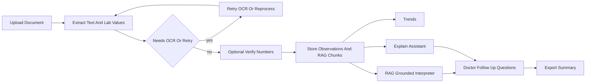

# Complete Lab Workflow

## Current State

The repo already has most primitives, but they are disconnected:

- Upload and extraction live in [`src/backend/api/documents.py`](src/backend/api/documents.py), and import can set `pending_ocr`, `parsed`, or `extraction_failed`.
- Numeric verification exists per observation in [`src/backend/api/observations.py`](src/backend/api/observations.py), but [`src/frontend/src/pages/VerificationWorkbench.tsx`](src/frontend/src/pages/VerificationWorkbench.tsx) only loads `needs_verification: true`, so `/verify?doc=...` can show an empty queue even when a parsed document has observations.
- Inbox has a three-dot item in [`src/frontend/src/pages/DocumentInbox.tsx`](src/frontend/src/pages/DocumentInbox.tsx), but it only navigates to Verify and there is no OCR/reprocess action.
- RAG exists in [`src/backend/modules/rag.py`](src/backend/modules/rag.py) and [`src/backend/api/assistant.py`](src/backend/api/assistant.py), but OCR text from scanned docs is not reliably chunked because `_create_chunks_and_embeddings` uses `pdfplumber` text extraction only.
- Export questions exist in [`src/backend/modules/export.py`](src/backend/modules/export.py) and [`src/backend/api/export.py`](src/backend/api/export.py), but `include_questions` is not wired into downloaded summaries.

## Target Flow

## Backend Plan

- Refactor the extraction portion of [`src/backend/api/documents.py`](src/backend/api/documents.py) into a shared helper that can be called by both import and retry/reprocess. It should decrypt the existing document, run the correct `ExtractModule` path, replace stale observations/chunks for that document transactionally, update `Document.status`, `parsed_at`, `collection_date`, and keep the existing audit trail.
- Add `POST /api/v1/documents/{document_id}/reprocess` for `pending_ocr`, `extraction_failed`, and parsed docs that need another extraction pass. This powers “Continue OCR” and “Retry extraction” from the inbox/workbench.
- Extend `GET /api/v1/observations/` with a `doc_id` query filter so the verification page can load all observations for the selected document, not only the global unverified queue.
- Add a bulk document verification endpoint, likely `POST /api/v1/documents/{document_id}/verify`, that marks all observations for that document verified and sets `Document.status = verified` when complete. Keep individual observation editing through the existing `POST /api/v1/observations/{observation_id}/verify` endpoint.
- Make OCR-derived text available to RAG by allowing chunk creation from `ExtractionResult.extracted_text` as page text, instead of relying only on `pdfplumber`. Update `GET /documents/{document_id}/pages` to return OCR/chunk text for scanned PDFs and images when available.
- Keep verification optional downstream: trends/interpreter/explain should still work with unverified observations, but responses and UI should surface `user_verified` and low-confidence status so users understand provenance.

## Frontend Plan

- Update [`src/frontend/src/services/documents.ts`](src/frontend/src/services/documents.ts) and [`src/frontend/src/services/types.ts`](src/frontend/src/services/types.ts) with `reprocessDocument`, `verifyDocument`, and response types. Update [`src/frontend/src/services/observations.ts`](src/frontend/src/services/observations.ts) to support `doc_id` filtering.
- Improve [`src/frontend/src/pages/DocumentInbox.tsx`](src/frontend/src/pages/DocumentInbox.tsx): after upload, show the imported result with actions; add three-dot menu items for “Review extracted values”, “Continue OCR / Retry extraction” when status allows, and “Preview source”.
- Rework [`src/frontend/src/pages/VerificationWorkbench.tsx`](src/frontend/src/pages/VerificationWorkbench.tsx) so `?doc=...` switches into document-review mode and loads all observations for that document. If no observations exist, show actionable status-specific controls instead of a generic empty queue.
- In the workbench, keep the existing side-by-side source preview, but make it document-aware: show all rows for the selected document, support edit-and-verify per row, “Mark document verified”, confidence badges, verified/unverified counts, and OCR/reprocess status.
- Add navigation from successful upload to the appropriate next step: parsed with rows -> Verify; pending OCR/extraction failed -> Workbench attention card with retry; verified or skipped -> Trends/Interpret/Explain CTAs.
- Add verification badges/warnings in [`src/frontend/src/pages/TrendsDashboard.tsx`](src/frontend/src/pages/TrendsDashboard.tsx), [`src/frontend/src/pages/LabInterpreter.tsx`](src/frontend/src/pages/LabInterpreter.tsx), and [`src/frontend/src/pages/ExplainAssistant.tsx`](src/frontend/src/pages/ExplainAssistant.tsx) so unverified data is allowed but visibly marked.

## RAG, Interpreter, And Export

- Use the existing RAG stack rather than adding a new vector store. Ensure uploaded lab text, including OCR text, produces chunks/embeddings during import/reprocess so [`src/backend/api/assistant.py`](src/backend/api/assistant.py) can ground answers in user documents.
- Add a grounded interpretation endpoint or extend existing interpretation generation to include retrieved document chunks from [`src/backend/modules/rag.py`](src/backend/modules/rag.py) alongside structured observation context from [`src/backend/modules/interpret.py`](src/backend/modules/interpret.py). The response should include user-document citations, reference citations, verification metadata, and the source observation IDs.
- Wire [`src/frontend/src/pages/LabInterpreter.tsx`](src/frontend/src/pages/LabInterpreter.tsx) to use the grounded path for selected observations/panels while preserving current template fallback if no model is configured.
- Wire `include_questions` in [`src/backend/api/export.py`](src/backend/api/export.py) into the stored summary data and text/html/pdf downloads. Keep [`src/backend/modules/export.py`](src/backend/modules/export.py) rule-based questions as fallback, and optionally enrich questions from grounded interpretation/Explain output when available.
- Update [`src/frontend/src/pages/ExportPage.tsx`](src/frontend/src/pages/ExportPage.tsx) so generated clinician questions are part of preview, copy, and download, not just a separate UI-only request.

## Validation

- Backend tests: add coverage for document reprocess, `doc_id` observation filtering, bulk document verification, OCR-text chunk creation, scanned/image pages returning OCR text, and export summaries with questions.
- Frontend tests: update [`src/frontend/src/__tests__/VerificationWorkbench.test.tsx`](src/frontend/src/__tests__/VerificationWorkbench.test.tsx) for document-review mode, empty OCR retry state, edit/verify, and mark-document-verified. Add or extend inbox tests for the three-dot workflow.
- E2E: extend [`src/frontend/e2e/ui-full-verification.spec.ts`](src/frontend/e2e/ui-full-verification.spec.ts) to cover upload -> review -> verify -> trends/interpreter/explain -> export questions.