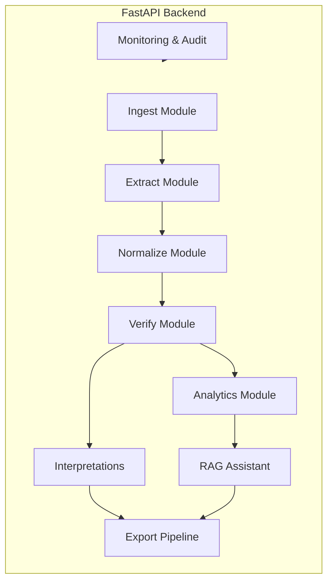
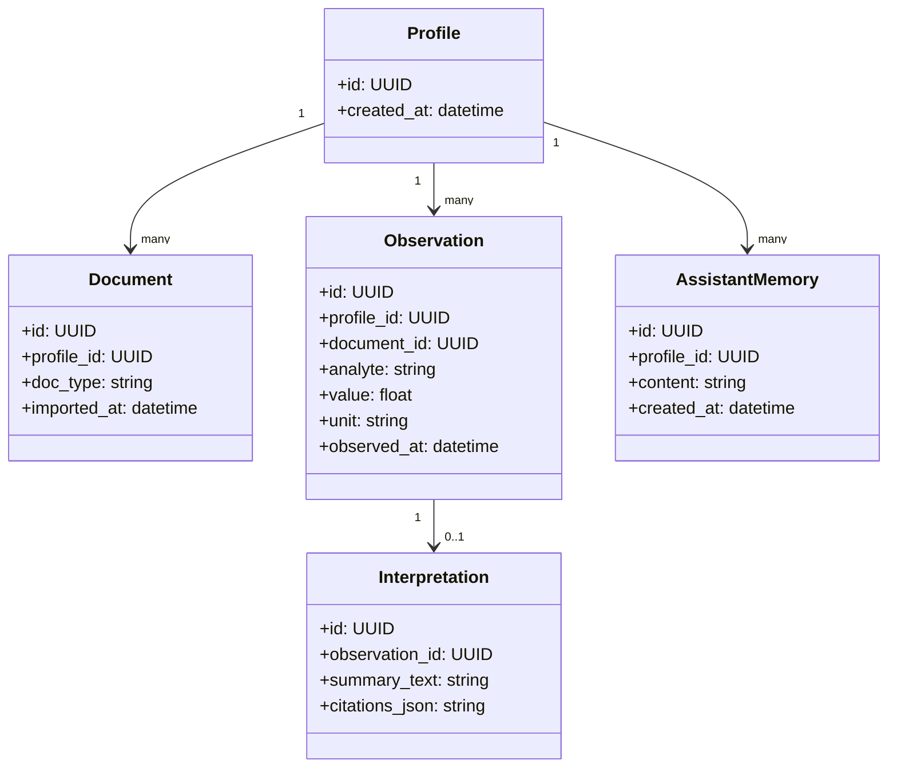
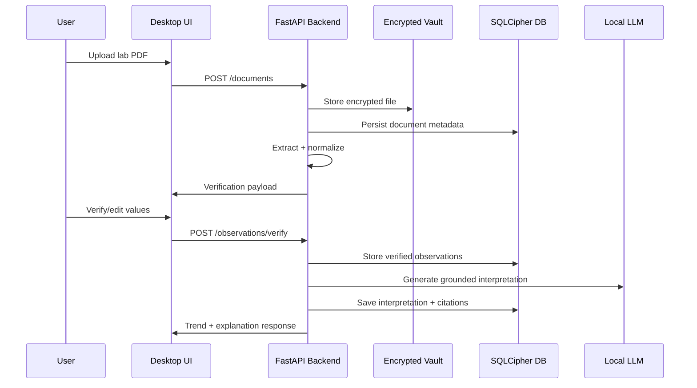

# HealthCentral

**Local-First Medical Results Companion**

A privacy-first desktop application for patients to import medical documents, extract structured information with user verification, visualize trends, and generate grounded explanations with citations.

## Overview

HealthCentral helps patients:
- **Import** lab PDFs and medical documents into a secure local vault
- **Extract & Verify** structured data with human-in-the-loop verification
- **Visualize** longitudinal trends with reference range context
- **Understand** results via grounded explanations with citations (local RAG)
- **Export** doctor-ready summaries and discussion prompts

## Core Principles

- **Local-First**: All data stays on your device by default
- **Privacy-First**: Encrypted at rest; no network calls required
- **Grounded Outputs**: Every claim cites user documents or curated references
- **Conservative Behavior**: Prefer "insufficient information" over speculation
- **No Medical Advice**: Education only; no diagnosis or treatment recommendations

## Project Structure

```
HealthCentral/
├── docs/                      # Architecture and feature documentation
│   ├── api/                   # API endpoint documentation
│   ├── user/                  # User guides, workflows, FAQ
│   ├── compliance/            # HIPAA, data privacy, audit checklist
│   ├── features/              # Feature architecture + active task list
│   └── model_tiers/           # AI model tier documentation
├── src/
│   ├── backend/              # Python FastAPI backend
│   │   ├── api/              # API routes and endpoints
│   │   ├── core/             # Core config, security, database
│   │   ├── models/           # SQLAlchemy database models
│   │   ├── modules/          # Feature modules (ingest, RAG, etc.)
│   │   ├── monitoring/       # Metrics, correlation IDs, timing
│   │   ├── security/         # Input validation, rate limiting, headers
│   │   ├── scripts/          # Backup, migrations, model management
│   │   └── tests/            # Backend test suites
│   └── frontend/             # React + Vite + TypeScript
│       ├── src/
│       └── public/
├── config/                   # Configuration templates (.env.example)
├── data/                     # Local data directory (gitignored)
├── models/                   # Local AI models (gitignored)
└── scripts/                  # Build and utility scripts
```

## Architecture Diagrams

### High-Level System Context

```mermaid
flowchart LR
    User[Patient] -->|Upload docs, review results| UI[Desktop UI (React/Vite)]
    UI -->|JWT + Loopback HTTP| API[FastAPI Backend]
    API -->|SQLCipher| MasterDB[(Master DB)]
    API -->|SQLCipher| ProfileDB[(Per-Profile Vault DB)]
    API --> Vault[(Encrypted Documents Vault)]
    API --> Vector[(Encrypted Vector Index)]
    API --> LLM[Local LLM (llama.cpp)]
    API --> Embeddings[Local Embeddings Model]
    API --> Export[Doctor-ready Exports]
```

### Backend Component View



### Core Data Model (UML)



### Document-to-Insight Sequence



## Technology Stack

### Current (Local-Only MVP)
- **Backend**: Python 3.11+ with FastAPI
- **Database**: SQLite + SQLCipher (encrypted)
- **Vector Store**: sqlite-vss or FAISS (encrypted)
- **Local LLM**: llama.cpp with GGUF models
- **Embeddings**: bge-small-en or e5-small
- **Frontend**: React + Vite + TypeScript

### Future Scalability
Architecture designed for:
- Web-based deployment (FastAPI → cloud hosting)
- Mobile apps (shared API layer)
- Multi-user support with authentication
- Cloud storage options (opt-in)

## Documentation Drift Notes

- README architecture sections align with `docs/01_backend_architecture_plan.md`, `docs/features/00_features_index.md`, and `docs/api/endpoints.md` as of 2026-04-29.
- To validate documentation drift locally, run: `python3 scripts/docs_lint.py`.

## SQLCipher Setup (Required for Database Encryption)

HealthCentral uses SQLCipher for encrypted per-profile databases. Each user profile has its own AES-256 encrypted SQLite database.

### Installation

#### Windows (Recommended: pre-built wheel)
```powershell
pip install sqlcipher3-binary
```

#### Linux (Debian/Ubuntu)
```bash
sudo apt-get install libsqlcipher-dev
pip install sqlcipher3-binary
```

#### macOS
```bash
brew install sqlcipher
pip install sqlcipher3-binary
```

### Verify Installation
```python
import sqlcipher3
conn = sqlcipher3.connect(":memory:")
cursor = conn.cursor()
cursor.execute("PRAGMA cipher_version")
print(cursor.fetchone())  # Should print ('4.x.x',)
```

### Development Without SQLCipher
If you cannot install SQLCipher, set in `.env`:
```
DATABASE_ENCRYPTION_REQUIRED=false
```
**WARNING:** Profile databases will be unencrypted. Never use in production.

## Database Migrations

HealthCentral uses **Alembic** for database schema migrations with a dual-environment setup:

- **Master database**: Profiles, audit logs, knowledge base (unencrypted)
- **Profile databases**: Per-user SQLCipher encrypted vaults

### Running Migrations

```powershell
cd src\backend

# Run master database migrations
python -m scripts.migrate master

# Check migration status
python -m scripts.migrate status

# Run profile migrations (requires password)
python -m scripts.migrate profile --profile-id <uuid>
```

### Safe Rollout
The migration system includes **baseline detection**:
- Existing databases without `alembic_version` are stamped (not migrated)
- This prevents "table already exists" errors on existing installations
- New installations get full schema creation via migrations

Migrations run automatically:
- Master migrations run on application startup
- Profile migrations run when a vault is opened

## Getting Started

### Prerequisites
- Python 3.11+
- Node.js 18+ (for frontend)

### Quick Start (Recommended)

The easiest way to start development is using the included dev script:

```powershell
# From the project root directory
.
\dev.bat

# Or directly with PowerShell
.
\dev.ps1
```

This script automatically:
- Checks for Python and Node.js installations
- Creates a Python virtual environment if needed
- Installs all dependencies (pip and npm)
- Creates the data directory structure
- Starts both backend and frontend servers

Once running:
- **Frontend**: http://localhost:3000
- **Backend API**: http://localhost:8000
- **API Documentation**: http://localhost:8000/docs

Press `Ctrl+C` to stop both servers.

### Supported Local Verification Bootstrap (WSL/Linux)

Use the WSL/Linux bootstrap path below to create the verifier environment that the repo-root proof bundle expects. Run every command from the repository root.

```bash
python3 --version
node --version

python3 -m venv .wsl-pytest-venv
./.wsl-pytest-venv/bin/python -m pip install --upgrade pip
./.wsl-pytest-venv/bin/python -m pip install -r src/backend/requirements.txt
npm --prefix src/frontend install

python3 scripts/docs_lint.py
npx --prefix src/frontend tsc --noEmit -p src/frontend/tsconfig.json
PYTHONPATH=src/backend ./.wsl-pytest-venv/bin/python -m pytest src/backend/tests/test_bootstrap_check.py -q
```

What this bootstrap proves:
- docs drift checks run from repo root;
- the frontend type-check works with the checked-in `src/frontend/tsconfig.json`;
- the backend pytest environment can import project dependencies and keeps the production encryption default intact.

#### Bootstrap prerequisites and recovery notes

- **Python**: use Python 3.11+ and create the backend verifier environment from the same WSL/Linux interpreter you will use for pytest.
- **Node.js**: use Node.js 18+ so `npx --prefix src/frontend ...` resolves the frontend toolchain correctly.
- **SQLCipher**: if `pip install -r src/backend/requirements.txt` fails around `sqlcipher3-binary` on Debian/Ubuntu, install `libsqlcipher-dev` first, then retry the pip install.
- **OCR packages**: `tesseract-ocr` and PDF/image system libraries are required for OCR-heavy backend tests and runtime features, but the bootstrap smoke test above does not depend on them.

#### Windows / WSL caveats

- If you are inside WSL, create and use the virtualenv from WSL (`python3 -m venv .wsl-pytest-venv`). Do **not** activate a Windows-created virtualenv from `/mnt/c/...`; compiled wheels can mismatch architecture.
- The repo's recorded backend proof commands assume the repo-root interpreter path `./.wsl-pytest-venv/bin/python`. If that environment is missing, recreate it with the commands above instead of changing the command paths.
- `npx --prefix src/frontend tsc --noEmit -p src/frontend/tsconfig.json` is the supported local frontend verification command for mounted WSL checkouts. If broader frontend tests stall on an NTFS-mounted repo, run them from a Linux-native filesystem.

### Current Contributor Proof Bundle

After the bootstrap succeeds, this is the maintained repo-root proof bundle for the current assistant-category and hygiene surface:

```bash
python3 scripts/repo_hygiene_check.py
python3 scripts/docs_lint.py
npm --prefix src/frontend run test:run -- src/__tests__/ExplainAssistant.test.tsx
npx --prefix src/frontend playwright test --config src/frontend/playwright.config.ts src/frontend/e2e/assistant.spec.ts --grep "category"
PYTHONPATH=src/backend ./.wsl-pytest-venv/bin/python -m pytest src/backend/tests/test_bootstrap_check.py src/backend/tests/security/test_password_hashing.py src/backend/tests/test_repo_hygiene_check.py
```

What this proves:
- no disallowed root scratch markdown/report artifacts are present before merge-sensitive work;
- docs follow the current historical-reference ownership rules;
- the Explain Assistant document-category filter is covered at both component and browser level;
- the supported backend proof bundle catches bootstrap, password-hashing, and repo-hygiene regressions from the same repo-root WSL interpreter path.

### Local-only artifact hygiene

Use the following repo-hygiene rules whenever you are about to interpret `git status`, perform an audit, or do pre-merge cleanup:

- `.bg-shell/` and `.wsl-pytest-venv/` are local-only helper directories. They should stay gitignored and should not be treated as shared project changes.
- Root scratch markdown and ad-hoc generated reports such as `PLAN.md`, `HANDOFF-*.md`, and `*_report*.md` are **not** broadly ignored on purpose. Clean them up or move them elsewhere before dirt-sensitive work.
- Run `git status --short` before release-oriented or status-sensitive work. If unexpected local-only files appear, clear them first instead of normalizing them into the repo.
- Use the contributor checklist in `CONTRIBUTING.md` when you need a repeatable pre-merge hygiene pass.

### Manual Installation

If you prefer manual setup beyond the verification bootstrap above:

```bash
# Clone repository
git clone https://github.com/your-org/HealthCentral.git
cd HealthCentral

# Backend setup (Linux/WSL)
python3 -m venv ~/venvs/healthcentral-backend
source ~/venvs/healthcentral-backend/bin/activate
python -m pip install --upgrade pip
python -m pip install -r src/backend/requirements.txt

# Frontend setup
npm --prefix src/frontend install
```

```powershell
# Backend setup (Windows PowerShell)
python -m venv .venv
.
\venv\Scripts\Activate.ps1
python -m pip install --upgrade pip
python -m pip install -r src/backend/requirements.txt

# Frontend setup
npm --prefix src/frontend install
```

### Manual Development

```bash
# Terminal 1: Start backend
cd src/backend
venv\Scripts\activate
uvicorn main:app --reload --host 127.0.0.1 --port 8000

# Terminal 2: Start frontend
cd src/frontend
npm run dev
```

## Documentation

### For Users
- [Getting Started](docs/user/getting-started.md)
- [Workflows](docs/user/workflows.md)
- [Troubleshooting](docs/user/troubleshooting.md)
- [FAQ](docs/user/faq.md)

### For Developers
- [API Documentation](docs/api/README.md)
- [Live API Endpoints (source of truth)](docs/api/endpoints.md)
- [Backend Integration Status (Historical Reference)](docs/05_backend_integration_status.md)
- [Backend Architecture](docs/01_backend_architecture_plan.md)
- [Documentation Index](docs/00_architecture_plans_index.md)

### Compliance & Operations
- [HIPAA Controls](docs/compliance/hipaa-controls.md)
- [Data Privacy](docs/compliance/data-privacy.md)
- [Disaster Recovery](docs/compliance/disaster-recovery.md)
- [Audit Checklist](docs/compliance/audit-checklist.md)

## API Overview

HealthCentral exposes a REST API via FastAPI at `http://localhost:8000/api/v1`. Interactive docs are available at `http://localhost:8000/docs`.

| Group | Endpoints | Description |
|-------|-----------|-------------|
| **Profiles** | `/profiles/` | Create, list, log in to, unlock, lock, and manage encrypted user profiles |
| **Documents** | `/documents/` | Import PDFs/images, list, classify, inspect extracted entities, render page images, delete |
| **Observations** | `/observations/` | List, verify, trend analysis, panel grouping |
| **Interpretations** | `/interpretations/` | Observation and panel interpretation plus biomarker knowledge lookup |
| **Assistant** | `/assistant/` | RAG chat with citations, glossary, and verification status |
| **Memory** | `/memory/` | Persistent assistant memory CRUD per profile |
| **Medications** | `/medications/` | CRUD, schedules, dose logging, adherence stats, pattern learning |
| **Gamification** | `/gamification/` | Badge inventory plus profile streak summaries |
| **Notifications** | `/notifications/` | Reminder settings, history, test sends, scheduler status, interaction logging |
| **Export** | `/export/` | CSV/JSON export, doctor summary, discussion questions |
| **Model Settings** | `/settings/model` | Model tier selection, downloads, external API config, timezone, and voice preferences |
| **Monitoring** | `/health`, `/monitoring/` | Health check and authenticated metrics dashboard |

Exact path-level API **source of truth**: [docs/api/endpoints.md](docs/api/endpoints.md).
`docs/05_backend_integration_status.md` is a **Historical Reference** that preserves the Sprint 06 snapshot and audit context, not the live API tracker or part of the canonical ownership/freshness policy.

For full endpoint details, see [API Documentation](docs/api/endpoints.md).

## Implementation Progress

See [docs/features/TASK_LIST.md](docs/features/TASK_LIST.md) for the active remaining-work tracker.

## License

[TBD]

## Disclaimer

This application is for informational and educational purposes only. It does not provide medical advice, diagnosis, or treatment recommendations. Always consult with qualified healthcare professionals for medical concerns.