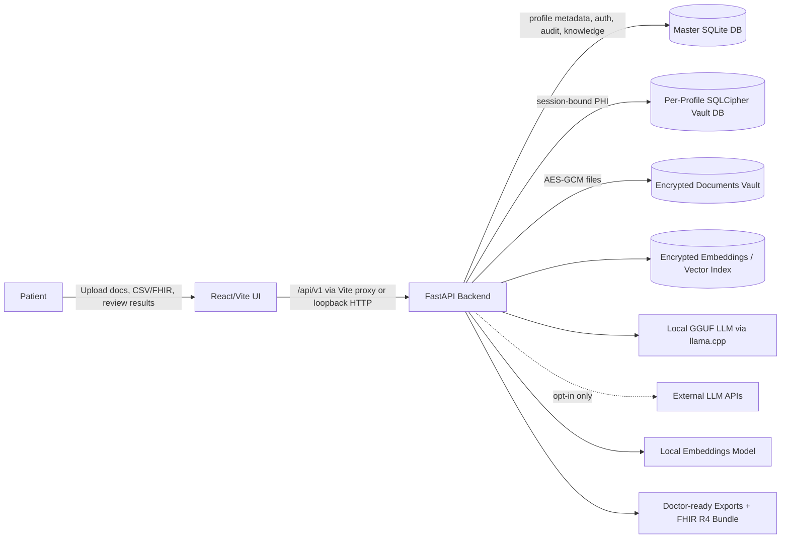
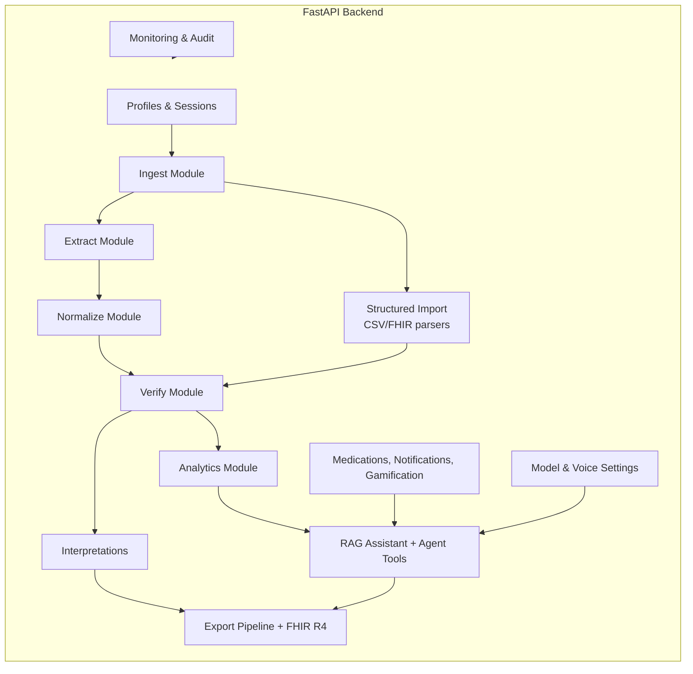
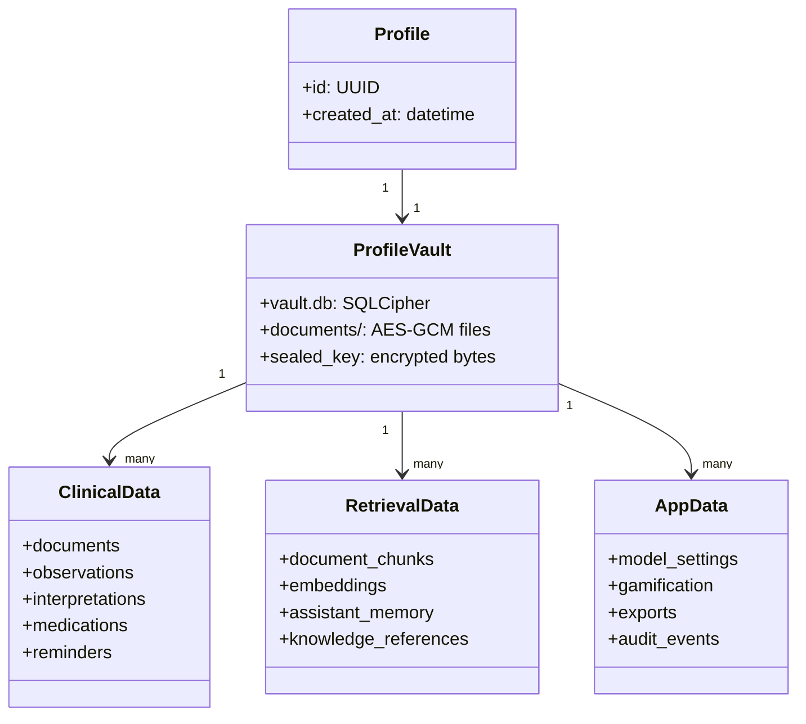
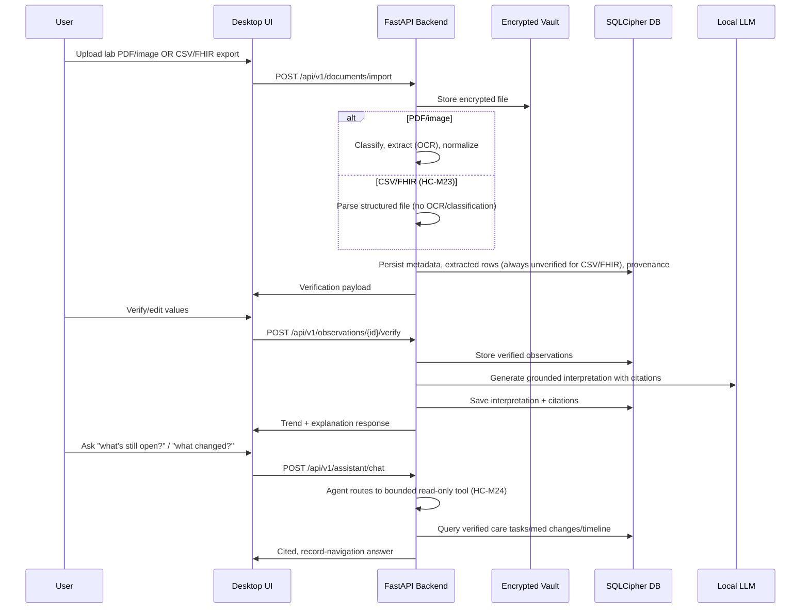

# HealthCentral

**Local-First Medical Results Companion**

A privacy-first desktop application for patients to import medical documents, extract structured information with user verification, visualize trends, and generate grounded explanations with citations.

## Overview

HealthCentral helps patients:
- **Import** lab PDFs, medical documents, and CSV/FHIR R4 exports from other systems into a secure local vault
- **Extract & Verify** structured data with human-in-the-loop verification — structured (CSV/FHIR) imports always land unverified, and medication mentions become reconciliation suggestions, never direct tracker mutations
- **Visualize** longitudinal trends with reference range context
- **Understand** results via grounded explanations with citations (local RAG), including bounded read-only questions about open follow-up tasks, medication changes, and record timeline
- **Export** doctor-ready summaries, discussion prompts, and a verified-only, redacted FHIR R4 bundle for other systems

## Core Principles

- **Local-First**: All data stays on your device by default
- **Privacy-First**: Encrypted at rest; no network calls required
- **Grounded Outputs**: Every claim cites user documents or curated references
- **Conservative Behavior**: Prefer "insufficient information" over speculation
- **No Medical Advice**: Education only; no diagnosis or treatment recommendations

## Project Structure

```
HealthCentral/
├── docs/                      # Architecture and feature documentation
│   ├── api/                   # API endpoint documentation
│   ├── user/                  # User guides, workflows, FAQ
│   ├── compliance/            # HIPAA, data privacy, audit checklist
│   ├── features/              # Feature architecture + active task list
│   └── model_tiers/           # AI model tier documentation
├── src/
│   ├── backend/              # Python FastAPI backend
│   │   ├── api/              # API routes and endpoints
│   │   ├── core/             # Core config, security, database
│   │   ├── models/           # SQLAlchemy database models
│   │   ├── modules/          # Feature modules (ingest, RAG, etc.)
│   │   ├── monitoring/       # Metrics, correlation IDs, timing
│   │   ├── security/         # Input validation, rate limiting, headers
│   │   ├── scripts/          # Backup, migrations, model management
│   │   └── tests/            # Backend test suites
│   └── frontend/             # React + Vite + TypeScript
│       ├── src/
│       │   ├── components/   # Reusable UI and feature components
│       │   ├── pages/        # Routed application screens
│       │   ├── services/     # API client and React Query hooks
│       │   └── stores/       # Zustand auth/session state
│       └── e2e/              # Playwright/browser verification specs
├── config/                   # Configuration templates (.env.example)
├── data/                     # Local data directory (gitignored)
├── models/                   # Local AI models (gitignored)
└── scripts/                  # Build and utility scripts
```

## Architecture Diagrams

The two highest-level views are kept inline below. The full set — request
lifecycle and middleware chain, module dependency direction, dual-database and
dual-migration data architecture, the document→insight pipeline, the agent
graph and its guardrails, the safety/privacy control-flow, frontend structure,
and the CI gates — lives in
**[`docs/architecture/`](docs/architecture/README.md)** (13 mermaid diagrams),
alongside an honest
[performance & scalability review](docs/architecture/performance-scalability-review.md).

### High-Level System Context



### Backend Component View



Request flow is also part of the architecture: CORS, correlation IDs, security headers, rate limiting, input validation, security audit logging, and timing middleware wrap the mounted API routes. The live router inventory is maintained in [`docs/api/endpoints.md`](docs/api/endpoints.md); [`docs/05_backend_integration_status.md`](docs/05_backend_integration_status.md) is historical audit context only.

### Core Data Model (UML)



The UML above is a domain map, not a table catalog. The live model layer includes documents, observations, interpretations, knowledge/chunks/embeddings, medication adherence, notifications, memory, model settings, document categories/entities, exports, audit events, and gamification.

### Document-to-Insight Sequence



## Technology Stack

### Current
- **Backend**: Python 3.11+ with FastAPI
- **Database**: SQLite master DB plus per-profile SQLCipher vault DBs
- **Document Vault**: AES-GCM encrypted files under per-profile vault directories
- **Vector/Retrieval**: FAISS/vector embeddings plus local curated reference content
- **Local LLM**: llama-cpp-python with GGUF models
- **Optional External LLMs**: OpenAI/Anthropic-compatible runners behind opt-in model settings and redaction checks
- **Embeddings**: sentence-transformers models such as bge/e5 tiers
- **Frontend**: React + Vite + TypeScript
- **Frontend State/Data**: React Router, TanStack Query, and Zustand

### Scalability posture

The meaningful scaling axis here is **one person's record growing over years**,
not concurrent users — this is a local-first desktop application by design, and
moving inference or storage off-device would break the guarantee the product
exists to make.

What that means in practice, with the current known limits and where they bite,
is written up in
[`docs/architecture/performance-scalability-review.md`](docs/architecture/performance-scalability-review.md).
The short version: search rebuilds its FTS index per query (the first thing to
degrade as documents accumulate), a few generated-export stores are held in
memory without a TTL, and LLM inference is deliberately in-process and blocking.
The review also lists what this system explicitly does *not* need, so nobody
adds a caching tier or a vector database to a single-user desktop app.

Any future web or multi-user deployment would be a different product with a
different privacy model; the shared API layer makes it *possible*, not planned.

## Documentation Source of Truth

1. `README.md` (this file — repo entrypoint)
2. `docs/api/endpoints.md` (exact mounted API route inventory and auth requirements)
3. `docs/00_architecture_plans_index.md` (full documentation index; see also `docs/roles/00_roles_index.md` for a domain-based entry point)
4. `docs/features/TASK_LIST.md` (active remaining-work tracker)
5. `docs/05_backend_integration_status.md` (Historical Reference — Sprint 06 snapshot retained for audit context only)

For backend architecture detail specifically, see [`docs/01_backend_architecture_plan.md`](docs/01_backend_architecture_plan.md)
(reachable via the architecture index and [`docs/roles/backend-api.md`](docs/roles/backend-api.md)).

To validate docs ownership, required sections, canonical-order consistency, and historical-doc
classification locally, run `python3 scripts/docs_lint.py` (add `--link-graph` to also regenerate
`docs/_link_graph.json`).

## SQLCipher Setup (Required for Database Encryption)

HealthCentral uses SQLCipher for encrypted per-profile databases. Each user profile has its own AES-256 encrypted SQLite database.

### Installation

#### Windows (Recommended: pre-built wheel)
```powershell
pip install sqlcipher3-binary
```

#### Linux (Debian/Ubuntu)
```bash
sudo apt-get install libsqlcipher-dev
pip install sqlcipher3-binary
```

#### macOS
```bash
brew install sqlcipher
pip install sqlcipher3-binary
```

### Verify Installation
```python
import sqlcipher3
conn = sqlcipher3.connect(":memory:")
cursor = conn.cursor()
cursor.execute("PRAGMA cipher_version")
print(cursor.fetchone())  # Should print ('4.x.x',)
```

### Development Without SQLCipher
If you cannot install SQLCipher, set in `.env`:
```
DATABASE_ENCRYPTION_REQUIRED=false
```
**WARNING:** Profile databases will be unencrypted. Never use in production.

## Database Migrations

HealthCentral uses **Alembic** for database schema migrations with a dual-environment setup:

- **Master database**: Profiles, audit logs, knowledge base (unencrypted)
- **Profile databases**: Per-user SQLCipher encrypted vaults

### Running Migrations

```powershell
cd src\backend

# Run master database migrations
python -m scripts.migrate master

# Check migration status
python -m scripts.migrate status

# Run profile migrations (requires password)
python -m scripts.migrate profile --profile-id <uuid>
```

### Safe Rollout
The migration system includes **baseline detection**:
- Existing databases without `alembic_version` are stamped (not migrated)
- This prevents "table already exists" errors on existing installations
- New installations get full schema creation via migrations

Migrations run automatically:
- Master migrations run on application startup
- Profile migrations run when a vault is opened

## Getting Started

### Prerequisites
- Python 3.11+
- Node.js 22+ (for frontend; Node.js 24 LTS recommended)

### Quick Start (Recommended)

The easiest way to start development is using the included dev script:

```powershell
# From the project root directory
.
\dev.bat

# Or directly with PowerShell
.
\dev.ps1
```

This script automatically:
- Checks for Python and Node.js installations
- Creates a Python virtual environment if needed
- Installs all dependencies (pip and npm)
- Creates the data directory structure
- Resolves the next free backend/frontend ports if defaults are busy
- Syncs `src/frontend/.env.local` with the resolved backend API URL
- Starts both backend and frontend servers

Default URLs when the standard ports are free:
- **Frontend**: http://localhost:3000
- **Backend API**: http://localhost:8000
- **API Documentation**: http://localhost:8000/docs

If a port is busy, use the resolved URLs printed by `dev.ps1` / `dev.bat`.

Press `Ctrl+C` to stop both servers.

### Supported Local Verification Bootstrap (WSL/Linux)

Use the WSL/Linux bootstrap path below to create the verifier environment that the repo-root proof bundle expects. Run every command from the repository root.

```bash
python3 --version
node --version

python3 -m venv .wsl-pytest-venv
./.wsl-pytest-venv/bin/python -m pip install --upgrade pip
./.wsl-pytest-venv/bin/python -m pip install -r src/backend/requirements.txt
npm --prefix src/frontend install

python3 scripts/docs_lint.py
npx --prefix src/frontend tsc --noEmit -p src/frontend/tsconfig.json
PYTHONPATH=src/backend ./.wsl-pytest-venv/bin/python -m pytest src/backend/tests/test_bootstrap_check.py -q
```

What this bootstrap proves:
- docs drift checks run from repo root;
- the frontend type-check works with the checked-in `src/frontend/tsconfig.json`;
- the backend pytest environment can import project dependencies and keeps the production encryption default intact.

#### Bootstrap prerequisites and recovery notes

- **Python**: use Python 3.11+ and create the backend verifier environment from the same WSL/Linux interpreter you will use for pytest.
- **Node.js**: use Node.js 22+ (Node.js 24 LTS recommended) so `npx --prefix src/frontend ...` resolves the frontend toolchain correctly.
- **SQLCipher**: if `pip install -r src/backend/requirements.txt` fails around `sqlcipher3-binary` on Debian/Ubuntu, install `libsqlcipher-dev` first, then retry the pip install.
- **OCR packages**: `tesseract-ocr` and PDF/image system libraries are required for OCR-heavy backend tests and runtime features, but the bootstrap smoke test above does not depend on them.

#### Windows / WSL caveats

- If you are inside WSL, create and use the virtualenv from WSL (`python3 -m venv .wsl-pytest-venv`). Do **not** activate a Windows-created virtualenv from `/mnt/c/...`; compiled wheels can mismatch architecture.
- The repo's recorded backend proof commands assume the repo-root interpreter path `./.wsl-pytest-venv/bin/python`. If that environment is missing, recreate it with the commands above instead of changing the command paths.
- `npx --prefix src/frontend tsc --noEmit -p src/frontend/tsconfig.json` is the supported local frontend verification command for mounted WSL checkouts. If broader frontend tests stall on an NTFS-mounted repo, run them from a Linux-native filesystem.

### Current Contributor Proof Bundle

After the bootstrap succeeds, this is the maintained repo-root proof bundle for the current assistant-category and hygiene surface:

```bash
python3 scripts/repo_hygiene_check.py
python3 scripts/docs_lint.py
npm --prefix src/frontend run test:run -- src/__tests__/ExplainAssistant.test.tsx
npx --prefix src/frontend playwright test --config src/frontend/playwright.config.ts src/frontend/e2e/assistant.spec.ts --grep "category"
PYTHONPATH=src/backend ./.wsl-pytest-venv/bin/python -m pytest src/backend/tests/test_bootstrap_check.py src/backend/tests/security/test_password_hashing.py src/backend/tests/test_repo_hygiene_check.py
```

What this proves:
- no disallowed root scratch markdown/report artifacts are present before merge-sensitive work;
- docs follow the current historical-reference ownership rules;
- the Explain Assistant document-category filter is covered at both component and browser level;
- the supported backend proof bundle catches bootstrap, password-hashing, and repo-hygiene regressions from the same repo-root WSL interpreter path.

### Full UI verification (optional)

- **Browser MCP (manual):** Step-by-step sweep and report template in [`src/frontend/e2e/BROWSER_MCP_PLAYBOOK.md`](src/frontend/e2e/BROWSER_MCP_PLAYBOOK.md).
- **Playwright (real PDF on disk):** Set `HC_E2E_REAL_PDF` to an absolute path, or on Windows rely on the default path documented in [`src/frontend/e2e/ui-full-verification.spec.ts`](src/frontend/e2e/ui-full-verification.spec.ts). Then from `src/frontend`:

```bash
npx playwright test --config playwright.config.ts --project real-pdf-local
```

CI runs the **`chromium`** project only (`npx playwright test --project chromium`), so the real-PDF suite is opt-in locally.

### Local-only artifact hygiene

Use the following repo-hygiene rules whenever you are about to interpret `git status`, perform an audit, or do pre-merge cleanup:

- `.bg-shell/` and `.wsl-pytest-venv/` are local-only helper directories. They should stay gitignored and should not be treated as shared project changes.
- Root scratch markdown and ad-hoc generated reports such as `PLAN.md`, `HANDOFF-*.md`, and `*_report*.md` are **not** broadly ignored on purpose. Clean them up or move them elsewhere before dirt-sensitive work.
- Run `git status --short` before release-oriented or status-sensitive work. If unexpected local-only files appear, clear them first instead of normalizing them into the repo.
- Use the contributor checklist in `CONTRIBUTING.md` when you need a repeatable pre-merge hygiene pass.

### Manual Installation

If you prefer manual setup beyond the verification bootstrap above:

```bash
# Clone repository
git clone https://github.com/your-org/HealthCentral.git
cd HealthCentral

# Backend setup (Linux/WSL)
python3 -m venv ~/venvs/healthcentral-backend
source ~/venvs/healthcentral-backend/bin/activate
python -m pip install --upgrade pip
python -m pip install -r src/backend/requirements.txt

# Frontend setup
npm --prefix src/frontend install
```

```powershell
# Backend setup (Windows PowerShell)
python -m venv .venv
.
\venv\Scripts\Activate.ps1
python -m pip install --upgrade pip
python -m pip install -r src/backend/requirements.txt

# Frontend setup
npm --prefix src/frontend install
```

### Manual Development

```bash
# Terminal 1: Start backend
cd src/backend
venv\Scripts\activate
uvicorn main:app --reload --host 127.0.0.1 --port 8000

# Terminal 2: Start frontend
cd src/frontend
npm run dev
```

## Documentation

### For Users
- [Getting Started](docs/user/getting-started.md)
- [Workflows](docs/user/workflows.md)
- [Troubleshooting](docs/user/troubleshooting.md)
- [FAQ](docs/user/faq.md)

### For Developers
- [API Documentation](docs/api/README.md)
- [Live API Endpoints (source of truth)](docs/api/endpoints.md)
- [Backend Integration Status (Historical Reference)](docs/05_backend_integration_status.md)
- [Backend Architecture](docs/01_backend_architecture_plan.md)
- [Documentation Index](docs/00_architecture_plans_index.md)

### Compliance & Operations
- [HIPAA Controls](docs/compliance/hipaa-controls.md)
- [Data Privacy](docs/compliance/data-privacy.md)
- [Disaster Recovery](docs/compliance/disaster-recovery.md)
- [Audit Checklist](docs/compliance/audit-checklist.md)

## Agent Overhaul — planning package

The `agent-overhaul` workstream promotes the single-shot `/assistant/` RAG explainer
into a read-only, governed plan→act→reflect agent (behind the `agent_enabled` flag,
default OFF). Planning artifacts and code scaffolds live alongside the code:

- **PRD:** [docs/prd/PRD_agent_overhaul.md](docs/prd/PRD_agent_overhaul.md)
- **Agile plan / cadence:** [AGILE_PLAN](docs/agile/AGILE_PLAN.md) ·
  [STANDUP](docs/archive/agile/STANDUP.md) · [RETRO](docs/archive/agile/RETRO.md) ·
  [RELEASE_CHECKLIST](docs/agile/RELEASE_CHECKLIST.md)
- **Grounding:** [GROUNDING](docs/agile/GROUNDING.md) ·
  [EXPLORATION_SUMMARY](docs/archive/agile/EXPLORATION_SUMMARY.md) ·
  [RECONCILIATION](docs/archive/agile/RECONCILIATION.md)
- **Audience expectations:** [main vs branch](docs/archive/agile/audience_expectations_main_vs_branch.md)

### Skill ↔ Epic ↔ Phase ↔ Sprint map

| Skill (`skills/`) | Epic | Phase doc | Sprint doc(s) | Release |
|---|---|---|---|---|
| [healthcentral-agent](skills/healthcentral-agent/SKILL.md) | E1 Agent Core | [P0](docs/archive/prd-phases/PHASE_0_foundation.md) · [P1](docs/archive/prd-phases/PHASE_1_first_tool.md) · [P2](docs/archive/prd-phases/PHASE_2_loop.md) | [S0](docs/archive/agile-sprints/SPRINT_0.md) · [S1](docs/archive/agile-sprints/SPRINT_1.md) · [S2](docs/archive/agile-sprints/SPRINT_2.md) | R1 |
| [healthcentral-guardrails](skills/healthcentral-guardrails/SKILL.md) | E2 Guardrails | [P3](docs/archive/prd-phases/PHASE_3_guardrails.md) · [P4](docs/archive/prd-phases/PHASE_4_phi_gate.md) | [S3](docs/archive/agile-sprints/SPRINT_3.md) · [S4](docs/archive/agile-sprints/SPRINT_4.md) | R2 |
| [healthcentral-backend](skills/healthcentral-backend/SKILL.md) | E4 LLMOps + E5 Cutover | [P5](docs/archive/prd-phases/PHASE_5_cutover_cache.md) | [S5](docs/archive/agile-sprints/SPRINT_5.md) | R2 |
| [healthcentral-evals](skills/healthcentral-evals/SKILL.md) | E3 Evals | [P6](docs/archive/prd-phases/PHASE_6_evals_ci.md) | [S6](docs/archive/agile-sprints/SPRINT_6.md) | R3 |
| — (uses evals + backend) | E6 Fine-tuning (stretch) | [P7](docs/prd/phases/PHASE_7_lora_stretch.md) | [S7](docs/agile/sprints/SPRINT_7.md) | R3 |

Code scaffolds (stubs, flag OFF) live under `src/backend/modules/agent/`; eval/test
scaffolds and golden fixtures under `src/backend/tests/agent/`.

## API Overview

HealthCentral exposes a REST API via FastAPI at `http://localhost:8000/api/v1`. Interactive docs are available at `http://localhost:8000/docs`.

| Group | Endpoints | Description |
|-------|-----------|-------------|
| **Profiles** | `/profiles/` | Create, list, log in to, unlock, lock, and manage encrypted user profiles |
| **Documents** | `/documents/` | Import PDFs/images or CSV/FHIR structured files (HC-M23, always unverified), list, classify, inspect extracted entities, render page images, delete |
| **Observations** | `/observations/` | List, verify, trend analysis, panel grouping |
| **Interpretations** | `/interpretations/` | Observation and panel interpretation plus biomarker knowledge lookup |
| **Assistant** | `/assistant/` | RAG chat with citations, glossary, verification status, and bounded read-only agent queries over care tasks/medication changes/timeline (HC-M24) |
| **Memory** | `/memory/` | Persistent assistant memory CRUD per profile |
| **Medications** | `/medications/` | CRUD, schedules, dose logging, adherence stats, pattern learning |
| **Gamification** | `/gamification/` | Badge inventory plus profile streak summaries |
| **Notifications** | `/notifications/` | Reminder settings, history, test sends, scheduler status, interaction logging |
| **Export** | `/export/` | CSV/JSON export, doctor summary, discussion questions, verified-only redacted FHIR R4 bundle export/download (HC-M22) |
| **Model Settings** | `/settings/model` | Model tier selection, downloads, external API config, timezone, and voice preferences |
| **Monitoring** | `/health`, `/monitoring/` | Health check and authenticated metrics dashboard |

Exact path-level API **source of truth**: [docs/api/endpoints.md](docs/api/endpoints.md).
`docs/05_backend_integration_status.md` is a **Historical Reference** that preserves the Sprint 06 snapshot and audit context, not the live API tracker or part of the canonical ownership/freshness policy.

For full endpoint details, see [API Documentation](docs/api/endpoints.md).

## Implementation Progress

See [docs/features/TASK_LIST.md](docs/features/TASK_LIST.md) for the active remaining-work tracker.

## License

[TBD]

## Disclaimer

This application is for informational and educational purposes only. It does not provide medical advice, diagnosis, or treatment recommendations. Always consult with qualified healthcare professionals for medical concerns.
