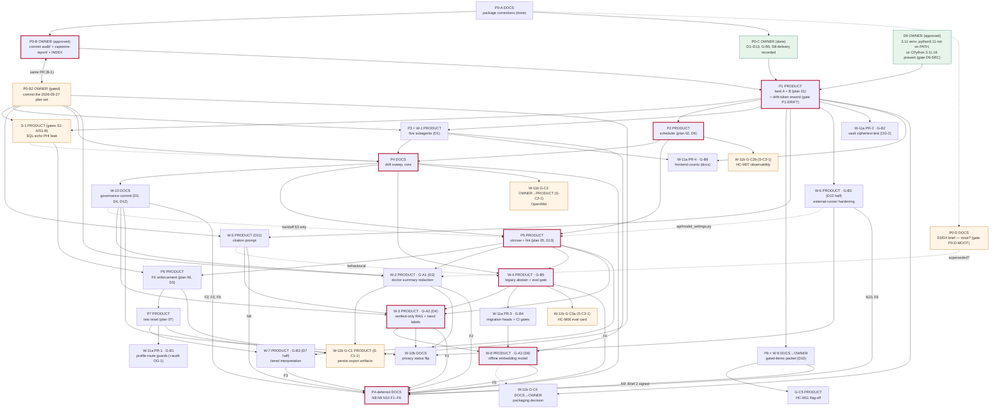

# Wave 3a — Integration audit: file collisions, dependency order, gates, ask-first

**Verdict:** 5 BLOCKER, 12 MAJOR, 13 MINOR. The plan set is not executable end to end as written. All 5 blockers are fixable with doc or plan edits plus 2 owner answers. None needs a code change.
**Scope:** the 14 plans `docs/plans/2026-09-27-*.md` (W01–W08, W10, W11a, W11b, P04, P08, S01) and audit plans 01, 02, 05, 06, 07.
**Refs:** main@40f590e, B@7b2ff1f, A@692fdf3. The repo was read-only throughout: `git status --porcelain` printed 19 lines before and 19 after.
**State labels in this file:** *proposed* (written in a plan, not approved), *owner-approved* (quoted from `owner-decisions-2026-09-27.md`), *owner-gated* (waiting on an unsigned line). Nothing below is implemented.

---

## 0. Findings

### BLOCKER (5)

| # | Location | Cause | Evidence | Fix |
|---|---|---|---|---|
| B-1 | `docs/capstone-report/owner-decisions-2026-09-27.md:46` (edited 2026-09-27 20:50 -0700) | The P0-B package now links to an **untracked** plan: `[W-8 plan](../plans/2026-09-27-W08-bundled-embedding-model.md)`. The P0-B approval covers only "INDEX.md + the audit/ and capstone-report/ package". A clean P0-B worktree therefore lacks the link target, and `docs_lint.py` DOC-007 fails ("Relative markdown links in docs must resolve to an existing file", `scripts/docs_lint.py:18`). P0-B's own acceptance is "Docs lint passed." | `grep -rnoE "\]\([^)]*2026-09-27-[A-Za-z0-9-]+\.md" docs/capstone-report audit` → the only link into `docs/plans/2026-09-27-*` is `owner-decisions…:46`. `stat` → mtime 20:50:35 | Owner answers **P0-B2** (new gate): commit the 2026-09-27 plan set in the **same PR** as P0-B. Fallback: turn `:46`'s link into an inline-code path. |
| B-2 | `modules/rag.py` order | The plans state contradictory orders. W-8 `:167`: "P5 → W-3 (`:322-328`) → W-5 (`:120-132`) → W-4 → **W-8**". W-3 `:177`: "**W-5 and W-4 before W-3**". W-3 stop gate 5 (`:1312`): STOP if "W-4 or W-5 has not landed". | grep lines quoted | Edit W-8 `:167` to read "W-5 (`:123-140`) → W-3 (`:323-332`, `:549-553`) → **W-8** (W-4 does not edit rag.py)". W-5 accepts either order (`W05:137`), so W-5 → W-3 → W-8 contradicts nothing. |
| B-3 | `.github/workflows/ci.yml` + `docs/architecture/ci-and-quality-gates.md` | The two single-PR plans state opposite orders. W-8 `:169`, on ci.yml: "P1 → P5 → G-B4 / W-4 → **W-8**", so W-11a PR-3 → W-8. W-11a `:181`, on ci-and-quality-gates.md: "P4 → W-8 (`:58`) → **W-11a Task 9**", so W-8 → W-11a PR-3. Each PR is atomic, so both orders cannot hold. | grep lines quoted | Canonical order: **W-4 → W-11a PR-3 → W-8** for both files. Edit W-11a `:181` to "P4 → W-11a Task 9 → W-8 (`:58`)". Edit P04 `:169` to "P4-core N6 → W-11a Task 9 → W-8 (`:58`) → F4". |
| B-4 | Collected-count slots in `CLAUDE.md` / `AGENT.md` | Plans 05, 06, 07 and W-6 add tests without updating the collected slots. Plan 05 Task 1 adds HC-TIME-001…004 (`05:56-91`), and none of its `git add` lines names CLAUDE.md or AGENT.md (`05:104-458`). Plan 06 adds 3 test files (`06:76,249,308`). Plan 07 adds `test_profile_test_reset.py` (`07:392`). W-6 adds +17 (`W06:1062`) and declares "`CLAUDE.md` \| W-10 only \| W-6 never edits it" (`W06:175`). Three phases then STOP on a stale slot: S-1 `:278`, W-2 `:323` ("If a figure in `COLLECTED_SLOTS` ≠ N0, **STOP**") and P08 `:238`. W-2 starts after P5, so it **will** stop. | grep lines quoted | Add one ground rule to the program (§5.4): every phase that changes collection updates the collected slots in the same commit. Put banners on plans 05, 06, 07. Add a count-slot carve-out to W-6 (commits 1–3 add `CLAUDE.md AGENT.md`, as W-2 does). |
| B-5 | P1 acceptance, plan 01 `:376`, `:495` | Plan 01 expects `harness_drift_check.py` to exit 0 on the merged tree. Its resolution rule for `recurring-failures.md` is "Union — keep ALL four additions" (`01:69`), which keeps A's `:33` token `` `GET /profiles/` ``, and the checker flags it. W-1 forbids editing the checker (W-1 "Does NOT license" #9), and no plan owns this fix. P1 is the root of the critical path. | Reproduced: `git archive 7b2ff1f` into scratch, run `python3 scripts/harness_drift_check.py` → `Harness drift check passed.`, `drift=0`. Then overwrite `docs/agentic/recurring-failures.md` with A's copy → `ERROR: docs/agentic/recurring-failures.md:33: missing path '/profiles/'`, `drift=1` | Owner gate **P1-DRIFT** (new): during P1's conflict resolution, reword the token in the already-conflicted `recurring-failures.md`, for example `GET /profiles` or "the list route". Add "`harness_drift_check.py` exits 0" to P1's measured acceptance. |

### MAJOR (12)

| # | Location | Cause → effect | Fix |
|---|---|---|---|
| M-1 | W-4 `:162` vs `:148`, `:152`; Task 0 (`:207-213`) | §5 says "Not dependent on W-3, W-5, W-6, W-7 or P2–P8". Its own shared-file table says ci.yml is "P1 → P5 → W-4" and evals.md comes "after P4". Task 0 checks only P1 ancestry. An executor could start W-4 before P4/P5 and collide on both files. W-8 `:169` and W-11a `:180` also assume P5 → W-4. | Add P4 and P5 ancestry checks to W-4 Task 0. Optional owner gate **W4-EXPEDITE**: land W-4 before P4/P5 because of its raised patient priority. P5 and P4 Task 1 would then rebase. |
| M-2 | `docs/capstone-report/*` | Edit policy is split. W-1, W-4, W-8 and W-11a edit capstone rows. W-2, W-3, W-5, W-6, W-7, W-10 and S-1 only report changes. On the same line: W-4 `:151`/`:1256` "Do not recount the scorecard (`:31`); tell the orchestrator", while W-8 `:1299` says "Recount the scorecard line." | Program rule (§5.2): plans edit only their own named rows, serially. The scorecard line and cross-row text belong to the orchestrator. Strike "Recount the scorecard line" from W-8 `:1299`. |
| M-3 | W-10 r3 (§1.2, Q2 "n/a") vs W-6 Q2 (`W06:1154`) | W-10 now calls the break-glass clause in `CLAUDE.md:60` (hunk C-2) and DP-4 "licensed by D12". W-6 still lists it as an unsigned owner question. D12's "Amend CLAUDE.md to name **the exception**" refers to the ModelRunner exception. Naming break-glass as an exception to "Redaction before anything leaves" is an inference. The scope rule says "Anything wider is still owner-gated." | Merge both into one owner gate, **GOV-BG**, default "include". W-10 keeps C-2's clause only once GOV-BG is signed; otherwise it states the D12 conditions without calling break-glass an exception. |
| M-4 | W-1, W-2, W-5 dependencies | Each plan commits into its **own untracked plan file** (W-1 Execution record; W-2 commit 4, `W02:1438`; W-5 commit 2, `W05:841`), yet none lists P0-B2. W-2's dependency table (`W02:144-155`) omits P0-B too; only its header (`W02:10`) names it. In a clean worktree the file is absent. | Add P0-B2 to each Task 0 (`git ls-files docs/plans/2026-09-27-W0N-*.md`). |
| M-5 | plan 06 (unchanged) × `src/backend/tests/test_care_tasks.py:809,825` | Both lines assert `== "012_pinboards"`. Plan 06's migration `013` moves the head, but plan 06 does not list the file, so P6 hits an unexplained failure and STOPs. Found by W-11b F-4. | `sed -n 800,828p …test_care_tasks.py` → `== "012_pinboards"` at relative lines 10 and 26. Add a plan 06 banner: Task 2 updates both literals to `013_fk_cascade_alignment`. Then G-C1 updates them again to `014`, as W-11b already plans. |
| M-6 | Embedding revision gate | `owner-decisions:46` says the "exact model revision [is] still owner-gated in the W-8 plan (Q-FC, revision pin)". W-8's sign-offs are Q-FC, Q-HASH, Q-OFFLINE and Merge only (`W08:1366-1384`); there is no revision-pin line. W-11b S-C4-5 says the revision "must match whatever W-8's own sign-off selects". | Add one owner gate, **EMB-REV**, to W-8: `all-MiniLM-L6-v2@1110a243fdf4706b3f48f1d95db1a4f5529b4d41`. It must be signed before W-8 merges, and W-11b S-C4-5 cites it. |
| M-7 | Orphan owner questions | 1. W-3 O-3 routes to W-7, which has no matching gate. 2. W-3 O-4 (misleading "upload documents" text) routes to W-4, but W-4 forbids new wording and has no gate for it. 3. W-7 OG-3 (6 unaudited interpretation routes) routes "under G-B1/W-11", but W-11a's scope is profile routes only. | Register **INTERP-UNVERIFIED**, **MSG-UNVERIFIED** and **AUD-INTERP** as standalone program owner items (§3.3). |
| M-8 | W-8 Q-FC × W-3 O-1 × W-4 §3 T2 | W-8's default fail-closed form sends legacy chat to the knowledge fallback (`W08:121`). That fallback's `_fetch_latest_obs` has no `user_verified` filter (W-4 `:111`, W-3 O-1), so it cites unverified values with `[cite:N]`, against D4. It happens whenever O-1 is unsigned. | Decide Q-FC and O-1 together as **VERIFIED-FALLBACK**. Recommended: O-1 = yes before W-8 merges. |
| M-9 | W-6 `api/model_settings.py` | The file holds API-key encryption (`encryption_manager.encrypt(`, B@7b2ff1f `:745`; `ProfileEncryptionManager` import `:22`). W-6 §1 `:34` says the new field "is listed for the owner's confirmation in §11", but no §11 row asks about it. Q4 names only `external_runner.py` and `test_redaction.py`. | Widen W-6 Q4: "…and the response-model field in `api/model_settings.py:208-213` (outside the encryption handler `:729-748`)". |
| M-10 | P7 edits `api/profiles.py` (imports `:52-72`, the reset endpoint `:498-532`) | P7 has no owner gate. For edits to the same file, W-11a OG-1 and program G-B1 require one ("auth-adjacent: tests only unless the owner approves route edits"), and P5 needed D13. The file holds login, unlock, change-password and recovery. | Add an owner line **P7-ROUTE** to P7 (default yes). The route is test-only: production → 404, name prefix → 403. |
| M-11 | Count slots serialize ~18 phases | Nearly every PRODUCT phase edits the same two count lines, so merges are strictly serial even when development can run in parallel (§2.4). Plan 01 Task 4 Step 2 also writes "`N-1` for the 'without an embedding model' figure" (`01:288`), a collected-derived number in a pass slot. The GLOBAL baseline rule in W-1/W-2/W-4/W-8/W-11a/W-11b forbids that. | Ground rule §5.4. Plan 01 banner: write only the collected number, and leave the pass sentence as it is and flag it. |
| M-12 | D9 | The handoff (`handoff:85`) says "`python3.11 -m venv` … If `python3.11` is missing, report that and ask." W-11a `:191` says no python3.11 exists on this machine. Measured: `/usr/bin` has only 3.12, but `uv python list --only-installed` shows `cpython-3.11.16 … /home/danny/.local/share/uv/python/cpython-3.11-linux-x86_64-gnu/bin/python3.11`, which runs (`Python 3.11.16`). | Owner gate **D9-SRC**: confirm the uv-managed 3.11.16 as the D9 interpreter (`uv venv -p 3.11 ~/venvs/asclexis-311`). Correct the W-11a `:186` wording. |

### MINOR (13)

| # | Location | Issue |
|---|---|---|
| m-1 | W-8 `:167` | Cites W-5 at `:120-132`. The actual range is `:123-140` (W-5 F-1). Fixed together with B-2. |
| m-2 | W-11b `:259` | "P2 → {W-4, W-7} → G-C3b" on `main.py`. Neither W-4 (§4 files) nor W-7 (owned files) edits `main.py`. |
| m-3 | W-11b `:260` | "W-1 / P8 → G-C4" on `feature_list.json`. W-1 only reads it (`W01:669`), and P08 forbids editing it ("Does NOT license" #7). |
| m-4 | W-11b `:257` | "plan 05 edits `test_fhir_export.py`". Plan 05 only runs it (`05:333`). |
| m-5 | W-5 `:138` | Calls P4's FAQ task "plan 04 Task 8". It is Task 7 (P04 §3 row 7). The row also says W-3 may touch faq `:100-104`, but W-3 edits no docs. |
| m-6 | W-3 §5 (`:181-182`) | "types.ts: W-6 may also edit this file". W-6 edits `modelSettings.ts`, not `types.ts`. |
| m-7 | W-7 `:149` | Says W-4/W-6 may edit `api/interpretations.py`. Both list it as read-only. |
| m-8 | W-7 `:153` | "W-7 creates → W-6 extends" `test_llm_import_boundary.py`. W-6 §4.1 does not list it, so the C-LLM-2 HTTP-client remainder has no owner. |
| m-9 | `docs/features/TASK_LIST.md` placement | P08 `:113` puts its entry "at the top of `## Session Notes` (entries are newest first)". W-11a `:184` says "Append at the end". Use newest-first. |
| m-10 | P08 `:120`, program `:69` | List "G-A1" as a `data-privacy.md` editor. W-2 (G-A1) treats it as read-only. The file's editors are W-10 and W-10b only. |
| m-11 | P04 `:172`, W-8 `:164` | Their `core/config.py` / `.env.example` orders omit S-1. S-1 shifts the anchors by +4/+5 (S01 §Shared-file ordering). |
| m-12 | untracked `docs/plans/2026-09-27-nightly-doc-drift-routine-spec.md` | A 15th 2026-09-27 plan, and a DOC-011 orphan. `docs_lint.py` now fails with **7 errors**: the S01, W02, W04, W07, W11a, W11b and nightly-spec orphans. The P0-B2 scope must include it or exclude it explicitly. |
| m-13 | P04 finding 11 | Says W-10 `:52` still routes `CLAUDE.md:62` to P4. The current W-10 text (`:70`, `:1121`) already says "It does not go to P4", so the finding is stale. |

---

## 1. File-ownership matrix

**Method.** For each of the 19 plans I read the owned-file tables. I also extracted every `git add` / `git rm` / `git commit … --` pathspec with a script (`wave3/pathspecs.py`, 14 plans), including the W-11b `$P=` variable lists, and I grepped the commit lines of plans 01, 02, 05, 06 and 07. Files found only by the pathspec scan are marked ★.

### 1.1 Shared files (edited by ≥ 2 phases)

"Canonical order" is this audit's proposal. It holds only once B-2, B-3 and B-4 are fixed.

| File | Phases (hunk / lines, ref) | Stated orders (source) | Canonical order (proposed) | Flag |
|---|---|---|---|---|
| `CLAUDE.md` count slots (`:30,:35` main; B `:30-35`) | P1 (resolve), P2, S-1, W-1 (C1, C4), W-2 (c1, c2), W-3 (T1-3, 7), W-4 (c1, c2), W-5 (c1), W-7 (C1, C2), W-8 (6 commits), W-11a (PR-1/2/3), G-C1, G-C3a, G-C3b, P4 (only if mismatch); not updated by P5, P6, P7, W-6 | "never concurrent; each writes its own measured count" (program `:300`; every W plan) | serial at merge. The second PR to merge re-measures and rewrites its own count commits | **B-4**, M-11 |
| `CLAUDE.md` invariant text (`:25`, `:59-62`) | W-10 (C-1, C-2, C-3 if Q1, C-4 if Q3); W-8 Task 8 changes only the pass-count wording in the baseline bullet | P04 `:164`: "P1 → P2 → P3 → P4 (baseline only) → W-10 → P5"; W-10 §4 same; W-5 hands `:62` to W-10 | P1 → P4 → **W-10**; no other plan edits `:25`/`:59-62` | OK (GOV-BG, GOV-D11 gates) |
| `AGENT.md` (count `:57` main / `:76` B; asclexis-evals row; `:20` openwiki; Commands) | count: as for CLAUDE.md; rows: P4 T9, T13; W-8 Commands line; G-C2 `:20` | P04 `:163`: "P1 → P2 → P3/W-1 → P4-core → W-10 → W-8"; W-11b: "P4 T13 → G-C2" | P1 → P2 → W-1 → P4 → W-8; P4 → G-C2 | OK |
| `docs/features/TASK_LIST.md` | P2 (Session Notes), P4 T5R + T16, P5 T14, P6 T4, P7, P8 T7 (`:4`, `:153` top), W-11a (each PR), N8 (`:63` optional) | P04 `:165`: "P1 (A) → P2 → P4-core → N8 → later"; P08: edit only in T7 on a fresh main; W-11a: "append at end" | serial; newest-first entries | m-9 |
| `docs/capstone-report/specs-compliance-matrix.md` | W-1 (GATE-09, GATED-06, conditional), W-4 (SAFE-04, GATE-05), W-8 (LOCAL-03 + scorecard), W-11a PR-1 (ISO-02, AUD-02), PR-2 (KEY-02), PR-3 (MIG-02, GATE-03, GATE-07), PR-4 (GATE-03/06 counts) | W-4 `:151`: "one W plan at a time … scorecard belongs to the orchestrator"; W-11a `:182`: row-scoped, rebase | row-scoped, serial; scorecard `:31` = orchestrator only | **M-2** |
| `docs/capstone-report/architecture-engineering-contract.md` | W-1 (`.claude/agents` row, conditional), W-4 (C-SAFE-2), W-8 (C-LOCAL-1/2), W-11a (C-ISO-1, C-AUDIT-1, C-KEY-1, C-MIG-2, C-API-3) | as above | row-scoped, serial | M-2 |
| `docs/capstone-report/claims-ledger.md` | W-1 (H5, H6), W-8 (C10), W-11a PR-4 ★ | W-1 `:170`: "never concurrently" | W-1 → W-11a PR-4 → W-8 (any order, serial) | OK |
| `docs/capstone-report/architecture-overview.md` | W-8 (`:62,:69,:132`), W-11a PR-4 ★ | none stated | serial | OK |
| `docs/capstone-report/owner-decisions-2026-09-27.md` | none of the 19 plans (orchestrator only) | W-8 Task 0 Step 2: "ask the orchestrator" | orchestrator | B-1 (link) |
| `.github/workflows/ci.yml` | P5 (docs-lint step ~`:28`), W-4 (`legacy-evals` job after `:150-168` B), W-11a PR-3 (lint/build, coverage, backend-lint), W-8 (fetch step in backend-tests and e2e) | program `:69`: P1 → P5 → G-B3/G-B4; W-4 `:148`: P1 → P5 → W-4 → G-B; W-11a `:180`: P5 → W-4 → W-11a; W-8 `:169`: G-B4/W-4 → W-8 | P1 → P5 → W-4 → W-11a PR-3 → W-8 | **B-3**, M-1 |
| `docs/architecture/ci-and-quality-gates.md` | P4 N6 (`:17,:19,:44,:45`), W-8 (`:58`), W-11a PR-3 (Task 9), P4 F4 | P04 `:169`: N6 → W-8 → F4; W-11a `:181`: P4 → W-8 → W-11a (soft) | P4 N6 → W-11a PR-3 → W-8 → F4 | **B-3** |
| `src/backend/modules/rag.py` | W-5 (`:128,:133,:134` in `SYSTEM_PROMPT` `:123-140`), W-3 (`:323-332` obs select; `:549-553` vector stmt, Task 3), W-8 (Task 5: query embed in `_search_vectors_async` `:515+`; Task 7: model-name filter on the same stmt) | W-3 `:177`: W-5, W-4 → W-3; W-5 `:136`: either order with W-3; W-8 `:167`: W-3 → W-5 → W-4 → W-8 | W-5 → W-3 → W-8 (W-3 and W-8 share the `_search_vectors_async` statement: a real hunk dependency) | **B-2** |
| `src/backend/api/assistant.py` | W-4 (3 imports; helper after `get_rag_module()` B `:203-216`; call after `rag.query` B `:826`), W-3 T7 (`_fetch_latest_obs` where, B `:1337-1341`, only if O-1) | W-4 `:145`: P1 → W-4 → W-3; W-3 `:176`: P1 → W-4 → W-3 | P1 → W-4 → W-3 | OK |
| `src/backend/api/profiles.py` | P5 T4 (utcnow in `create_profile`/`login`/`unlock_profile`/`change_password`; D13), P7 (imports `:52-72`, const after `:82`, endpoint `:498-532`), W-11a T2 (audit calls, OG-1), G-C1 (tuple line + docstring `:799-803`, S-C1-2) | program `:69`: P5 → P7 → G-B1; W-11a `:178`; W-11b `:254` | P5 → P7 → {W-11a PR-1, G-C1}, never concurrent | M-10 |
| `src/backend/tests/support/routes.py` | P7 (adds `profile_name`, `profile_db`), W-11a PR-1 (adds `real_auth=False`) | program: P7 → G-B1; W-11a `:179` | P7 → W-11a PR-1; W-2/W-3/W-4/W-7/W-8/G-C1 read it | OK |
| `src/backend/core/config.py` | S-1 (+4 after `debug` B `:28`), P4 N7 (comment B `:108`), W-8 (`embedding_model_path` near B `:111-112`) | S-1: P1 → S-1 → P4 → W-8; P04: P1 → P4 → W-8; W-8: P1 → P4 → W-6(if) → W-8 | P1 → S-1 → P4 → W-8 | m-11 |
| `config/.env.example` | S-1 (after `:14`), P4 OG-4 (`:92-99`, gated), W-8 (`:82-84`) | S-1: S-1 → P4 T3 → W-8; W-8: P4 T3 → W-8 | P1 → S-1 → P4 (OG-4) → W-8 | OK |
| `src/backend/core/database.py` | S-1 (`:46` echo; +1 hide_parameters), P6 (listener after ~`:48`) | S-1: P1 → S-1 → P6 | P1 → S-1 → P6 | OK (S-1 gated) |
| `src/backend/core/profile_database.py` | S-1 (`:308` inside `create_async_engine(...)` only), P6 (listener ~`:314`/after `:356`) | S-1: "must land before P6 … never concurrently" | P1 → S-1 → P6 | OK (both ask-first; §4) |
| `.gitignore` | W-1 (after `:45`), W-8 (after B `:81-86`) | W-1 `:165`: P1 → W-1; W-8 `:168`: P3/W-1 → W-8 | P1 → W-1 → W-8 | OK |
| `docs/agentic/evals.md` | P4 T1 (`:9,:20,:21`), W-4 (one entry + Privacy row), G-C3a (item 8) | P04 `:170`: P4 → W-4; W-4 `:152`: after P4; W-11b `:258`: P4 → W-4 → G-C3a | P4 → W-4 → G-C3a | M-1 |
| `docs/architecture/pipelines.md` | P4 N1–N3, N8 (`:111`), F1/F2/F4 | P04 `:168` | P4-core → N8 → F1/F2/F4 (serial) | OK |
| `docs/architecture/README.md` | P2 (`:121-124`), P4 N4, F3/F5 | P04 `:167` | P2 → P4 N4 → F3/F5 | OK |
| `docs/architecture/backend.md` | P4 N5, F3/F6 | P04 | P4 → F-tasks | OK |
| `docs/features/00_features_index.md` | P2 T6 (`:26`), P4 T4, N8 (`:38`) | P04 `:166` | P2 → P4 → N8 | OK |
| `docs/user/faq.md` | P4 T7 (`:44-47`), W-5 (`:108-110`) | P04 `:171`; W-5 `:139` | serial, disjoint lines | m-5 |
| `docs/compliance/data-privacy.md` | W-10 (DP-1…DP-4: Portability, `:173-178`, new section, `:200` main / `:217` A), W-10b (status lines) | P04 `:173`: P1 (A) → W-10 → W-10b; W-10 `:241`: P1 → P4 → W-10 → W-10b | P1 → W-10 → W-10b | m-10 |
| `docs/00_architecture_plans_index.md` | P4 T13 (A `:63-65`), G-C2 (`:58` main) | W-11b `:262` | P4 → G-C2 | OK |
| `docs/INDEX.md`, `docs/_link_graph.json` | P0-B, P0-B2, P4 T16, W-4 c4, G-C2, G-C3a, G-C4 (regenerated) | program `:301`; W-11b `:263` | regenerate on a clean tree; the last PR to merge regenerates | OK |
| `src/backend/api/model_settings.py` | P5 T4 (utcnow B `:660,:876`), W-6 (`ExternalApiSettingsResponse` `:208-213` + 1 import) | W-6 `:172`: "W-6 → P5 (recommended), else W-6 waits for P5" | P1 → W-6 → P5 (preferred), or P5 → W-6 | M-9 |
| `src/backend/api/observations.py` | P5 T3 (`:459,:489`), W-3 (`TrendPoint` `:156-168`, construction `:608-618`) | program; W-3 `:175` | P5 → W-3 | OK |
| `src/backend/api/interpretations.py` | P5 T3 (`:559`), W-7 (new route + 2 imports) | W-7 `:149` | P5 → W-7 | m-7 |
| `src/backend/modules/model_selector.py` | P5 T11 (14 sites; +18 lines after P1), W-7 (delete `load_model`… B `:437-570`) | W-7 `:148` | P1 → P5 → W-7 | OK |
| `src/backend/modules/export.py` | P5 T10 (`:164,:352`), W-2 (`redact_summary_data` after `:211-221`; `:203` if O-2(a)) | program `:69`; W-2 `:138` | P5 → W-2 | OK |
| `src/backend/api/export.py` | W-2 (`generate_doctor_summary` `:379-479`), G-C1 (stores `:43-50`, `:446`, `:799`, `:1227-1230`, downloads) | W-2 `:139`; W-11b `:253` | P5 → W-2 → G-C1 | OK |
| `src/backend/api/documents.py` | P5 T2 (4 sites, import `:20`), W-8 T6 (reorder delete/embed; A `:867-871`) | W-8 `:166` | P1 → P5 → W-8 | OK |
| `src/backend/api/notifications.py` | P2 (`:132-139`, `:490-511`), P5 T5 | program | P2 → P5 | OK |
| `src/backend/modules/notification_scheduler.py` | P2 (add error class, factory, `:517-520` log), P5 T6 | program overlap row 2 | P2 → P5 | OK |
| `src/backend/main.py` | P2 (lifespan `:66-81`), G-C3b (`create_app()` `:86-88`) | W-11b `:259` | P2 → G-C3b | m-2 |
| `src/backend/models/document_category.py` | P5 T1 (`:26,:52`), P6 T2 (`:22,:38` ondelete) | program P5 → P6 | P5 → P6 | OK |
| `src/backend/tests/test_care_tasks.py` | P6 (**undeclared**, `:809,:825`), G-C1 | W-11b `:256` | P6 → G-C1 | **M-5** |
| `src/frontend/src/pages/SettingsPage.tsx` | P1 (auto-merge check, `01:267` ★), W-6 (1 import + 1 JSX after B `:674-677`) | W-6 `:170` | P1 → W-6 | OK |
| `src/frontend/src/services/modelSettings.ts` | P1 (B), W-6 (`:214-219`) | W-6 `:171` | P1 → W-6 | OK |
| `docs/agentic/harness.md`, `roadmap.md` | P1 (B brings them), W-1 (B `:25-27`; `:10`, `:17`), P4 T15 (verify only) | W-1 `:166` | P1 → W-1 → P4 T15 | OK |
| `CS4610_Report_Demo/README.md` | P1 (B), W-1 (B `:20-23`) | W-1 `:167` | P1 → W-1 | OK |
| `docs/agentic/recurring-failures.md` | P1 (conflict union), P6/P7 (only if new instance) | W-1 `:168`: P1 only | P1 (+ P1-DRIFT reword) → P6/P7 conditional | **B-5** |
| `docs/compliance/hipaa-controls.md` | P4 N9 (`:169`, after Brief 2 signed) | P08 S-2; P04 N9 | P8 Brief 2 signed → N9 | OK (P8-B2-ORDER) |
| `skills/asclexis-guardrails/SKILL.md` | P4 N10 (`:63`) | P04 N10 after W-6; W-10 F-1 | W-6 → N10 | OK |
| `src/backend/scripts/download_models.py` | P1 (B), W-8 (`embedding` subcommand) | W-8 `:165` | P1 → W-8 | OK |
| `feature_list.json` | G-C4 T4.4 only (status flip, after S-C4-1) | W-11b `:260` (wrong predecessors) | G-C4 only | m-3 |

### 1.2 Single-owner files (edited by exactly one phase)

| Phase | Files (hunk / action) |
|---|---|
| P1 / plan 01 | 5 conflicted files (above) + branch contents (A: 21 files, B: 120). A/B touch no ask-first file (`git diff --name-only 40f590e <ref> -- <ask-first list>`: A → none; B → only `core/audit.py`, `core/config.py`) |
| P2 / plan 02 | `core/auth.py:361-419` (2 hooks), `tests/test_notification_scheduler_wiring.py` (new), `docs/api/endpoints.md` (conditional) |
| S-1 | `tests/security/test_sql_echo_phi.py` (new); `docs/plans/2026-09-27-S01-…md` (Execution record) |
| W-1 / P3 | `.claude/agents/{docs-consistency-scanner,dependency-policy-auditor,agentic-roadmap-researcher,verification-engineer,windows-bootstrap-engineer}.md` (new), `tests/test_claude_agent_definitions.py` (new), plan file Execution record |
| P4-core | `README.md`, `docs/compliance/security-review-sprint06.md`, `CONTRIBUTING.md` (`:179`), `skills/asclexis-agent/SKILL.md`, `skills/asclexis-evals/SKILL.md`, `.serena/memories/*.md` ×7 (`git rm`), plan §15; gated: `api/__init__.py`, `modules/agent/__init__.py` (OG-5), root `scripts/download_models.py` (OG-6 delete) |
| P4-deferred | `docs/features/04_self_improvement_loop.md:113` (N8), `docs/compliance/hipaa-controls.md` (N9), `skills/asclexis-guardrails/SKILL.md` (N10) |
| P5 / plan 05 | `models/*` (14 files: audit, chat_session, chunk, embedding, gamification, interpretation, knowledge_base, medication, memory_item, model_settings, observation, response_feedback, …), `modules/{adherence_patterns,platform_notifications,ingest,rl_dataset,hardware_detection}.py`, `modules/agent/{graph.py:128,139, nodes/act.py:57, tools/compute_trend.py:60}`, `tests/test_time_source.py` (new), `tests/{agent/conftest.py, agent/test_agentic_queries.py, agent/test_s2_loop.py, test_documents_api.py, test_export_api.py, test_memory_crud.py}`, `scripts/time_source_lint.py` (new) |
| P6 / plan 06 | `core/fk_audit.py`, `src/backend/scripts/fk_orphan_audit.py`, `tests/test_fk_audit.py`, `migrations/profile/versions/013_fk_cascade_alignment.py`, `models/care_plan_task.py:38-43`, `tests/support/db.py`, `tests/test_fk_migration_013.py`, `tests/test_fk_enforcement.py` |
| P7 / plan 07 | `tests/test_profile_test_reset.py` (new) |
| P8 | `audit/2026-09-25/gated-items-decision-packet.md` (new) |
| W-2 | `tests/test_export_redaction.py` (new, 8 items), plan file |
| W-3 | `tests/test_verified_only_consumers.py`, `components/TrendVerificationMarkers.tsx`, `__tests__/{TrendVerificationMarkers,InterpretedTrendChart}.test.tsx` (new); `services/types.ts:192-204`, `pages/TrendsDashboard.tsx` (`:145-156,:434-461,:479-487,:496-515`), `lab-interpreter/InterpretedTrendChart.tsx` (`:36-43,:78-81,:158-166,:169`), `__tests__/TrendsDashboard.test.tsx:68-107` |
| W-4 | `tests/legacy_eval/{__init__,harness}.py`, `golden/*.json` ×8, `test_legacy_eval_gate.py`, `tests/test_legacy_abstain.py`, `scripts/legacy_eval_gate.py` (all new) |
| W-5 | `tests/test_rag_citation_prompt.py` (new), `docs/features/01_lab_result_interpreter_architecture.md:195-216`, `docs/compliance/ai-safety.md:20`, `docs/user/workflows.md:113-116`, plan §15 |
| W-6 | `core/external_runner.py` (`generate_async` B `:165-239` + 3 module-level symbols), `tests/test_external_runner_hardening.py` (new), `tests/test_redaction.py:366-397` (1 test, 0 lines removed), `components/settings/ExternalApiBreakGlassWarning.tsx` + test (new) |
| W-7 | `modules/interpret.py` (`__init__`, `_llm_interpretation`, `interpret_with_model` ~`:877-1021`), `tests/test_llm_import_boundary.py`, `tests/test_interpret_tiered.py` (new) |
| W-8 | `modules/embeddings.py`, `tests/test_embedding_bundle.py`, `tests/test_embedding_fail_closed_paths.py` (new), `docs/architecture/performance-scalability-review.md:130` |
| W-10 / W-10b | only the 2 shared files above |
| W-11a | `tests/support/master_db.py`, `test_profile_route_guards.py`, `test_profile_route_audit.py`, `tests/security/test_vault_ciphertext.py`, `test_migration_heads.py` (new); `audit/repository-audit-dashboard.html:255` ★ |
| W-11b G-C1 | `models/export_artifact.py`, `migrations/profile/versions/014_export_artifacts.py`, `tests/test_export_artifact_persistence.py` (new); `models/__init__.py` (`:63,:103-105`), `api/pinboards.py` (`:13,:495-501`), `tests/test_visit_prep_packet.py` (`:255-262`, HC-PKT-010…016), `tests/test_fhir_export.py` (HC-FHIR-102…104) |
| W-11b G-C2 / C3a / C3b / C4 | `openwiki/**`, `openwiki/README.md`; `tests/support/minimal_pdf.py`, `tests/fixtures/extraction_golden/manifest.json`, `tests/test_extraction_golden.py`, `docs/agentic/eval-cards/extraction.md`; `core/logging_setup.py`, `security/audit_middleware.py:60-67`, `tests/monitoring/test_correlation.py`, `tests/security/test_audit_middleware.py`, `e2e/health-smoke.spec.ts`; `docs/plans/<date>-packaging-decision.md` |

### 1.3 Order contradictions (full list)

| Pair | File | Plan X says | Plan Y says | Severity |
|---|---|---|---|---|
| W-8 × W-3 | `modules/rag.py` | W-8 `:167`: W-3 → W-5 | W-3 `:177`, `:1312`: W-5 → W-3 (hard stop) | **BLOCKER B-2** |
| W-8 × W-11a | `ci.yml` / `ci-and-quality-gates.md` | W-8 `:169`: W-11a (G-B4) → W-8 | W-11a `:181`: W-8 → W-11a (soft) | **BLOCKER B-3** |
| W-4 (internal) × W-11a/W-8 | `ci.yml`, `evals.md` | W-4 `:162`: no P2–P8 dependency | W-4 `:148`/`:152`, W-11a `:180`, W-8 `:169`: P5 → W-4; P4 → W-4 | MAJOR M-1 |

No other pair states opposite orders. I checked every row of §1.1.

---

## 2. Integrated dependency graph (replaces `implementation-program.md:38-67`)

Solid edge = hard dependency (a shared file, or a required upstream artifact). Dashed edge = soft (a preferred sequence, no shared-file conflict). Owner-state classes: `appr` = owner-approved decision; `gate` = owner-gated; `crit` = on the critical path. All phases are *proposed*.

### 2.1 Edge reasons (one row per edge)

| # | Edge | Kind | Reason (source) |
|---|---|---|---|
| 1 | P0-A → P0-B, P0-C | hard | package prepared (program `:42-43`) |
| 2 | P0-A ⇢ P0-D | soft | P0-D brief; W-2 S-5 asks whether it is moot (`W02:153`) |
| 3 | P0-B ⇄ P0-B2 | hard, mutual | `owner-decisions:46` links the W-8 plan (B-1). The plans link `../capstone-report/*`. Neither passes DOC-007 without the other |
| 4 | P0-B → P1 | hard | clean tree (program P1 depends-on) |
| 5 | P0-C → P1 | hard | decisions recorded (program) |
| 6 | D9 → P1 | hard | phase-gate interpreter for every PRODUCT phase (program ground rule 3). Drawn only to P1; it applies to all |
| 7 | P1 → S-1 | hard | post-P1 tree (S01 Dependencies) |
| 8 | P0-B2 → S-1 | hard | S-1 stop gate G3: "the plan file is not on main" |
| 9 | P1 → P2 | hard | program |
| 10 | P1 → W-1 | hard | B brings `harness_drift_check.py`, harness.md, the CS4610 README (W01 §Dependencies) |
| 11 | P0-B2 → W-1 | hard (proposed, M-4) | W-1 writes its own plan's Execution record |
| 12 | P1 → P8 | hard | HC-M11 record on main (P08 Dependencies) |
| 13 | P1 → W-5 | hard | post-merge tree (W05 §7) |
| 14 | P0-B2 → W-5 | hard (proposed, M-4) | W-5 commit 2 edits its own plan file |
| 15 | P1 → W-6 | hard | SettingsPage.tsx, modelSettings.ts, api/model_settings.py (W06 §5) |
| 16 | P2 → P4 | hard | P4 Task 4 (`00_features_index.md:26`) and `docs/architecture/README.md` (P04 §5) |
| 17 | W-1 → P4 | hard | P4 Task 15 verifies W-1 (P04 §5 precondition 5) |
| 18 | P0-B2 → P4 | hard | P04 precondition 1; P4 edits its own §15 |
| 19 | S-1 ⇢ P4 | soft | `core/config.py`, `.env.example` anchors shift +4/+5 (S01 shared-file table) |
| 20 | P4 → W-10 | hard | W10 §5: "P4 merged … hard" |
| 21 | P2 → P5 | hard | `notification_scheduler.py`, `api/notifications.py` (program overlap row 2) |
| 22 | P4 → P5 | hard | `TASK_LIST.md`, no concurrent doc edits (program) |
| 23 | W-10 ⇢ P5 | soft | handoff §3 order only. W-10 and P5 share no file (script: `['W-10','P5'] DISJOINT` with slots). **Proposed: run in parallel** |
| 24 | W-6 ⇢ P5 | soft | `api/model_settings.py`; W-6 `:172` "W-6 merges before P5 starts … otherwise W-6 waits for P5" |
| 25 | S-1 → P6 | hard | `core/database.py`, `core/profile_database.py` adjacent hunks; "S-1 must land before P6" |
| 26 | P5 → P6 | hard | `models/document_category.py` (program) |
| 27 | P6 → P7 | hard | FK state known (program) |
| 28 | P5 → W-2 | hard | `modules/export.py` (W02 `:138`) |
| 29 | W-10 → W-2 | hard | HC-EXPR-002 pins CSV/JSON as unredacted, which is lawful only once they are named exceptions (W02 `:140`) |
| 30 | P0-B2 → W-2 | hard (proposed, M-4) | W-2 commit 4 edits its own plan file |
| 31 | P4 → W-4 | hard (proposed, M-1) | `docs/agentic/evals.md` (W04 `:152`) |
| 32 | P5 → W-4 | hard (proposed, M-1) | `ci.yml` (W04 `:148`) |
| 33 | W-5 ⇢ W-4 | soft | behavioural: the old prompt produces `is_valid=False`, which W-4 would then abstain on (W05 §5) |
| 34 | W-4 → W-3 | hard | `api/assistant.py` (W03 `:176`, W04 `:145`) |
| 35 | W-5 → W-3 | hard | `modules/rag.py` serialization; W-3 stop gate 5 |
| 36 | P5 → W-3 | hard | `api/observations.py` |
| 37 | W-10 → W-3 | hard | W-3 stop gate 5 (W-10 must have landed) |
| 38 | P5 → W-7 | hard | `model_selector.py`, `api/interpretations.py` |
| 39 | P7 → W-7 | hard | `route_client` signature (W07 Dependencies) |
| 40 | P7 → W-11a PR-1 | hard | `api/profiles.py` reset tuple, `routes.py` (W11a `:179`) |
| 41 | P1 → W-11a PR-2 | hard | program G-B2 |
| 42 | W-4 → W-11a PR-3 | hard | `ci.yml` (W11a `:180`) |
| 43 | P1 → W-11a PR-4; W-1 → PR-4 | hard | program G-B6; `claims-ledger.md`/matrix row serialization (overlap script) |
| 44 | W-3 → W-8 | hard | `_search_vectors_async` statement (`rag.py:515+`) is edited by W-3 Task 3 and W-8 Tasks 5 and 7 |
| 45 | W-1 → W-8 | hard | `.gitignore` (W08 `:168`) |
| 46 | W-11a PR-3 → W-8 | hard | `ci.yml` + `ci-and-quality-gates.md` (B-3 resolution) |
| 47 | W-2 → G-C1 | hard | `api/export.py`; persist redacted summaries (W02 `:139`) |
| 48 | P6 → G-C1 | hard | migration `014` after `013`; `test_care_tasks.py` head literal |
| 49 | P7 → G-C1 | hard | HC-RESET-010 pins the reset tuple |
| 50 | P0-B2 → G-C1 (all W-11b groups) | hard | W11b header: "This plan set … must also be committed" |
| 51 | P4 → G-C2 | hard | P4 Task 13 rewrites the referrers first |
| 52 | W-4 → G-C3a | hard | `docs/agentic/evals.md` (W11b `:258`) |
| 53 | P2 → G-C3b | hard | `main.py` |
| 54 | P1 → G-C4; W-8 ⇢ G-C4 | hard; soft | G-C4 reads W-8's seam if it has landed |
| 55 | P8 → G-C5 | hard | program: "P8 brief 5; P1" |
| 56 | W-2, W-3, W-6, W-10 → W-10b | hard | W10 Task 6 |
| 57 | P4 → P4-deferred; W-5 → N8; P8 → N9; W-6 → N10/F6; W-3 → F1; W-2 + W-10 → F2; W-7 (+W-6, W-10) → F3; W-4 → F4; W-8 → F5 | hard | P04 §5 trigger table |
| 58 | P0-D ⇢ W-2 | soft | program `:59` P0-D → G-A; gate P0-D-MOOT |

### 2.2 Critical path

**P0-B(+B2) → P1 → P2 → P4 → P5 → W-4 → W-3 → W-8 → P4-deferred (F5): 9 serial PRs.** W-4 → W-11a PR-3 → W-8 is equally long. The program's old path (… → P6 → P7) is one PR shorter: P5 → P6 → P7 → G-C1.

Owner gates **on** the critical path:

| Gate | When it bites |
|---|---|
| P0-B2 | before P0-B merges |
| D9-SRC | before P1's gate runs |
| P1-DRIFT | before P1 acceptance |
| OQ-1 | W-4 Task 2 |
| OQ-5 | W-4 merge |
| O-5 | W-3 Task 3 (skippable; −1 test) |
| Q-OFFLINE | W-8 Task 2 |
| VERIFIED-FALLBACK (Q-FC + O-1) | W-8 merge |
| EMB-REV | W-8 merge |

D6 and D13 are already owner-approved.

If the soft W-10 ⇢ P5 edge is kept, W-10 joins the path (+1 docs PR). Recommendation: drop it, and run W-10 beside P5.

### 2.3 Parallel groups with no shared files

These were checked by script (`wave3/overlap.py`), including the count slots once B-4 is fixed.

| Wave | May be **developed** concurrently (0 shared files, excluding count slots) | May be **merged** without a rebase (0 shared files, including count slots) |
|---|---|---|
| after P1 | {S-1 or P2 or W-1 or W-5}, W-6, P8, G-C4, W-11a PR-2. Check result: `['S-1','W-6','G-C4','P8'] DISJOINT` | W-6 ∥ G-C4 ∥ P8 ∥ one count-slot writer. P8 conflicts with P2 on `TASK_LIST.md` |
| after P2 + W-1 | P4-core ∥ W-6 (P4 ∥ P8 conflicts on `TASK_LIST.md`; P4 ∥ S-1 conflicts on `config.py`, `.env.example`) | same |
| after P4 | **W-10 ∥ P5** (`DISJOINT` in both modes); W-10 ∥ W-6 | W-10 ∥ P5 |
| after P5 | P6 ∥ W-4 ∥ W-2 (dev `DISJOINT`) | pairs share the count slots only → serial merge |
| after P6 / W-4 | P7 ∥ W-3 (dev `DISJOINT`); W-11a PR-3 after W-4 | serial merge |
| after P7 | W-7 ∥ W-11a PR-1; G-C3a ∥ G-C3b; W-11a PR-3 ∥ W-7 | serial merge |
| after W-2 + P6 + P7 | G-C1 (conflicts with W-11a PR-1 on `api/profiles.py`) | serial |
| tail | W-8 → W-10b, P4-deferred | serial |

---

## 3. Gate register (every unsigned owner gate)

Legend: **PE** = pre-execution (blocks starting a task); **PM** = pre-merge (the PR stays open); **POST** = decision after merge (packet or record). "Canonical" is the ID proposed for duplicates (§3.2).

### 3.1 By plan

| Gate (plan's ID) | Plan | Question | Blocks | Plan's default | When | Canonical |
|---|---|---|---|---|---|---|
| **P0-B2** (new) | program | Commit the 15 untracked `docs/plans/2026-09-27-*.md` (14 plans + nightly spec) in the P0-B PR | P0-B lint, P4, S-1, W-1, W-2, W-5, W-11b | — (recommend: yes, one PR) | PE | P0-B2 |
| **D9-SRC** (new) | program | Use uv-managed CPython 3.11.16 for the D9 venv | every PRODUCT gate | — (recommend yes) | PE | D9-SRC |
| **P1-DRIFT** (new) | program / plan 01 | Reword `` `GET /profiles/` `` in the resolved `recurring-failures.md:33` so the drift check exits 0 | P1 acceptance (`01:376`), W-1 Task 0 | — (recommend yes) | PE | P1-DRIFT |
| **SLOT-RULE** (new) | program | Every collection-changing commit updates the collected slots; banners on plans 05/06/07; W-6 carve-out | W-2, S-1, P08 Task 0 | — (recommend yes) | PE | SLOT-RULE |
| **W4-EXPEDITE** (new, optional) | program | Land W-4 before P4/P5 (patient priority) | reorders ci.yml/evals.md | not recommended by any plan | PE | W4-EXPEDITE |
| **P7-ROUTE** (new) | plan 07 | Approve P7's edit to the `/profiles/test/reset` route in `api/profiles.py` | P7 | — (recommend yes) | PE | P7-ROUTE |
| OG-1 | P04 | Add `/memories` to `.serena/.gitignore` | nothing | unsigned = no edit | POST | — |
| OG-2 | P04 | CSV/JSON/doctor-summary exports include unverified rows | none (docs note) | document only | POST | **D4-EXPORTS** |
| OG-3 | P04 | `ollama_base_url` never passed to OllamaProvider: wire it or document it as unused | nothing | comment fix only | POST | — |
| OG-4 | P04 | Remove the `VECTOR_STORE_TYPE` lines from `config/.env.example` | Task 3 commit | unsigned = docs part only | PE (commit) | — |
| OG-5 | P04 | Docstring edits in `api/__init__.py`, `modules/agent/__init__.py` | Task 10 commit | unsigned = no edit | PE (commit) | — |
| OG-6 | P04 | Delete root `scripts/download_models.py` | Task 14 commit | unsigned = no delete | PE (commit) | — |
| N9 prerequisite | P04 | Plan 08 Brief 2 signed | N9 | deferred | PE (N9) | **P8-B2-ORDER** |
| S-1 (brief lines ×7, incl. Q4b, Q5a, Q5b) | P08 | per-brief owner decisions | G-C5 (Brief 5), N9 (Brief 2), retention plan (Brief 4) | unsigned | POST | — |
| S-2 | P08 | P8 Brief 2 before P4 `:169`, or P4 skips `:169` | N9 | — | PE (N9) | **P8-B2-ORDER** |
| S-3 | P08 | Open a separate fix for debug SQL echo? | S-1 exists | — | PE (S-1) | **SQL-ECHO** |
| S1-A | S-1 | `sql_echo` setting; both engines; `.env.example`; HC-SQLECHO-001…003 | S-1 Task 2 | Task 1 only (uncommitted) | PE | **SQL-ECHO** |
| S1-B | S-1 | `hide_parameters=True` on both engines | S-1 Task 3 | skip Task 3 | PE | SQL-ECHO |
| OG-1 | W-1 | `PreToolUse` hook to enforce the write scope | nothing | not done | POST (optional) | — |
| OG-2 | W-1 | Give `verification-engineer` Bash | nothing | not done | POST (optional) | — |
| OG-3 | W-1 | HC-AGENTS-008 inside the backend suite | Task 9 | manual gate | PE (Task 9) | — |
| OG-4 | W-1 | Widen `write_scope` beyond `dev.ps1`/`dev.bat` | nothing | not done | POST (optional) | — |
| OG-5 | W-1 | Committed `.claude/settings.json` deny rules | nothing | fresh-worktree check | POST (optional) | — |
| S-1/O-1 | W-2 | Keep the summary unidentified? | nothing | unidentified | PM | — |
| S-2/O-2 | W-2 | ISO-8601 dates (a) or accept `[DATE-REDACTED]` (b) | W-2 Task 3 | (a) recommended | PE | — |
| S-3/O-3 | W-2 | Accept the underscore-joined PHI gap (a) or a `redaction.py` plan (b) | W-2 merge | — (plan offers (a)) | PM | — |
| S-4/O-4 | W-2 | `/export/questions` + ExportPage "Copy" outside W-2? | nothing | outside | PM | **EXPORT-QUESTIONS** |
| S-5 | W-2 | P0-D is moot for W-2 | W-2 Task 0 | moot | PE | **P0-D-MOOT** |
| O-5 | W-3 | Verified-document filter for legacy chunks | W-3 Task 3 | blocked | PE | — |
| O-1 | W-3 | No-LLM knowledge fallback verified-only | W-3 Task 7 | skipped | PE | **VERIFIED-FALLBACK** |
| O-2 | W-3 | Veto marking on the LabInterpreter chart | Task 6 | runs | PE (veto) | — |
| O-3 | W-3 | Unverified value inside the interpretations question | nothing (orphan) | no change | POST | **INTERP-UNVERIFIED** |
| O-4 | W-3 | Misleading "upload documents" message | nothing (orphan) | no change | POST | **MSG-UNVERIFIED** |
| OQ-1 | W-4 | Template: T1 `ABSTAIN_TEMPLATE` / T2 / T3 | W-4 Task 2 | T1 | PE | — |
| OQ-2 | W-4 | Acknowledge: timeouts and one-failed-claim answers also abstain | merge | keep literal | PM | — |
| OQ-5 | W-4 | Green "claims verified" footer under an abstention | merge | — | PM | — |
| Seed PR | W-4 | Throwaway draft PR `w4-seed-DO-NOT-MERGE` | Task 5 Step 2 | — | PE | **CI-SEED** |
| OQ-3, OQ-4 | W-4 | Abstain on `interpret-grounded`; escalate on advice | nothing | open, not licensed | POST | — |
| C-1 line | W-5 | D11 covers rewording `CLAUDE.md:62` in W-10 | W-10 C-3 | — | PE (W-10) | **GOV-D11** |
| N-mapping line | W-5 | Add "where N is the number in that source's context label" | nothing | not added | POST | — |
| F-3 line | W-5 | Chip numbering as a work item | nothing | — | POST | — |
| Q1 | W-6 | Break-glass keeps current meaning in every `app_env`, or production only | W-6 start (stop S1) | current meaning | PE | **BG-REACH** |
| Q2 | W-6 | W-10 names audited break-glass under `CLAUDE.md:60` | W-10 C-2, DP-4 | yes | PE (W-10) | **GOV-BG** |
| Q3 | W-6 | Warning in chat too? | merge | Settings only | PM | — |
| Q4 | W-6 | Ask-first-adjacent edit to `core/external_runner.py` + `test_redaction.py` (extend: `api/model_settings.py`, M-9) | W-6 Tasks 1–3 | covered | PE | — |
| Q5 | W-6 | Warning copy | merge | as written | PM | — |
| OG-1 | W-7 | Tier selects the loaded weights | nothing | not done | POST | — |
| OG-2 | W-7 | Existing `/interpret` + LabInterpreter use the tiered path | nothing | not done | POST | — |
| OG-3 | W-7 | Audit rows on 6 interpretation routes | nothing (orphan) | not here | POST | **AUD-INTERP** |
| Q-FC | W-8 | Patient-visible fail-closed form | merge | existing surfaces | PM | **VERIFIED-FALLBACK** (coupled) |
| Q-HASH | W-8 | Exclude hash-fallback vectors | Task 7 | not started | PE | — |
| Q-OFFLINE | W-8 | Per-call offline, not process-wide | Task 2 | per-call | PE | — |
| (missing) revision pin | W-8 / owner-decisions `:46` | Pin `all-MiniLM-L6-v2@1110a243…` | merge | pinned in constraints | PM | **EMB-REV** |
| Q1 | W-10 | Include D11 hunk C-3 | C-3 | include | PE | **GOV-D11** |
| Q2 | W-10 | *(r3: "not a gate")* break-glass clause | C-2, DP-4 | included | PE | **GOV-BG** (M-3) |
| Q3 | W-10 | Name the runner under Local-first (C-4) | C-4 | skip | PE | — |
| Q4 | W-10 | Land in the handoff §3 slot with P variants | order | §3 slot | PE | — |
| Q5 | W-10 | "like backups (BKUP-UX-001)" phrase | merge | keep | PM | — |
| OG-1 | W-11a | Audit calls in `api/profiles.py` | Task 2 | tests only | PE | — |
| Q-AUD-LIST | W-11a | Audit `GET /profiles/` (a) or exempt (b) | Task 2 (`GET /`) | (a) recommended | PE | — |
| OG-2 | W-11a | Commit the ciphertext test | Task 3 commit | uncommitted | PE | — |
| Q-RUFF | W-11a | (a) hard-error rules / (b) full cleanup / (c) none | Task 7 | (a) recommended | PE | — |
| Q-COV | W-11a | Coverage threshold | none (report only) | report only | PM | — |
| OG-3 | W-11a | Seed draft PR in real CI | optional step | UNMEASURED | PE | **CI-SEED** |
| S-C1-1 | W-11b | G-C1 go + vault-table design | all of G-C1 | — | PE | — |
| S-C1-2 | W-11b | Docstring `api/profiles.py:799-803` | 1 commit | recommend yes | PE | — |
| S-C2-1 | W-11b | Owner runs OpenWiki; source to an LLM API | G-C2 | — | PE | — |
| S-C2-2 | W-11b | Tool edits to CLAUDE/AGENT(S).md | G-C2 merge | reject | PM | — |
| S-C2-3 | W-11b | Reword openwiki referrers | Task C2.3 | — | PE | — |
| S-C3-1 | W-11b | G-C3 go (minimal scope) | G-C3a, G-C3b | — | PE | — |
| S-C3-2 | W-11b | HC-M06 threshold = measured − 0.05 | G-C3a | as stated | PE | — |
| S-C3-3 | W-11b | HC-M07 record factory, not Filter | G-C3b | as stated | PE | — |
| S-C4-1…4 | W-11b | path, data dir, signing, licences | HC-M08b | inside record | POST | — |
| S-C4-5 | W-11b | Embedding model + revision to bundle | installer | W-8 candidate | POST | **EMB-REV** |
| D6/D13/D5/merge lines | plans 02/05/06 | already owner-approved; merge sign-offs remain | merge | — | PM | — |
| D5 orphan report | plan 06 | owner reviews the orphan report before Task 2 | P6 Task 2 | — | PE | — |
| N-02 (FTS tables) | plan 07 | treatment of the `search_records*` tables | P7 coverage test | clear both, flag | PE | — |

### 3.2 Duplicates → one canonical ID

| Canonical | Merges | Proposed default | Owner of the signature line |
|---|---|---|---|
| **GOV-BG** | W-6 Q2 + W-10 Q2 (declared "not a gate" in r3) | include the clause, worded within D12 | W-10 §10 (W-6 Q2 points to it) |
| **GOV-D11** | W-10 Q1 + W-5 §12 line 2 | include C-3 | W-10 §10 |
| **BG-REACH** | W-6 Q1 + W-10 §1.4 #6 (defers) | current meaning, fail-closed on the audit row | W-6 §11 |
| **P8-B2-ORDER** | P08 S-2 + P04 N9 prerequisite | P4-core skips `:169`; N9 runs after Brief 2 is signed (P04 already does this) | P08 |
| **SQL-ECHO** | P08 S-3 + S-1 S1-A/S1-B | answer P08 S-3 with "yes → S-1"; sign S1-A (and S1-B) | S-1 |
| **EXPORT-QUESTIONS** | W-2 S-4/O-4 + P08 R11 (`P08:151`) | outside W-2; open a separate item | W-2 |
| **D4-EXPORTS** | P04 OG-2 + W-2 finding 4 + W-3 §1 #10 | document only (no filter) | P04 |
| **VERIFIED-FALLBACK** | W-3 O-1 + W-8 Q-FC (legacy-chat row) + W-4 §3 T2 note | O-1 = yes, signed before W-8 merges | W-3 (Q-FC cites it) |
| **EMB-REV** | owner-decisions `:46` "revision pin" (no line in W-8) + W-11b S-C4-5 | `all-MiniLM-L6-v2@1110a243fdf4706b3f48f1d95db1a4f5529b4d41` | W-8 (new line) |
| **CI-SEED** | W-4 "Seed PR" + W-11a OG-3 | one approval for throwaway draft PRs, closed unmerged | program |
| **P0-D-MOOT** | W-2 S-5 + program edge P0-D → G-A | moot (D3/D4 decided) | program |

### 3.3 Orphans (no plan owns the question)

| ID | Source | Question | Proposed home |
|---|---|---|---|
| INTERP-UNVERIFIED | W-3 O-3 | An unverified observation's value still reaches the model through the interpretations question (`api/interpretations.py:427-432`) | program owner item; a later W-7 follow-up |
| MSG-UNVERIFIED | W-3 O-4 | "Please make sure you have uploaded relevant documents" misleads patients with unverified data (`rag.py:1236-1245`) | program owner item (new wording needs a licence) |
| AUD-INTERP | W-7 OG-3 / F-3 | 0 audit calls in `api/interpretations.py` (C-AUDIT-1 gap, not in matrix AUD-01) | program owner item; a G-B1 extension |
| C-LLM-2 remainder | W-7 `:153` | HTTP-client imports outside `core/llm/` | program item (m-8) |
| RL-EXPORTS | W-11b F-1 (security) | `rl_exports/` survives profile delete and is not git-ignored | program owner item (delete flow is auth-adjacent) |

---

## 4. Ask-first audit

Scope: every edit to `modules/{interpret_safety,redaction,faithfulness,verifier_agent}.py`, `core/{auth,security,profile_database,database,document_crypto,external_runner}.py`, or other auth/encryption code.

| Phase / task | File : hunk | Covering approval (verbatim) | Verdict |
|---|---|---|---|
| P1 (plan 01) | branch contents | "Merge both branches as-is" (owner-decisions "Earlier records", audit §21 Q3, agent-recorded). A and B change **no** listed file: `git diff --name-only 40f590e 692fdf3 -- <list>` → none; `… 7b2ff1f -- <list>` → `core/audit.py`, `core/config.py` only | OK |
| P2 Task 2 (plan 02) | `core/auth.py:361-419` (2 hooks) | D6: "Two small hooks in open/close_profile_database_on_login/logout; session-scoped reminders only (fire only while a vault is unlocked); records skipped_locked. Quiet hours stay unenforced." | OK (owner-approved) |
| P5 Task 4 (plan 05) | `api/profiles.py` auth flows (`create_profile`, `login`, `unlock_profile`, `change_password`) | D13: "Same value (naive UTC), one import + swap per site; tests must show identical serialization. Reviewer checks the auth hunks specifically." | OK (owner-approved) |
| P5 Task 4 | `api/model_settings.py` (B `:660,:876`; the file encrypts API keys at `:729-748`) | NONE. The hunks sit outside the encryption handler | adjacent, not listed. MINOR: the reviewer confirms the hunks are outside `:729-748` |
| P6 Task 3 (plan 06) | `core/database.py` (listener ~`:48`), `core/profile_database.py` (~`:314`, beside the key hook) | D5: "P14/P15 CASCADE, P16/P17 SET NULL, pragma ON for master + profile engines. … owner still reviews the orphan report before migration." | OK (owner-approved; orphan-report gate PE) |
| S-1 Tasks 2–3 | `core/database.py:46` (+1); `core/profile_database.py:308` (+1), inside `create_async_engine(...)` only | NONE → gate **S1-A** / **S1-B** (S01 `:1093-1097`). Stop G7 blocks any other `profile_database.py` line | gated (OK as gated) |
| W-6 Tasks 1–2 | `core/external_runner.py` `generate_async` (B `:165-239`) + 3 new symbols; hunks must stay outside `:1-92` (encryption helpers) and `:328-369` | D12: "Keep the opt-in feature as a documented ModelRunner exception, but make strict redaction unconditional (remove the dev bypass; keep break-glass only with audit + UI warning). Amend CLAUDE.md to name the exception." + gate **Q4** | covered + gated (PE) |
| W-6 Task 2 | `tests/test_redaction.py:366-397` (test of the ask-first module; +1 patch, +1 assertion, 0 removed) | D12 + Q4 | covered + gated |
| W-6 Task 3 | `api/model_settings.py:208-213` (file holds `encryption_manager.encrypt`) | D12 ("UI warning" implies the field, W06 `:34`); **not** in Q4 | MAJOR M-9: add it to Q4 |
| W-2 Task 2 | calls `RedactionEngine(policy_level="strict")`; `redaction.py` unedited (acceptance: `git diff --exit-code … redaction.py`) | D3: "Doctor summary goes to a third party → redact it (strict). …" | OK (no ask-first edit) |
| W-4 Task 2 | `api/assistant.py` beside `faithfulness`/`verifier_agent`; imports `templates.py` | G-B5: "If is_valid=False, return the abstention/knowledge-fallback template instead of the answer … Threshold stays 0.6 (never lowered)." + Consequence #6: "use the existing fallback/abstain templates and do not edit `faithfulness.py` / `verifier_agent.py`." | OK |
| W-7 Task 2 | `modules/interpret.py` (calls `interpret_safety`; that file is read-only) | Consequence #3: "Rewriting tiered interpretation onto ModelRunner and wiring it to a route touches `modules/interpret.py`, which calls `modules/interpret_safety.py`. The safety module stays read-only unless the owner separately approves an edit to it." | OK |
| W-5 Task 1 | `modules/rag.py:128,133,134` (imports `PROHIBITED_PATTERNS`, untouched) | D11: "… remove the contradictory prompt line. … no validator edit." | OK |
| W-11a Task 2 | `api/profiles.py` audit calls + `get_db` on the reset route | NONE → gate **OG-1** (+ Q-AUD-LIST) | gated |
| W-11a Task 3 | `tests/security/test_vault_ciphertext.py` (no encryption code edited) | NONE → gate **OG-2** | gated |
| W-11a Q-RUFF (b) | would touch all 4 safety modules + `core/auth.py`, `security.py`, `profile_database.py` | NONE → Q-RUFF default (a) touches none | gated |
| P7 Task 2 (plan 07) | `api/profiles.py` reset route `:498-532`, imports `:52-72` | NONE; program P7 lists it as owned without a gate | MAJOR M-10: gate **P7-ROUTE** |
| G-C1 | `api/profiles.py` (tuple line; docstring `:799-803`); new vault table (no crypto code) | NONE → **S-C1-1**, **S-C1-2** | gated |
| G-C3b | `security/audit_middleware.py:60-67` (security middleware, not auth) | NONE → **S-C3-1**, **S-C3-3** | gated |
| W-10 | `CLAUDE.md` invariants (governance, not the ask-first list) | Consequence #1: "amend `CLAUDE.md` (D3: CSV/JSON as named exceptions; D12: the external runner as a named ModelRunner exception) … in their own `docs:` commit" | C-1, DP-1…4 covered; C-2 break-glass clause → MAJOR M-3 (**GOV-BG**); C-3 → GOV-D11; C-4 → Q3 |
| W-1, W-3, W-8, P4, P8 | no ask-first edit; each lists the files as read-only | — | OK |

**Result:** 0 ask-first edits without covering text or a gate, so none is a BLOCKER. Three need wider gate text: M-3, M-9, M-10.

---

## 5. Program deltas (proposed replacement text for `docs/capstone-report/implementation-program.md`)

Everything below is **proposed**. It records no approval.

### 5.1 Replace `## Dependency graph` (`:38-67`)

Replace the mermaid block with §2's block. Replace the paragraph at `:69` with:

> **Critical path (proposed):** P0-B + P0-B2 (one PR) → P1 → P2 → P4 → P5 → W-4 → W-3 → W-8 → P4-deferred F5. W-4 → W-11a PR-3 → W-8 is equally long, and P5 → P6 → P7 → G-C1 is one PR shorter. Solid edges are hard dependencies (shared file or required artifact); dashed edges are preferred sequences with no shared-file conflict. W-10 runs beside P5 (they share no file). The owner gates on the path are P0-B2, D9-SRC, P1-DRIFT, OQ-1, OQ-5, O-5 (skippable), Q-OFFLINE, VERIFIED-FALLBACK and EMB-REV.

### 5.2 Replace the "Shared files are ordered…" sentence (`:69`)

> **Shared files are ordered as follows (proposed; supersedes the earlier list).** No two open PRs edit the same file. The PR that merges second rebases and re-measures.
> - `CLAUDE.md` invariant text (`:25`, `:59-62`): P1 → P4 → **W-10**. No other phase edits it.
> - `CLAUDE.md` / `AGENT.md` collected-count slots: every collection-changing commit, serial at merge (ground rule 8).
> - `api/profiles.py`: P5 → P7 → {W-11a PR-1, G-C1}.
> - `tests/support/routes.py`: P7 → W-11a PR-1.
> - `.github/workflows/ci.yml`: P1 → P5 → W-4 → W-11a PR-3 → W-8.
> - `docs/architecture/ci-and-quality-gates.md`: P4 N6 → W-11a PR-3 → W-8 → F4.
> - `modules/rag.py`: W-5 → W-3 → W-8 (W-4 does not edit it).
> - `api/assistant.py`: P1 → W-4 → W-3.
> - `modules/export.py`: P5 → W-2.
> - `api/export.py`: P5 → W-2 → G-C1.
> - `api/observations.py`: P5 → W-3.
> - `api/interpretations.py`, `modules/model_selector.py`: P5 → W-7.
> - `api/model_settings.py`: W-6 → P5 (preferred) or P5 → W-6.
> - `api/documents.py`: P5 → W-8.
> - `core/config.py`: P1 → S-1 → P4 (N7) → W-8.
> - `config/.env.example`: P1 → S-1 → P4 (OG-4) → W-8.
> - `core/database.py`, `core/profile_database.py`: P1 → S-1 → P6.
> - `.gitignore`: P1 → W-1 → W-8.
> - `docs/agentic/evals.md`: P4 → W-4 → G-C3a.
> - `docs/compliance/data-privacy.md`: P1 → W-10 → W-10b. P4 and W-2 do not edit it; the earlier "P1 → P4 → G-A1" is superseded.
> - `docs/features/TASK_LIST.md`: serial, newest-first Session Notes.
> - `docs/capstone-report/*`: each plan edits only its own named rows, serially. The matrix scorecard line and cross-row text are edited only by the orchestrator.
> - `tests/test_care_tasks.py`: P6 → G-C1.
> - `main.py`: P2 → G-C3b.

### 5.3 New prerequisite rows (insert under `## P0`)

> **P0-B2 · OWNER · owner-gated.**
> - **Outcome:** the 15 untracked `docs/plans/2026-09-27-*.md` files (W01–W08, W10, W11a, W11b, P04, P08, S01, nightly spec) are committed **in the same PR as P0-B**, and the index is regenerated there.
> - **Why:** `owner-decisions-2026-09-27.md:46` links the W-8 plan, so P0-B alone fails DOC-007. Six plans (P4, S-1, W-1, W-2, W-5, W-11b) edit their own plan file.
> - **Acceptance:** in a clean worktree, `docs_lint.py` prints "Docs lint passed." (today: 7 DOC-011 orphans), and `generate_docs_index.py --check` exits 0.
> - **Sign-off:** owner; it widens P0-B's approved scope.
>
> **D9 · OWNER · owner-approved; source owner-gated (D9-SRC).**
> - `python3.11` is not on PATH (`/usr/bin/python3.12` only).
> - A uv-managed CPython 3.11.16 exists: `uv python list --only-installed`.
> - Proposed command: `uv venv -p 3.11 ~/venvs/asclexis-311 && uv pip install -p ~/venvs/asclexis-311 -r src/backend/requirements.txt`.
> - Acceptance: `~/venvs/asclexis-311/bin/python -c "import sys, sqlcipher3; assert sys.version_info[:2]==(3,11)"` exits 0.

Add to P1's measured acceptance:
- `python3 scripts/harness_drift_check.py` exits 0 on the resolved merge. Gate P1-DRIFT; measured risk: drift=1 from A's `recurring-failures.md:33`.
- Plan 01 Task 4 writes the collected number only, never "N-1" into a pass slot.

### 5.4 New ground rule 8 (append to `## Ground rules`)

> 8. **Collected-count slots move with collection.** Any commit that changes the collected backend count also updates, in that same commit, only the collected numbers in `CLAUDE.md` ("**N backend tests collected.**", "if it differs from N") and in `AGENT.md` ("N collected").
>    - Pass-count sentences change only with a pass count measured in a named environment (interpreter, plus embedding model present or absent).
>    - This applies to plans 05, 06 and 07 (banners) and to W-6 (count-slot carve-out).
>    - Development may run in parallel; merges are serial on these two lines, and the second PR re-measures.
>    - *(Owner-gated: SLOT-RULE.)*

### 5.5 New section `## W-plans (2026-09-27)` (insert after `## Gap phases with no existing plan`)

All rows are **proposed**. "Approved scope" quotes an existing owner decision; "gated" lists unsigned lines. Plan paths are relative to the repo root.

| ID | Kind | Plan | Depends on (hard; *soft*) | Stop gates (owner) | Measured acceptance | Sign-off |
|---|---|---|---|---|---|---|
| S-1 | PRODUCT | `docs/plans/2026-09-27-S01-sql-echo-phi-leak.md` | P1, P0-B2, D9; before P6; *before P2, P4* | S1-A (Task 2), S1-B (Task 3); no D-decision covers S-1 | collected = start + 3 (+1 with S1-B); break-it table green→red; probe sentinels 0 on the end tree | owner: S1-A, S1-B, merge |
| W-1 (= P3) | PRODUCT + DOCS | `…W01-harness-agents-branch-a.md` | P1 (+P1-DRIFT), P0-B2, D9, D1 (approved) | OG-3 (Task 9); OG-1/2/4/5 optional | 5 files in `git ls-files .claude/agents`; drift check 0; collected = start + 7 (+8) | owner merge (D1) |
| P4-core | DOCS | `…P04-doc-drift-sweep-amendment.md` | P0-B2, D9, P1, P2, W-1; *S-1* | OG-4/5/6 per commit; S1–S9 | Task 16 greps empty; lint + index pass; collected = start | none beyond D2/D3 |
| P4-deferred | DOCS | same (N8–N10, F1–F6) | per trigger: W-5, P8 Brief 2, W-6, W-3, W-2+W-10, W-7, W-4, W-8 | N9 needs P8-B2-ORDER | per task | owner merge per PR |
| W-10 | DOCS (governance) | `…W10-governance-invariant-amendments.md` | P0-B, P1, P4 | GOV-D11 (C-3), GOV-BG (C-2 clause), Q3 (C-4), Q4 (slot) | exactly 2 files; `w10_assert.py` 9/9; lint + index 0; collected unchanged | owner merge |
| W-10b | DOCS | same, Task 6 | W-2, W-3, W-6, W-10 | S6 (variant I needs 4 evidence items) | 1 file; lint + index 0 | owner merge |
| W-2 (G-A1) | PRODUCT | `…W02-doctor-summary-redaction.md` | P0-B2, P1, P4, W-10, P5, D9 (approved scope: D3) | S-2/O-2 (Task 3), S-3/O-3 (pre-merge), P0-D-MOOT | 8 items; collected = start + 8; 1 xfail; `redaction.py` diff empty | owner S-3, S-6 |
| W-3 (G-A2) | PRODUCT | `…W03-verified-only-rag-and-trend-labels.md` | P1, P5, W-10, W-4, W-5, D9 (approved scope: D4) | O-5 (Task 3), O-1 (Task 7, VERIFIED-FALLBACK), O-2 veto | collected = start + 5 (−1 per skipped task); agent golden set IDENTICAL; vitest + 8 | owner merge |
| W-4 (G-B5) | PRODUCT | `…W04-legacy-abstain-and-eval-gate.md` | P0-B, P1, **P4, P5** (M-1), D9; *W-5* (approved scope: G-B5) | OQ-1 (Task 2), OQ-5 + OQ-2 (pre-merge), CI-SEED | `legacy-evals` fails on the seed, passes on main; 0.6 unchanged | owner PR acceptance |
| W-5 | PRODUCT + DOCS | `…W05-citation-marker-prompt.md` | P0-B2, P1, D9 (approved scope: D11) | GOV-D11 (for W-10); N-mapping (optional) | 3 red → green; collected = start + 3 | owner merge |
| W-6 (G-B3, D12 half) | PRODUCT | `…W06-external-runner-hardening.md` | P1, D9; *W-10*; *before P5* (approved scope: D12) | BG-REACH (Q1), Q4 (+ `api/model_settings.py`), Q3/Q5 pre-merge, SLOT-RULE carve-out | collected = start + 17; `test_redaction.py` green; hunks outside `:1-92`, `:328-369` | owner merge |
| W-7 (G-B3, D7 half) | PRODUCT | `…W07-tiered-interpretation-via-modelrunner.md` | P1, P5, P7, D9 (approved scope: D7) | none pre-execution; OG-1/2/3 not licensed | collected = start + 23; only `core/llm/llama_cpp_provider.py` imports `llama_cpp` | owner merge |
| W-8 (G-A3) | PRODUCT | `…W08-bundled-embedding-model.md` | P1, P4, P5, W-1, W-3, W-11a PR-3, D9 (approved scope: D8 + D8-delivery) | Q-OFFLINE (Task 2), Q-HASH (Task 7), Q-FC + VERIFIED-FALLBACK + EMB-REV (pre-merge) | 13 (+1) new tests; socket-blocked HC-EMB-001/002 green; no weights in git | owner merge |
| W-11a PR-1 (G-B1) | PRODUCT | `…W11a-test-and-gate-hardening.md` | P5, P7, D9 | OG-1 + Q-AUD-LIST (Task 2) | collected = start + 15 (21/22 with Task 2) | owner merge |
| W-11a PR-2 (G-B2) | PRODUCT (tests) | same | P1, D9 | OG-2 (commit) | 7 passed on Linux with `HC_REQUIRE_SQLCIPHER=1` | owner merge |
| W-11a PR-3 (G-B4) | PRODUCT (CI) | same | P4, P5, W-4, D9 | Q-RUFF (Task 7), Q-COV, CI-SEED | each gate fails on a seeded violation; collected = start + 5 | owner merge |
| W-11a PR-4 (G-B6) | DOCS | same | P0-B, P1, W-1 | — | Windows vitest/Playwright outputs pasted | owner merge |
| G-C1 | PRODUCT | `…W11b-roadmap-items-gc1-gc4.md` | P0-B2, P5, W-2, P6, P7, D9 | S-C1-1 (all), S-C1-2 | 16 items; download 200 after restart; migration `014` linear | owner |
| G-C2 | OWNER → PRODUCT | same | P4 (Task 13), owner run | S-C2-1, S-C2-2 (pre-merge), S-C2-3 | `openwiki/` generated; lint + index 0 | owner |
| G-C3a / G-C3b | PRODUCT | same | P4 + W-4 / P2; D9 | S-C3-1, S-C3-2 / S-C3-3 | 5 items + eval card / HC-OBSV + E2E-HEALTH | owner |
| G-C4 | DOCS → OWNER | same | P1; *W-8* | S-C4-1…5 (S-C4-5 = EMB-REV) | decision record; no build | owner |
| G-C5 | PRODUCT | none yet | P8 Brief 5, P1 | HC-M11 flag-only (branch A §14 d2) | flag off ⇒ eval output byte-identical | owner |

Rows to update in the existing text:
- **P3** becomes "W-1 (plan above); plan 03 superseded by D1 = A, all 5".
- **P8** becomes "P8 = W-9 (`…P08-gated-packet-hipaa-aligned-amendment.md`)".
- The gap table rows G-A1…G-C4 gain a "Plan" column pointing at the rows above.
- **G-B3** = W-7 + W-6.
- **P0-D** gets "superseded? (gate P0-D-MOOT)".
- P4's row drops `data-privacy.md:173-174` and `CLAUDE.md:62` (now W-10 / GOV-D11).
- P7 gains P7-ROUTE.
- P6 gains "update `tests/test_care_tasks.py:809,825` head literals (M-5)".

---

## 6. Evidence (commands run, read-only)

| Claim | Command | Output (excerpt) |
|---|---|---|
| Tree unchanged | `git status --porcelain \| wc -l` (start, end) | `19`, `19` |
| Docs lint today | `python3 scripts/docs_lint.py` | 7 × `DOC-011 orphan` (S01, W02, W04, W07, W11a, W11b, nightly spec); `Docs lint failed with 7 error(s).` |
| B-1 link | `grep -rnoE "\]\([^)]*2026-09-27-[A-Za-z0-9-]+\.md[^)]*\)" docs/capstone-report audit` | `owner-decisions-2026-09-27.md:46:](../plans/2026-09-27-W08-bundled-embedding-model.md)`; the other hits are `audit/…/2026-09-27-followup.md` (in package) |
| B-5 drift | `git archive 7b2ff1f \| tar -x -C wave3/drift; python3 scripts/harness_drift_check.py` | `Harness drift check passed.` `B-only drift=0` |
| B-5 drift | same, with `git show 692fdf3:docs/agentic/recurring-failures.md` swapped in | `ERROR: docs/agentic/recurring-failures.md:33: missing path '/profiles/'` `B+A-recurring drift=1` |
| B-4 P5 adds tests | `grep -n "def test\|HC-TIME" audit/2026-09-25/plans/05-utcnow-migration.md` | `test_hc_time_001…004` at `:67-91`; git-add lines `:104-458` name no CLAUDE.md |
| M-5 | `sed -n 800,828p src/backend/tests/test_care_tasks.py \| grep -n 012` | `== "012_pinboards"` ×2 |
| M-9 | `git show 7b2ff1f:src/backend/api/model_settings.py \| grep -n encrypt` | `:22 ProfileEncryptionManager`, `:745 encrypted_key = encryption_manager.encrypt(` |
| M-12 | `uv python list --only-installed`; `…/python3.11 --version` | `cpython-3.11.16-linux-x86_64-gnu …`; `Python 3.11.16` |
| Ask-first on branches | `git diff --name-only 40f590e <A\|B> -- <ask-first list + core/audit.py core/config.py security/>` | A: none; B: `src/backend/core/audit.py`, `src/backend/core/config.py` |
| Pathspec scan | `python3 wave3/pathspecs.py` | 98 path tokens (incl. 6 non-path noise tokens); ★ found only by the scan: `audit/repository-audit-dashboard.html`, `docs/capstone-report/architecture-overview.md` (W-11a PR-4), `src/frontend/src/pages/SettingsPage.tsx` (plan 01 `:267`) |
| Overlaps | `python3 wave3/overlap.py` | 40 shared files; group checks as quoted in §2.3 |

Next action: the orchestrator puts P0-B2, P1-DRIFT, SLOT-RULE and D9-SRC to the owner as one 4-question multiple-choice prompt.
