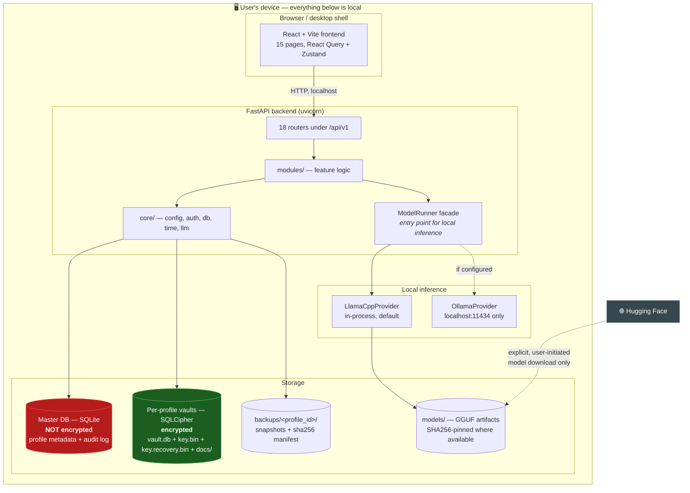
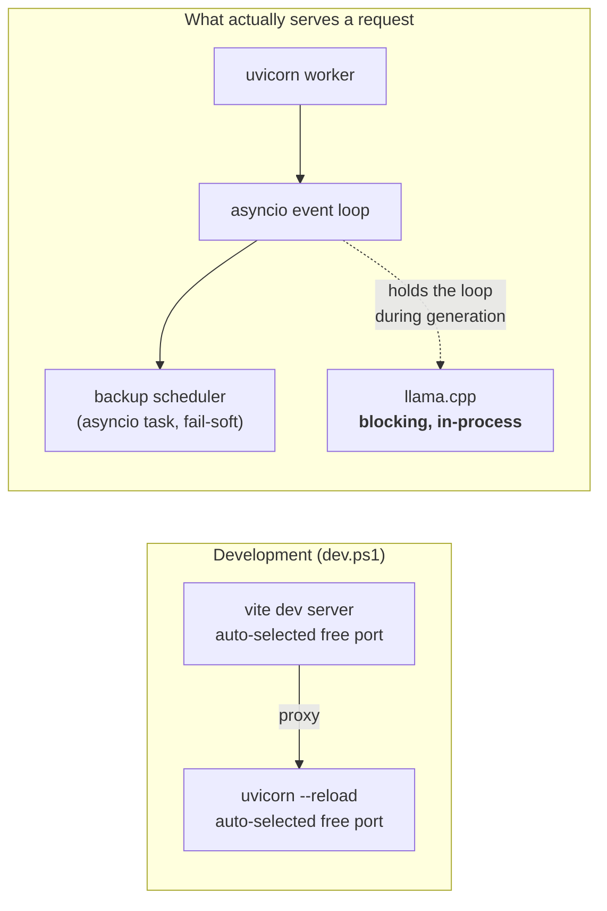

# Architecture Diagrams

**Last Updated:** 2026-10-04
**Owner:** Project Lead
**Refresh Trigger:** A new router, module, database, migration chain, or CI job is added or removed

Hand-authored mermaid diagrams of the running system, kept here so the whole
structure can be reviewed in one place. Mermaid rather than image files on
purpose: diagrams render on GitHub, and they diff line-by-line when the code
they describe changes.

These describe **what exists**, not what is planned. Where a diagram shows a
known weakness it says so rather than drawing the idealised version — the point
of this set is to support the
[performance & scalability review](performance-scalability-review.md).

| Diagram | What it answers |
|---|---|
| [System context & topology](#system-context) | What processes run, what talks to what, where the network boundary is |
| [Backend structure](backend.md) | Request lifecycle, module dependencies, data architecture |
| [Pipelines](pipelines.md) | Document → insight, assistant/agent graph, safety control-flow |
| [Frontend](frontend.md) | Pages, services, state |
| [CI & quality gates](ci-and-quality-gates.md) | What blocks a merge |
| [Performance & scalability review](performance-scalability-review.md) | Where this breaks as data grows |

Authority: these diagrams sit **below** [`CLAUDE.md`](../../CLAUDE.md),
[`AGENT.md`](../../AGENT.md) and the canonical docs indexed by
[`docs/00_architecture_plans_index.md`](../00_architecture_plans_index.md). If a
diagram disagrees with those, they win and the diagram is stale.

---

## System context

The whole product runs on one machine. There is no server tier, no sync
service, and no telemetry — the only "remote" thing in the picture is an
optional model download the user explicitly triggers.

**Read the colours.** The green store is SQLCipher-encrypted; the red one is
not. That asymmetry is the single most important fact about this system's
privacy posture, and it is why
[AUDIT-PHI-001](../compliance/hipaa-controls.md) minimizes what audit rows may
contain — the audit log is the one patient-linked dataset living outside the
encryption boundary.

The dashed Hugging Face edge is a model download the user chooses in Settings.
It is not the only outbound path in code today:

- **Embedding model, first use.** `modules/embeddings.py` builds
  `SentenceTransformer(name)` with no offline flag, so the first embedding call
  can fetch the model from Hugging Face. Owner decision D8 (2026-09-27): no
  runtime download. Interim delivery (D8-delivery): `download_models.py`
  fetches the model once into a local models dir, and the runtime loads that
  path with Hugging Face offline and fails closed if it is absent; an
  installer bundles it later (G-C4). **Approved, not yet implemented** (work
  item W-8).
- **Opt-in cloud LLM.** `core/external_runner.py` can call OpenAI or Anthropic
  when the user enables the external API (off by default). It does not go
  through `ModelRunner`. Owner decision D12 (2026-09-27) keeps it as a
  documented exception. Strict redaction is now unconditional; break-glass
  (`EXTERNAL_API_REDACTION_BREAK_GLASS`) is the only way to weaken it, writes
  an audit record, and shows a warning in Settings and on the assistant chat
  page (work item W-6). Naming the exception in `CLAUDE.md` is
  **approved, not yet implemented** (work item W-10).

`ModelRunner` is the entry point for local inference. One dormant path bypasses
it: `modules/model_selector.py` imports `llama_cpp` directly, and its only
caller, `interpret_with_model`, is never called. Owner decision D7 routes it
through `ModelRunner` (work item W-7, not yet implemented). `OllamaProvider` is
pinned to localhost by design; see [`CLAUDE.md`](../../CLAUDE.md) hard
invariants. All decisions: [owner-decisions-2026-09-27.md](../capstone-report/owner-decisions-2026-09-27.md).

## Process topology

Two background tasks start with the app: the **backup scheduler**
(BKUP-UX-001) and the **medication-reminder notification scheduler**
(Phase 3). Both share the locked-vault constraint — a background task
cannot open a profile's SQLCipher vault without the user's password — so
both are session-scoped: backups due while locked are recorded
`skipped_locked`, and reminders only fire while the profile is unlocked.
The scheduler registers a per-profile session factory at vault open
(`core/auth.py::open_profile_database_on_login`) and unregisters at close;
`GET /notifications/scheduler/status` reports how many registered profiles
were skipped because they locked mid-session. Reminder content lives only
in the per-profile vault — nothing reminder-related is written to the
master DB.

The dotted edge is a real constraint, not a stylistic choice: llama.cpp
inference is CPU-bound and in-process, so a long generation occupies the worker.
At single-user desktop scale that is invisible; it is the first thing that
would matter under any concurrency. See the
[performance review](performance-scalability-review.md#llm-inference).
