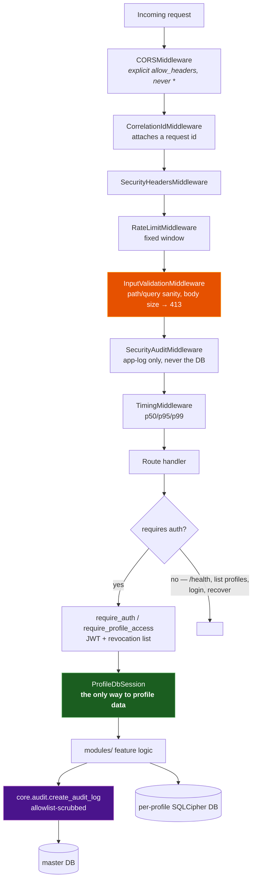
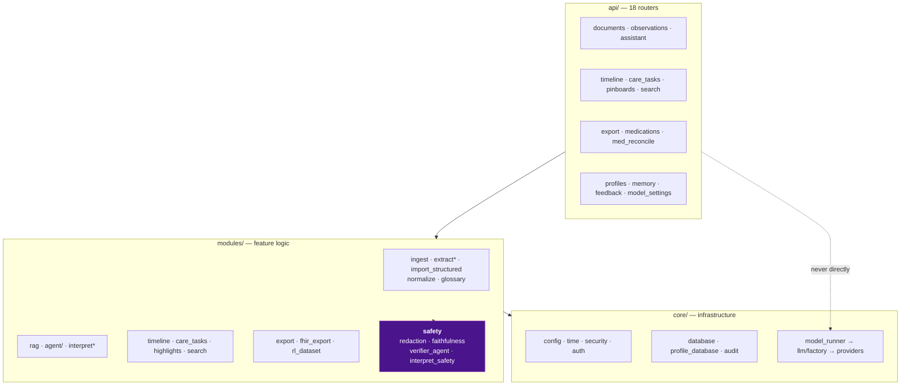
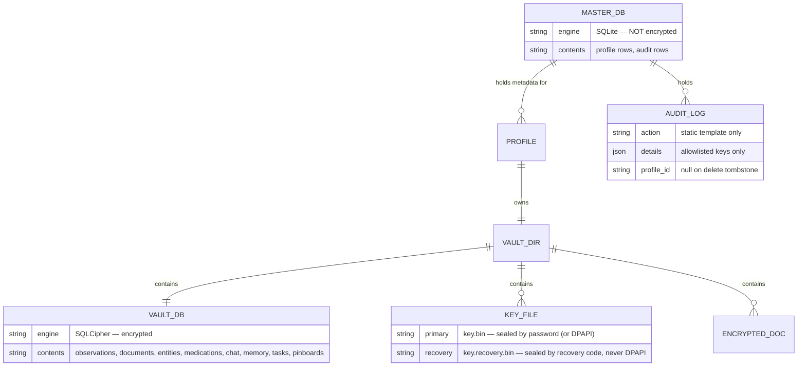
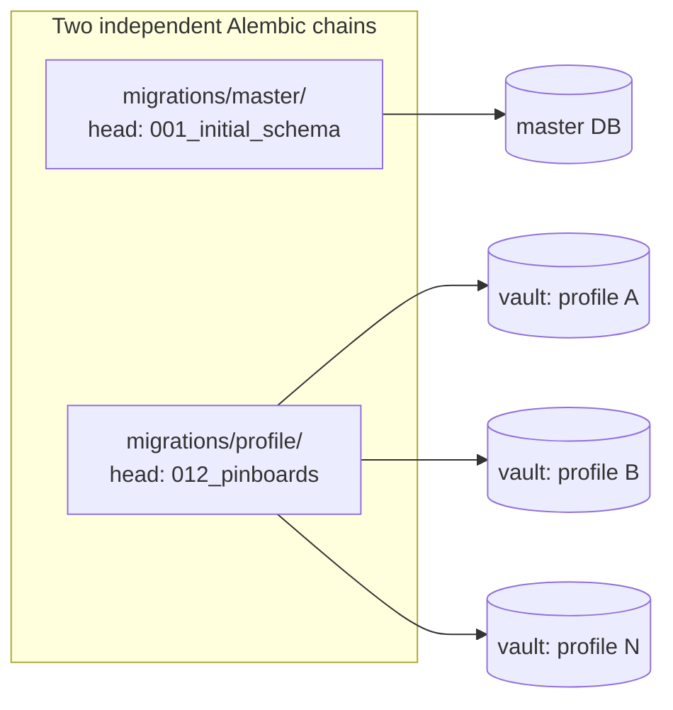

# Backend Structure

**Last Updated:** 2026-07-27
**Owner:** Project Lead
**Refresh Trigger:** Middleware order changes, a router is added/removed, or a migration chain gains a head

Part of the [architecture diagram set](README.md).

---

## Request lifecycle

Every request crosses the same middleware chain before it reaches a route. The
order is defined in `src/backend/main.py` and matters: cheap rejections happen
before expensive work, and auditing happens before timing so the audit row
exists even for a request that later fails.

Two nodes carry invariants rather than just behaviour:

- **`ProfileDbSession`** is the only sanctioned route to patient data. Querying
  profile data through the master `get_db()` breaks per-profile isolation.
- **`create_audit_log`** is a single choke point on purpose. Every `log_*_event`
  helper and every agent audit event passes through it, so the PHI allowlist
  cannot be bypassed by a new call site.

`InputValidationMiddleware` is highlighted because it is the one that returns
before the app runs: oversized bodies get a clean 413 on both the
`Content-Length` path and the streaming path (`_BodyTooLargeError`).

## Module dependency direction

Rules this diagram encodes:

- Dependencies point **downward only**. `core/` never imports from `modules/`
  or `api/`.
- Feature code reaches the LLM **only** through `ModelRunner` → `llm/factory`.
  Importing `llama_cpp` or calling Ollama directly from a router is a
  violation, which is why that edge is drawn dotted and labelled.
- The safety modules are called *by* feature code but are not a layer feature
  code may reshape — they are on CLAUDE.md's ask-first list.

## Data architecture

The profile chain is applied **once per profile database**, so an N-profile
install runs the same migration N times against N separate files. New profile
tables need a new profile migration with a linear `down_revision`; the two
chains never cross.

**Why the master DB is the sensitive one.** It is unencrypted and it is
per-install rather than per-profile, so anything written there escapes both the
encryption boundary and the isolation boundary. That is the entire motivation
for the audit allowlist, and why profile deletion purges audit rows.
