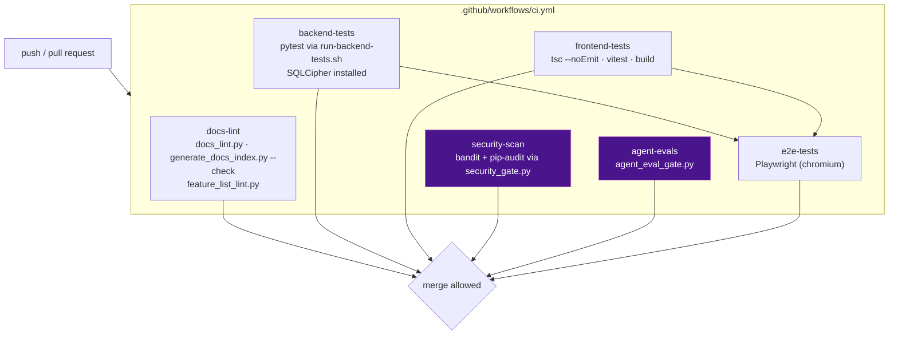

# CI & Quality Gates

**Last Updated:** 2026-07-27
**Owner:** Project Lead
**Refresh Trigger:** A CI job is added, removed, or changes what it blocks on

Part of the [architecture diagram set](README.md).

---

## What each gate actually protects

| Job | Blocks on | Why it exists |
|---|---|---|
| `docs-lint` | Doc drift (DOC-003…DOC-013), stale generated index, malformed feature inventory | Documentation that contradicts the code is worse than no documentation |
| `backend-tests` | Any pytest failure | Baseline is ~1160 passing, 1 known env-only embedding-similarity failure |
| `frontend-tests` | Type errors, vitest failures, build failures | — |
| `security-scan` | High/critical findings not covered by a dated, owner-attributed waiver | Waivers expire on purpose |
| `agent-evals` | `injection_resistance < 1.0` or `phi_leakage > 0` | Injection and leakage resistance are regression-tested guarantees, not one-time reviews |
| `e2e-tests` | Playwright failures | Runs after backend and frontend jobs pass |

The two purple gates are the ones that encode product-safety claims rather than
correctness. `agent-evals` in particular holds an absolute bar: **any** injection
that succeeds, or **any** PHI leak, fails the build — there is no threshold to
tune downward.

## Known env-only failure

`test_rag_pipeline.py::...test_api_rag_index_002b_similar_text_yields_similar_embeddings`
needs a real embedding model and fails in environments without one. The 0.7
similarity threshold is deliberately not lowered to make it pass.
