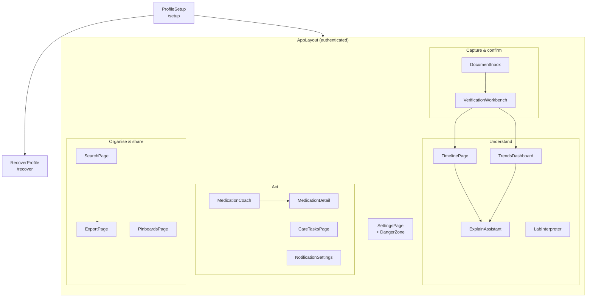
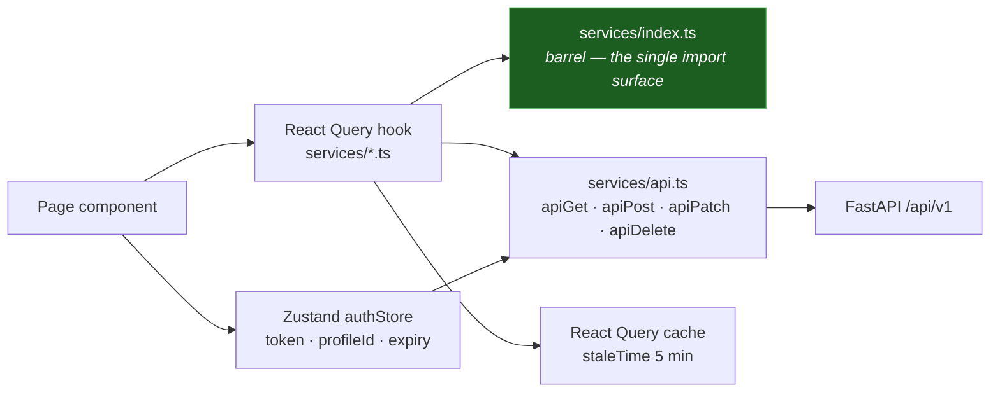
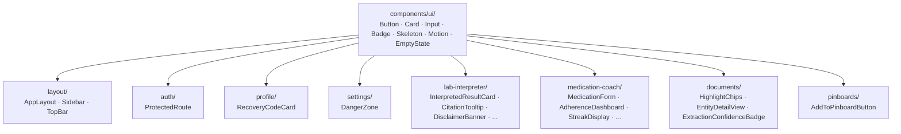

# Frontend Architecture

**Last Updated:** 2026-07-27
**Owner:** Project Lead
**Refresh Trigger:** A page, service module, or state store is added or removed

Part of the [architecture diagram set](README.md).

---

## Pages and the flows they serve

## Data flow

Two conventions worth stating because they are easy to erode:

- **Everything is exported through `services/index.ts`.** Pages import from the
  barrel, not from individual service files, so the API surface stays visible
  in one place. (Medication hooks are the exception and are imported directly.)
- **Server state lives in React Query; only session state lives in Zustand.**
  The auth store holds the token, profile id and expiry — nothing that the
  server owns.

## Component families

Accessibility is a requirement rather than a polish pass: WCAG 2.2 AA, 44 px
targets, keyboard navigation, screen-reader labels, 200 % zoom, and reduced
motion honoured through `useReducedMotion`.
