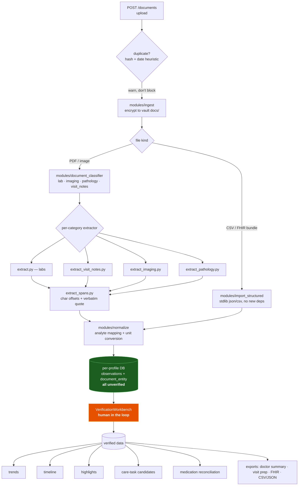
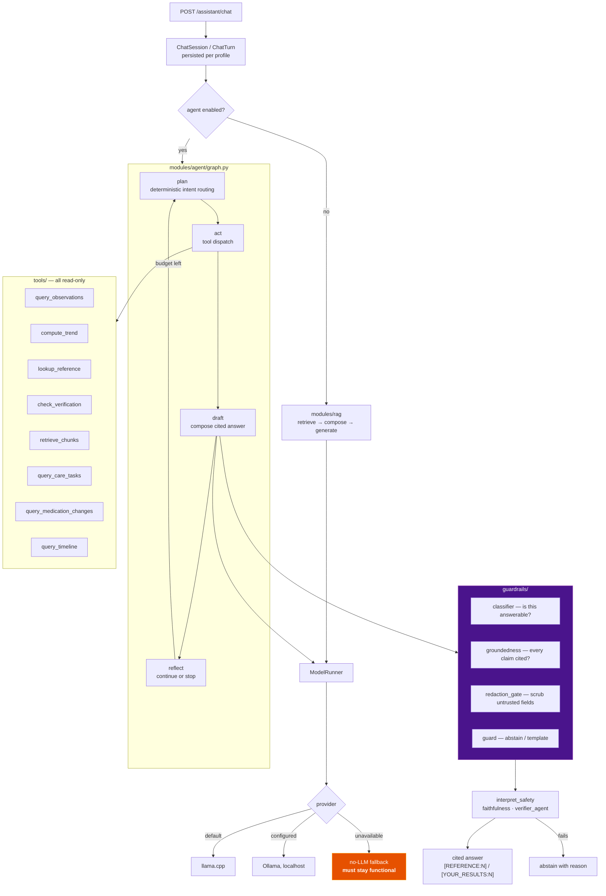
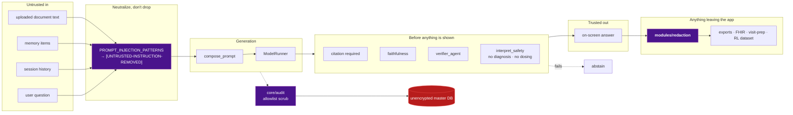

# Pipelines: Documents, Assistant, Safety

**Last Updated:** 2026-07-27
**Owner:** Project Lead
**Refresh Trigger:** An extractor, agent tool, guardrail, or export surface is added or removed

Part of the [architecture diagram set](README.md).

---

## Document → insight

The path a file takes from upload to something the user can act on. Note the
two entry points: OCR-based extraction for PDFs and images, and deterministic
parsing for structured imports (CSV / FHIR bundles, HC-M23).

**Everything lands unverified.** That is the load-bearing property of this
diagram: extraction is a suggestion, not a fact, until a human confirms it.
Structured imports are no exception — a FHIR bundle is more accurate than OCR
but still arrives unverified. Downstream surfaces consume the *verified* set;
where they surface unverified rows (the timeline), they label them as pending
rather than presenting them as history.

Reprocessing is rejected for `lab_csv` / `fhir_bundle` documents: there is no
document text to rebuild from, so re-extraction would delete entities and
recreate nothing.

## Assistant & agent graph

Three things this diagram is asserting:

1. **Tools are read-only.** The agent can query the record; it cannot mutate it.
2. **The no-LLM fallback is a supported path**, not a degraded accident. Every
   surface must work with no model present.
3. **Retrieved text is untrusted input.** Document chunks, entity names and
   memory items are attacker-controlled (a PDF can contain "ignore previous
   instructions"), so they pass through the injection filter before reaching a
   prompt. That is why `redaction_gate` sits inside the loop rather than at the
   end.

## Safety & privacy control-flow

Every point where data crosses a trust boundary.

The purple nodes are the mandatory chokepoints. Redaction is unconditional on
the export path — including the RL dataset export, which forces
`policy_level="strict"` with no configuration knob, because an export must not
be made *less* redacted by configuration.
