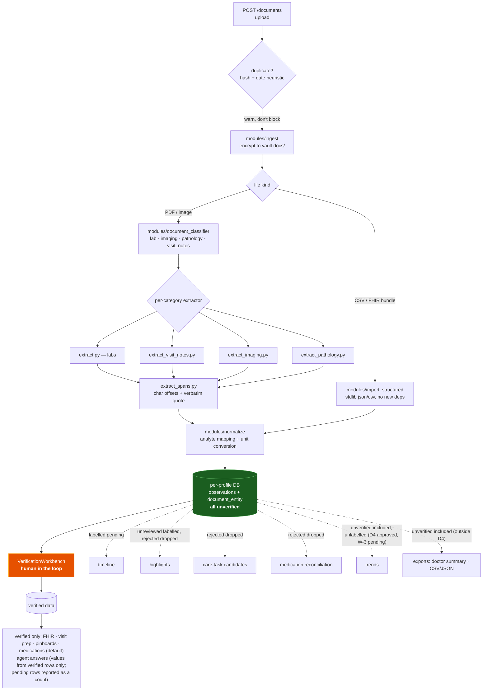
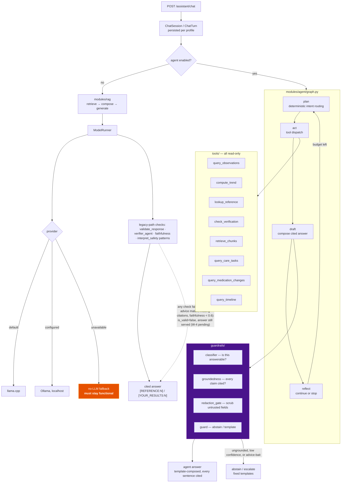
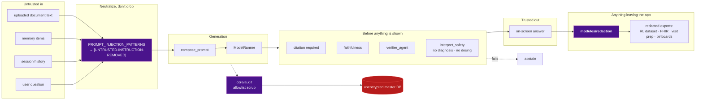

# Pipelines: Documents, Assistant, Safety

**Last Updated:** 2026-10-04
**Owner:** Project Lead
**Refresh Trigger:** An extractor, agent tool, guardrail, or export surface is added or removed

Part of the [architecture diagram set](README.md).

---

## Document → insight

The path a file takes from upload to something the user can act on. Note the
two entry points: OCR-based extraction for PDFs and images, and deterministic
parsing for structured imports (CSV / FHIR bundles, HC-M23).

**Everything lands unverified.** That is the load-bearing property of this
diagram: extraction is a suggestion, not a fact, until a human confirms it.
Structured imports are no exception — a FHIR bundle is more accurate than OCR
but still arrives unverified. Surfaces differ in what they do with unverified
rows:

- **Verified only:** FHIR export, visit prep, pinboards, and medications
  (unless the caller passes `verified_only=false`).
- **Agent answers:** values come from verified rows only; pending rows are
  reported as a count.
- **Shown with a label:** the timeline (pending) and highlights (unreviewed).
  Rows the user rejected are dropped from highlights, care-task candidates and
  medication reconciliation.
- **Included without a label:** trends and the legacy (non-agent) RAG path.
  Owner decision [D4](../capstone-report/owner-decisions-2026-09-27.md)
  (2026-09-27) approved the change: trends may show unverified points only
  when visibly marked "unverified", and legacy RAG cites verified values only.
  **Approved, not yet implemented** (work item W-3).
- **Included, outside D4:** CSV / JSON exports and the doctor summary.

Reprocessing is rejected for `lab_csv` / `fhir_bundle` documents: there is no
document text to rebuild from, so re-extraction would delete entities and
recreate nothing.

## Assistant & agent graph

Four things this diagram is asserting:

1. **Tools are read-only.** The agent can query the record; it cannot mutate it.
2. **The no-LLM fallback is a supported path**, not a degraded accident. Every
   surface must work with no model present.
3. **Retrieved text is untrusted input.** Document chunks, entity names and
   memory items are attacker-controlled (a PDF can contain "ignore previous
   instructions"), so they pass through the injection filter before reaching a
   prompt. That is why `redaction_gate` sits inside the loop rather than at the
   end.
4. **Only the legacy path calls a model.** The agent's `draft` node composes
   answers from templates over tool output; it makes no LLM call. The legacy
   safety modules (`interpret_safety`, `faithfulness`, `verifier_agent`) run on
   the legacy path only. The agent guard reuses just the 0.6 confidence cutoff
   from `modules/faithfulness.py` and abstains below it.

## Safety & privacy control-flow

Every point where data crosses a trust boundary.

The purple nodes are the mandatory chokepoints. On the export path, redaction
runs on the RL dataset export (forced `policy_level="strict"` with no
configuration knob, because an export must not be made *less* redacted by
configuration) and on FHIR, visit-prep and pinboard exports. It does **not** run
on CSV / JSON exports, the doctor summary, or backups. Backups are deliberately
unredacted: a redacted backup cannot be restored. For the other three, owner
decision [D3](../capstone-report/owner-decisions-2026-09-27.md) (2026-09-27)
applies: the doctor summary is to be strictly redacted
(**approved, not yet implemented**, work item W-2), and CSV / JSON stay full-fidelity as the
patient's own data, to be named as deliberate exceptions in `CLAUDE.md` and
`docs/compliance/data-privacy.md` (work item W-10).
