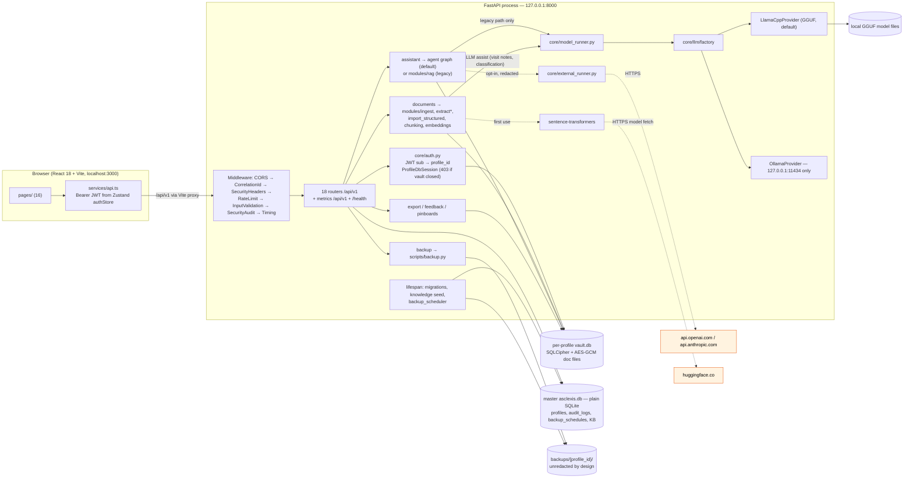

# Asclexis — Architecture & Integration Overview

**Last Updated:** 2026-09-28
**Evidence basis:** main @ `40f590e` (working tree also carries the owner's uncommitted `.serena/project.yml` / `docs/INDEX.md` edits — neither affects code). Two unmerged branches are described only in §13 (proposed).

This document separates **verified current architecture** (§1–§11) from **proposed change** (§13). Every current-state statement carries `path:line` evidence from the 2026-09-27 re-check (orchestrator + read-only mapping agents; load-bearing lines spot-verified by the orchestrator). Where the hand-drawn diagrams in [`docs/architecture/`](../architecture/README.md) disagree with code, §12 lists the divergence; code wins.

Normative rules derived from this picture are in [architecture-engineering-contract.md](architecture-engineering-contract.md); per-invariant enforcement status is in [specs-compliance-matrix.md](specs-compliance-matrix.md); sequencing of change is in [implementation-program.md](implementation-program.md).

**State vocabulary** (one never implies another): `implemented` (code exists) · `wired` (reachable from a running app) · `tested` (a test exercises it) · `proposed` · `owner-approved` (an owner answer is on record, with its source) · `owner-gated` (needs an owner decision not yet on record) · `unknown`.

---

## 1. Process and system boundaries

| Element | Current fact | Evidence | State |
|---|---|---|---|
| Launcher | `dev.ps1` (Windows) starts backend on 8000 and frontend on 3000, picking the next free port if busy; writes `VITE_API_URL` into `.env.local` | `dev.ps1:28-29,670,682,695` | wired |
| Backend process | `uvicorn main:app --host 127.0.0.1`; `main.py` binds 127.0.0.1 in `local` mode | `dev.ps1:719`, `src/backend/main.py:164-171` | wired |
| Frontend process | Vite dev server :3000 (`dev.ps1:282` passes `--strictPort`; `vite.config.ts:47` itself has `strictPort: false`), proxies `/api` → backend | `src/frontend/vite.config.ts:45-54`, `dev.ps1:281-282` | wired |
| Production serving of the built SPA | No `StaticFiles`/`app.mount` in the backend; no desktop shell (Tauri/Electron/PyInstaller) | `grep -rn "StaticFiles\|app.mount" src/backend` → none | **unknown** (not wired) |
| CORS | local mode: `http://localhost:3000`, `http://127.0.0.1:3000` only | `src/backend/main.py:101-103,141-146` | wired |
| Server mode (`APP_MODE=server`) | Reserved config branches only | audit §5 (REPORTED) | proposed / not built |

## 2. Integration diagram (current state only)

Dashed edges are network or conditional paths. The only default-on outbound path is the implicit Hugging Face fetch of the embedding model (and user-triggered model downloads); the cloud LLM path is off by default. The notification scheduler is **not** drawn because nothing starts it.

## 3. Subsystem table

| Subsystem | Owning module(s) | Input → output | Persistence / security boundary | Depends on | State |
|---|---|---|---|---|---|
| HTTP edge | `src/backend/main.py`, `security/`, `monitoring/` | request → routed request | none; SecurityAudit logs to logger (DB logging off by default, `core/config.py:79`) | FastAPI | wired, tested |
| Auth & session | `core/auth.py`, `core/token_revocation.py` | Bearer JWT → `profile_id` + `ProfileDbSession` | profile id comes from JWT `sub` (`core/auth.py:191`), never a request param; 403 if vault closed (`:298-310`) | `core/security.py` | wired, tested (mostly direct-call) |
| Profile lifecycle & keys | `api/profiles.py`, `core/security.py`, `core/profile_database.py` | create / unlock / recover / delete | DEK = Fernet key (`core/security.py:184-186`) sealed by DPAPI or password (`:323`); recovery copy password-sealed (`api/profiles.py:546-566`); crypto-erase `:773-939` | master + vault | wired, tested (direct-call) |
| Document ingest | `api/documents.py`, `modules/ingest.py`, `modules/extract*.py`, `modules/import_structured.py` | file → encrypted file + unverified observations + chunks/embeddings | AES-GCM file encryption (`core/security.py:443-466`); vault rows | embeddings, OCR, optional LLM assist (`api/documents.py:983`) | wired, tested |
| Human verification | `api/documents.py:1249-1278`, `api/observations.py:458-488`, `pages/VerificationWorkbench` | user action → `user_verified=True` | vault | — | wired; **downstream gating partial** (§5) |
| Trends / timeline / search | `api/observations.py`, `api/timeline.py`, `modules/search.py` | vault rows → series / FTS results | vault (search uses raw-SQL FTS5 tables, `modules/search.py:28-50`) | — | wired, tested |
| Assistant | `api/assistant.py`, `modules/agent/`, `modules/rag.py` | question → cited answer or abstention | vault reads; chat persisted per profile | ModelRunner (legacy path only) | wired, tested; eval-gated on agent path only |
| LLM layer | `core/model_runner.py`, `core/llm/` | prompt → text | local model files; Ollama pinned to 127.0.0.1 (`core/llm/ollama_provider.py:31-54`, `core/llm/factory.py:51`) | llama-cpp-python (lazy) | wired |
| External runner (opt-in) | `core/external_runner.py` | prompt → cloud completion | strict redaction when `redaction_enabled` (default True, `core/config.py:135`); production blocks non-strict unless break-glass (`core/external_runner.py:166-198`); outside production `redaction_enabled=False` skips redaction (`:201`) | `httpx` | implemented, off by default |
| Exports | `api/export.py`, `modules/export.py`, `modules/fhir_export.py`, `api/feedback.py` + `modules/rl_dataset.py` | vault → CSV/JSON/summary/visit-prep/FHIR/JSONL | redaction on RL, FHIR, visit-prep, pinboard; **not** on CSV/JSON/doctor summary (§8); export artifacts held in process-memory dicts `api/export.py:44,47,50` (`_summary_store`, `_packet_store`, `_fhir_store`; `api/pinboards.py:13,495` also writes `_packet_store`), lost on restart (matrix PRIV-08 `gap`; W-11b measured a 404 after restart) | redaction | wired, partly tested |
| Backup / restore | `api/backup.py`, `scripts/backup.py`, `modules/backup_scheduler.py` | vault → archive; archive → vault | unredacted by design (`docs/compliance/data-privacy.md:173-178`); raw `sqlite3` (bypasses SQLAlchemy listeners) | master `backup_schedules` | wired, HTTP-tested (`tests/test_backup_routes.py`) |
| Notifications | `modules/notification_scheduler.py`, `api/notifications.py` | schedule → reminder | vault | — | implemented, **not wired** (`:559` has no production caller) |
| Audit trail | `core/audit.py` | event → `audit_logs` row + logger echo | master DB (unencrypted); also logged at INFO via the logger (`core/audit.py:254-261`); no product code configures a file sink (`log_file_path` only creates the directory, `core/database.py:87`), so plan 08's `logs/asclexis.log` claim is false (matrix AUD-05) | — | wired; 4 profile routes unaudited (matrix §7, AUD-02) |

## 4. Data architecture

| Store | Engine / protection | Contents | Evidence |
|---|---|---|---|
| Master `asclexis.db` | plain `sqlite+aiosqlite`, **not encrypted** | `profiles`, `audit_logs`, `backup_schedules`, knowledge base (`biomarker_knowledge`, `intervention_mappings`, `biomarker_relationships`) | `core/config.py:180-184`, `core/database.py:44,103` |
| Per-profile `vaults/<id>/vault.db` | SQLCipher, `PRAGMA key` in connect listener, fail-closed cipher check | the other 24 tables: documents, observations, chunks, embeddings, chat, medications, care tasks, pinboards, model settings, feedback… | `core/profile_database.py:315-356` |
| Key files | `key.bin`, `key.method`, `key.recovery.bin`, `key.recovery.method` beside the vault | sealed DEK + recovery copy | `core/profile_database.py:131-158` |
| Document files | AES-GCM with the profile DEK | original uploads | `core/security.py:443-466`, `modules/ingest.py:190` |
| Backups | `backups/{profile_id}/` archives | full-fidelity vault + sealed keys | `AGENT.md` flow 4; `scripts/backup.py` |

**Foreign keys:** `PRAGMA foreign_keys` is set nowhere (only a comment, `api/profiles.py:914`), so declared `ondelete` actions are inert; deletes rely on explicit child-first code. **Test caveat:** the backend suite runs with `DATABASE_ENCRYPTION_REQUIRED=false` (`tests/conftest.py:57`); on-disk ciphertext is exercised only by e2e.

## 5. Document path and the verification gate

`POST /documents` (`api/documents.py:400`) → `IngestModule.import_document` (encrypt + store) → `_run_extraction_pipeline` (`:567`) or `_run_structured_import_pipeline` (`:708`) → observations created with `user_verified=False` (`:655,757`) → chunks + embeddings created at import, before verification (`:849-850`) → classification/entity extraction (`:928`, LLM assist at `:983`).

| Consumer | Reads only verified data? | Evidence |
|---|---|---|
| Agent tools (`query_observations`, `compute_trend`, `retrieve_chunks`) | yes | `modules/agent/tools/query_observations.py:56`, `compute_trend.py:45-56`, `retrieve_chunks.py:73` |
| FHIR export, visit-prep, pinboards | yes | `modules/fhir_export.py:358`, `api/export.py:764`, `api/pinboards.py:146,452` |
| Medications | yes by default; `verified_only` is a query parameter the caller can override | `api/medications.py:461,499,514`; `src/frontend/src/services/medications.ts:143` |
| Trends endpoint | **no** | `api/observations.py:529-535` (no `user_verified` filter) |
| Legacy RAG retrieval | **no** (labels verified rows only) | `modules/rag.py:323-331,433,549-552` |
| CSV / JSON / doctor summary | **no** | `api/export.py:130-150` |

Whether trends must exclude unverified rows is a **spec question** (PRD `docs/Local_First_Medical_Results_Companion_PRD_v0_1.md` requires verification of OCR numerics; `docs/architecture/pipelines.md:53-56` says downstream surfaces consume the verified set). D4 decided it 2026-09-27 (`owner-decisions-2026-09-27.md:16`): trends may show unverified points, visibly marked; legacy RAG cites verified values only (W-3, proposed).

## 6. Assistant path

1. `POST /assistant/chat` (`api/assistant.py:669`).
2. **Agent path — default ON** (`modules/agent/settings.py:19`, checked `api/assistant.py:728`): `run_agent` (`modules/agent/graph.py:144`) plan → act (≤ `MAX_STEPS = 5`, `modules/agent/state.py:19`) → reflect → draft → guard. 8 registered read-only tools (`modules/agent/tools/registry.py:42-67`). **Draft is deterministic template composition — no LLM call anywhere in `modules/agent/`** (`nodes/draft.py:1-31`). Guard maps sentences to sources and applies the advice classifier/templates (`guardrails/guard.py:20-32`). On main the response's `VerificationInfo` is hard-coded (`faithfulness_score=1.0`, `api/assistant.py:608-617`).
3. **Legacy path** (flag off, or any agent exception, `api/assistant.py:745-751`): `rag.query` (`:755`) → ModelRunner (`modules/rag.py:1267-1291`) → `validate_response` (`:793`, validates `[cite:N]`, `:819`), `verify_all_claims` (`:1002`), faithfulness scorer (`:1007`), prohibited patterns reused from `interpret_safety` (`:176-178`).
4. **No-LLM fallback:** `ModelUnavailableError` (`modules/rag.py:1277-1281`) → `_build_knowledge_fallback` (`api/assistant.py:847,1224`); reachable from the legacy path only.
5. The per-request external runner is resolved (`api/assistant.py:697-698`) but is not passed to the agent.

## 7. Model and network boundary (product code; tests excluded)

| Call site | Purpose | Through ModelRunner? | Default | Evidence |
|---|---|---|---|---|
| `core/llm/llama_cpp_provider.py:36` | local inference | yes (it is the provider) | on | — |
| `core/llm/ollama_provider.py` (`httpx`) | local inference | yes | off; host pinned `127.0.0.1:11434` | `:31-54,73` |
| `modules/model_selector.py:438` (`:456` after P1) `from llama_cpp import Llama` | tiered interpretation | **no** | **dormant** — only caller chain is `interpret_with_model` (`modules/interpret.py:877`), which has **0 callers** | `grep -rn interpret_with_model src/backend` |
| `core/external_runner.py:261-300` (`httpx` → OpenAI/Anthropic) | opt-in cloud inference | **no** | off (`use_external_api` default `False`, `models/model_settings.py:78-81`); strict redaction default | used by `api/assistant.py:697`, `api/interpretations.py:436` |
| `modules/embeddings.py:56` `SentenceTransformer(name)` | embeddings | n/a | **implicit** HF download on first use (no `local_files_only`/offline flag) | — |
| `hf_hub_download` (`api/model_settings.py:892-919`, `modules/model_selector.py:607-633`) | model download | n/a | user-triggered | — |

No `requests`, `aiohttp` or raw `socket` use in product code. `core/config.py:109` claims non-local Ollama URLs are "rejected at startup", but `validate_startup` (`:197-270`) has no such check — enforcement is at provider construction and the provider API (`api/model_settings.py:799-808`).

## 8. Export paths

| Path | Redacted? | Evidence |
|---|---|---|
| RL dataset (`POST /feedback/export`, `confirmed=true`) | yes, strict, no knob | `api/feedback.py:306,384` → `modules/rl_dataset.py:105-215` |
| FHIR | yes, strict | `api/export.py:1148` → `modules/fhir_export.py:50-65` |
| Visit-prep (md/html/pdf), pinboard export | yes, strict | `modules/export.py:533,637-642`; `api/pinboards.py:382` |
| CSV / JSON | **no** | `api/export.py:904,960` → `modules/export.py:223,267` |
| Doctor summary (text/html/pdf) | **no** | `api/export.py:379,482,537` → `modules/export.py:82,290,358` |
| Backup download | no — deliberate, documented | `docs/compliance/data-privacy.md:173-178` |

## 9. Background jobs

Lifespan (`src/backend/main.py`): master DB filename migration (`:35-37`) → `validate_startup` (`:40`) → `init_database` (`:45`) → master Alembic (`:48`) → knowledge seed, fail-soft (`:51-64`) → `start_backup_scheduler`, fail-soft (`:69-73`, stopped `:77-81`). The backup scheduler records `skipped_locked` when a vault is closed (AGENT.md flow 4). **Not started:** `start_notification_scheduler` (`modules/notification_scheduler.py:559`; only re-exported at `modules/__init__.py:136`; `api/notifications.py:502` reads status only).

## 10. Migrations

| Chain | Revisions | Head | When applied | Evidence |
|---|---|---|---|---|
| Master | 2 (`001_initial_schema`, `002_backup_schedules`) | `002_backup_schedules` | at startup | `main.py:48`, `core/migrations.py:107-178` |
| Profile | 12 (`001_initial_schema` … `012_pinboards`), linear | `012_pinboards` | every vault open (login, unlock, create, recover) | `core/profile_database.py:365-367`, `core/migrations.py:194-337` |

Databases that already have tables but no `alembic_version` table are stamped to head rather than migrated (`core/migrations.py:145-150,302-307`). No test enforces a single head per chain.

## 11. CI and test gates

One workflow, `.github/workflows/ci.yml` (push to `main` and `Security-Revamp-*`; PRs to `main`); no `continue-on-error`; every Python job pins 3.11.

| Job | Runs | Notes |
|---|---|---|
| docs-lint | `docs_lint.py`, `generate_docs_index.py --check`, `feature_list_lint.py` | `:10-28` |
| backend-tests | SQLCipher install, `scripts/run-backend-tests.sh -q` | `:30-48`; **1245 collected** at `40f590e` (measured 2026-09-27) |
| frontend-tests | `npm ci`, `tsc --noEmit`, `vitest run` | `:50-73`; no `npm run build`, no eslint |
| security-scan | bandit / pip-audit (`\|\| true`) → `security_gate.py` | `:75-110`; gate **fails open** on missing/malformed reports (`scripts/security_gate.py:49-51,76-78`) — fix on branch B |
| agent-evals | `scripts/agent_eval_gate.py` over 74 golden cases, == 1.0 / == 0 bars | `:112-130`; agent path only |
| e2e-tests | Playwright chromium, needs FE+BE | `:132-168` |

Branch-protection "required checks" are not stored in the repo → **unknown**. Not run anywhere in CI: ruff, black, mypy, eslint, coverage thresholds, `scripts/check_sqlcipher.py`.

## 12. Divergences from `docs/architecture/*.md` (code wins)

| Doc line | Doc says | Code says |
|---|---|---|
| `docs/architecture/pipelines.md:41-46,53-56` | trends and all exports consume the verified set | trends, legacy RAG, CSV/JSON/doctor summary read unverified rows (§5) |
| `docs/architecture/pipelines.md:96` | agent `DRAFT --> ModelRunner` | agent draft makes no LLM call (§6) |
| `docs/architecture/pipelines.md:110` | guard → `interpret_safety · faithfulness · verifier_agent` | agent guard imports only `FaithfulnessConfig` (`guardrails/guard.py:32`); those modules run on the legacy path |
| `docs/architecture/pipelines.md:181-182` | redaction unconditional on the export path | CSV/JSON/doctor summary unredacted (§8) |
| `docs/architecture/README.md:50` | ModelRunner "the only LLM entry point" | dormant `model_selector` bypass + opt-in external runner (§7) |
| `docs/architecture/backend.md:93` | `core/` never imports from `modules/` | 5 imports: `core/config.py:229`, `core/document_crypto.py:65`, `core/external_runner.py:202`, `core/llm/llama_cpp_provider.py:122`, `core/model_runner.py:117` (matrix GATE-13) |
| `docs/architecture/ci-and-quality-gates.md:19,45` | frontend job runs build | CI runs `tsc --noEmit` + `vitest run` only |

These are documentation defects to fix in the doc-drift phase (P4 of the program); none is fixed in this pass.

## 13. Proposed change (not current behaviour)

| Change | Source | Status | Touches |
|---|---|---|---|
| Security gate fails closed; hygiene check in CI | branch B `934a842` | owner-approved to merge "as-is" (audit §21 Q3, agent-recorded) — **unmerged** | `scripts/security_gate.py`, `ci.yml` |
| Agent verification from real groundedness counts | branch B `cc202d9` | same | `api/assistant.py`, agent guard/schemas |
| Memory-route audit logging, answer-cache fingerprint | branch B `2c98ae6` | same | `api/memory.py`, `core/audit.py`, `modules/agent/cache.py` |
| Phi-4-mini mid tier; `llama-cpp-python==0.3.35` pin | branch B `3c77eec`, `3eb9e9d` | same | model tiers, `requirements.txt` |
| Recovery-code card; correlations via endpoint; care-task quote cleared on document delete | branch A `692fdf3`, `45ac889` | same | frontend Settings, `api/documents.py` |
| Wire notification scheduler (session-scoped, `skipped_locked`) | plan 02 | owner-approved (§21 Q1, agent-recorded; D6 approves the `core/auth.py` hooks) | `main.py`, `core/auth.py`, `modules/notification_scheduler.py` |
| FK enforcement: P14/P15 CASCADE, P16/P17 SET NULL, pragma on both engines | plan 06; owner record `fe31e78` (branch A) | blast radius owner-approved (agent-recorded, branch-only); delete semantics **D5 decided 2026-09-27** (approve all four; orphan report still reviewed) | profile migration 013, `core/database.py`, `core/profile_database.py` |
| `datetime.utcnow` → `core.time.utcnow` + lint | plan 05 | proposed (invariant already binding) | 30 product files |
| HC-M11 NLI cross-encoder behind default-off flag | backlog plan §14 decision 2 (branch A) | owner-approved *for building behind a flag only* | ask-first files — production behaviour change is owner-gated |
| `.claude/agents/` layer vs doc correction | plan 03 → W-1 | **D1 decided 2026-09-27: A, all 5 agents** (hooks not licensed) | `.gitignore`, `docs/agentic/` |
| Desktop packaging (HC-M08) | audit §21 Q4 "Both" | proposed; decision spike first | new |
| Export redaction scope, verification-gate scope | this pass (matrix PRIV-04, SAFE-02) | **D3 + D4 decided 2026-09-27** (W-2, W-3 proposed) | `modules/export.py`, `api/observations.py`, `modules/rag.py` |

## 14. Unknowns

- How a built SPA is served outside dev (no static mount, no shell).
- Which CI checks are merge-required (branch protection not in repo).
- Local Playwright pass count: UNMEASURED on Windows (e2e backend start fails: `RuntimeError: SQLCipher required but not available`, `core/database.py:78`; no sqlcipher3 wheel on Windows, and `DATABASE_ENCRYPTION_REQUIRED=false` was deliberately not set). Known facts (measured on main@90c502a, Windows, 2026-10-04): vitest 186 listed / 186 passed in 32 files; Playwright chromium 30 listed in 6 files. The old "155 / 25" were historical pass counts (`docs/features/TASK_LIST.md`; matrix GATE-03, GATE-06); RCC PR #37 will make vitest 188.
- Backend **pass** counts on any ref (only collection was measured, Python 3.13.7 on Windows vs CI 3.11).
- Runtime behaviour of backup `skipped_locked` and agent cache hit rates (not executed).
