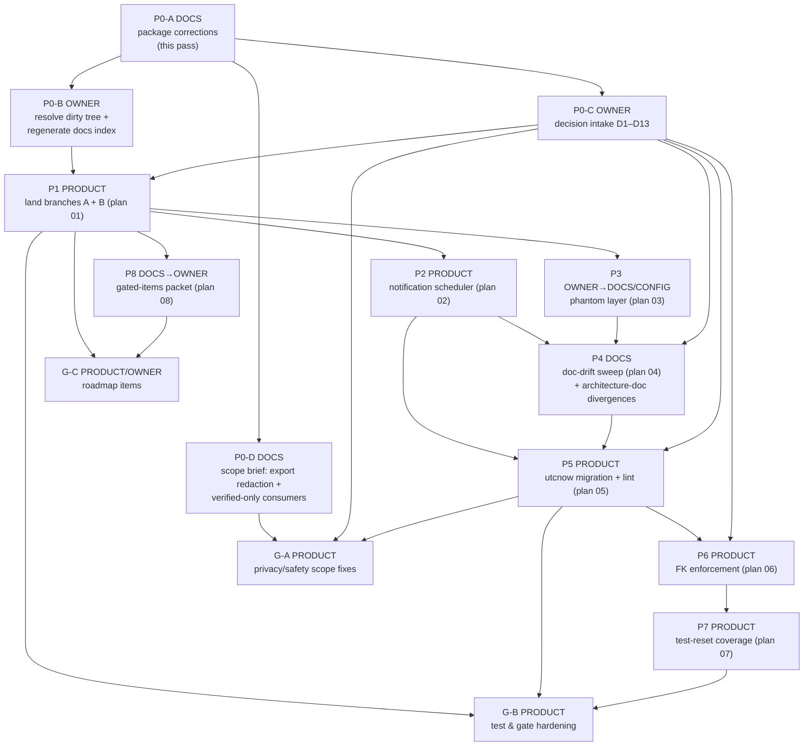

# Asclexis — Implementation Program

**Last Updated:** 2026-09-27 (owner decisions recorded)
**Status:** PLAN ONLY. Nothing in this program has been executed, merged, or committed. It replaces the "pending" implementation-program entry in the capstone README and supersedes the sequencing in audit §22–§23 wherever they differ.

This program orders the eight audit plans (`audit/2026-09-25/plans/01`–`08`) and the gaps found on 2026-09-27 that no plan covers. It includes the independent review's corrections ([follow-up](../../audit/2026-09-25/review/2026-09-27-followup.md)). The rules it must preserve are in [architecture-engineering-contract.md](architecture-engineering-contract.md). The gaps it closes are in [specs-compliance-matrix.md](specs-compliance-matrix.md).

## Ground rules for every phase

1. **Three kinds of work, never mixed in one step.**
   - `DOCS`: documentation or planning only.
   - `PRODUCT`: a code, config, CI, or schema change.
   - `OWNER`: a decision or sign-off only the owner can give.

   Agents prepare `OWNER` items; they never record an approval that was not given.
2. **Measured baselines only.** Each phase starts by measuring collection **and** a run on its starting tree, and records the interpreter, OS and command. Acceptance is stated relative to that measurement: "collected = start + tests this phase adds; failures ⊆ start failures". No phase uses a number carried from another ref.
   - Reference points measured 2026-09-27 (collection only; Windows Python 3.13.7):

     | Ref | Collected |
     |---|---|
     | main `40f590e` | 1245 |
     | branch A `692fdf3` | 1248 |
     | branch B `7b2ff1f` | 1288 |
     | A+B merge-tree, 5 doc conflicts unresolved | 1291 |

   - These are context, not targets.
3. **Interpreter.** CI uses Python 3.11 (`.github/workflows/ci.yml`). In this WSL checkout, `python` is absent and `/home/danny/venvs/healthcentral-backend` lacks SQLAlchemy. `/mnt/c/Python313/python.exe` (3.13.7) collects successfully.
   - Before P1, the owner picks the phase-gate interpreter: a 3.11 venv with `src/backend/requirements.txt` (preferred, matches CI) or the Windows 3.13 install.
   - Record the choice in each phase's log.
   - Frontend toolchain runs on Windows; `vitest` stalls under WSL on `/mnt/c`.
4. **Clean trees.** Execute in a dedicated `git worktree` per phase. The owner's uncommitted `docs/INDEX.md` and `.serena/project.yml` edits and the untracked `audit/` + `docs/capstone-report/` package stay untouched unless the owner says otherwise. Stage with explicit pathspecs and review `git diff --cached --name-only` (contract C-GATE-3).
5. **Ask-first surfaces** (CLAUDE.md §1) need an explicit owner "yes" *for that change*, even inside an approved phase:
   - `modules/interpret_safety.py`, `modules/redaction.py`, `modules/faithfulness.py`, `modules/verifier_agent.py`;
   - anything auth or encryption, **including `core/auth.py`**.
6. **Humans merge.** Every `PRODUCT` phase ends at a PR and stops for the owner's merge.
7. **Re-read [`docs/agentic/recurring-failures.md`](../agentic/recurring-failures.md) before claiming any phase done**, and re-walk whole flows, not diffs (#2).

## Dependency graph

The critical path is P0-B → P1 → P2 → P4 → P5 → P6 → P7. P3, P8, G-A and G-B can run beside it once their inputs land, but no two phases may edit the same file at the same time. Shared files are ordered by the graph edges: `api/profiles.py` (P5 → P7 → G-B1), `tests/support/routes.py` (P7 → G-B1), `ci.yml` (P1 → P5 → G-B3/G-B4), `modules/export.py` and `api/observations.py` (P5 → G-A), `docs/compliance/data-privacy.md` (P1 → P4 → G-A1). The audit order (branches → scheduler → phantom → drift → utcnow → FK → reset → gated) is kept, with two changes: P8 moves earlier, because it is docs-only, and the new G-phases are added.

## Owner decision intake (P0-C)

**All D1–D13, P0-B and G-B5 were answered on 2026-09-27: see [owner-decisions-2026-09-27.md](owner-decisions-2026-09-27.md).** The last column shows each answer. Each decision blocks only the phases listed. D11–D13 were added after the 2026-09-27 contracts review.

| # | Decision | Options (source) | Blocks | Recorded position today |
|---|---|---|---|---|
| D1 | Phantom agent/hook layer | Plan 03 Branch **A** (author + unignore `.claude/agents/`) or **B** (correct docs; the plan author estimates it ~80% pre-written in commit `7b2ff1f`. Plan 03's "Branch B" option is not git branch B, although that commit lives on git branch B) | P3, P4 Task 15 | **DECIDED 2026-09-27: A, all 5 agents** (not the recommendation) |
| D2 | `.serena/memories/` | delete / regenerate / freshness gate (plan 04 Task 12; research 02) | P4 Task 12 | **DECIDED: delete** |
| D3 | Do CSV, JSON and doctor summary count as "leaving"? | redact them, **or** amend `data-privacy.md:173-174` and CLAUDE.md wording to scope redaction to third-party/external paths | G-A1, P4 | **DECIDED: redact doctor summary; CSV/JSON named exceptions** |
| D4 | May trends and legacy RAG use unverified observations? | filter to verified, **or** keep them with labelling and amend `pipelines.md` | G-A2, P4 | **DECIDED: trends label unverified; legacy RAG verified-only** |
| D5 | Approve each FK delete effect explicitly: P14/P15 → CASCADE, P16/P17 → SET NULL; pragma on both engines | approve / amend | P6 Task 2 | **DECIDED: approve all four + pragma** |
| D6 | Scheduler scope, plus touching `core/auth.py` | approve plan 02's session-scoped design and the two `core/auth.py` hooks | P2 | **DECIDED: approve as planned** |
| D7 | Dormant `model_selector` `llama_cpp` path | delete dead code, or route it through ModelRunner | G-B3 | **DECIDED: route via ModelRunner** (not the recommendation) |
| D8 | Implicit embedding-model download | pin offline/local path, or accept | G-A3 | **DECIDED: bundle the model** (not the recommendation; delivery mechanism open) |
| D9 | Phase-gate interpreter | 3.11 venv (CI parity) or Windows 3.13 | all PRODUCT phases | **DECIDED: new 3.11 venv** |
| D10 | HIPAA applicability | owner + legal review; no status asserted | P8 brief 4 | **DECIDED: treat as HIPAA-aligned** (design posture, not a legal status) |
| D11 | Citation-marker vocabulary (`[cite:N]` vs `[YOUR_RESULTS:N]`/`[REFERENCE:N]`; matrix SAFE-08, contract C-SAFE-5) | align docs to code, or code to docs | P4 (doc wording); any prompt change is ask-first-adjacent | **DECIDED: docs match code (`[cite:N]`)** |
| D12 | External runner (`core/external_runner.py`) as a ModelRunner exception, plus its dev-mode and break-glass redaction bypasses (matrix LOCAL-04, LLM-01) | accept as documented exceptions, or route/remove | G-B3 | **DECIDED: keep, harden** (unconditional redaction; break-glass with audit + UI warning) |
| D13 | `api/profiles.py` auth hunks in P5 (mechanical `utcnow` swap in `create_profile`, `login`, `unlock_profile`, `change_password`) | approve / exclude | P5 Task 4 | **DECIDED: approve** |

---

## P0 — Documentation preparation

**P0-A · DOCS · done in this pass (2026-09-27).**
- **Outcome:** package corrected, four capstone docs written, follow-up published.
- **Owned files:** see the follow-up's changed-file list.
- **Verification:** `python3 scripts/docs_lint.py`, `python3 scripts/generate_docs_index.py --check`, and a relative-link resolver over every edited file. Results are in the follow-up.
- **Rollback:** everything is untracked or uncommitted, so restore from the owner's copy.

**P0-B · OWNER.**
- **Outcome:** the owner decides what happens to the uncommitted `docs/INDEX.md` / `.serena/project.yml` edits and to the untracked package: commit on a docs branch, or keep local. Then run `python3 scripts/generate_docs_index.py && python3 scripts/docs_lint.py --link-graph` so the index covers the new capstone docs.
- **Stop gate:** do not regenerate over uncommitted owner edits without consent.
- **Acceptance:** `generate_docs_index.py --check` exits 0; `docs_lint.py` prints "Docs lint passed."

**P0-C · OWNER.**
- **Outcome:** answers to D1–D13, each recorded with date and wording in `docs/features/TASK_LIST.md` Session Notes or a dated `docs/plans/` decision record.
- **Acceptance:** each answer quotes the owner. Agents do not paraphrase an answer into a broader approval.

**P0-D · DOCS.**
- **Outcome:** a 1–2 page brief for D3 and D4. It lists the exact surfaces (overview §5, §8), what each option changes, and the patient-visible effect.
- **Owned files:** a new dated `docs/plans/` file.
- **Acceptance:** each surface is cited `path:line`, and the options are neutral.

## P1 — Land branches A and B (plan 01) · PRODUCT

- **Outcome:** security gate fails closed; agent trust score computed; recovery-code card and correlations wiring on main; care-task quote cleared on document delete; FK and HC-M11 owner records on main.
- **Owned files:** the 5 conflicted files (`AGENT.md`, `CLAUDE.md`, `docs/INDEX.md`, `docs/_link_graph.json`, `docs/agentic/recurring-failures.md`) plus the branch contents. Branch A has 21 files; branch B has 120. There are no migrations in either branch; they touch `ci.yml` and `requirements.txt`.
- **Depends on:** P0-B (clean tree), D9.
- **Stop gates:**
  - Branch A ≠ 5 or branch B ≠ 19 commits ahead after `git fetch`.
  - Conflicts beyond the 5 files.
  - The security gate does not exit non-zero on a missing report.
  - Any failure not present on the parent refs.
  - Owner merge approval.
- **Verification** (clean worktree):
  1. `git rev-list --count origin/main..<branch>` for each branch.
  2. `git merge-tree --write-tree --name-only origin/claude/healthcentral-agentic-research-r1n54x origin/claude/asclexis-repo-audit-349pjq` → exactly the 5 files listed above (reproduced 2026-09-27).
  3. `cd src/backend && <interp> -m pytest tests/ -p no:cacheprovider -q` on main, A, B and the merge.
  4. `cd src/frontend && npx tsc --noEmit && npx vitest run` (Windows).
  5. `python3 scripts/docs_lint.py && python3 scripts/generate_docs_index.py --check`.
  6. `python3 scripts/agent_eval_gate.py`.
  7. `python3 scripts/security_gate.py --bandit /nonexistent.json --pip-audit /nonexistent.json; echo $?`, which must be non-zero.
- **Measured acceptance:**
  - Merged collected count recorded.
  - Merged failures ⊆ (A failures ∪ B failures ∪ main failures), with each failure named.
  - The step 7 exit code is non-zero.
  - `grep -n "faithfulness_score=1.0" src/backend/api/assistant.py` → none.
  - `SettingsPage.tsx` mounts both `RecoveryCodeCard` and `TierCapabilities`.
  - The baseline lines in `CLAUDE.md` and `AGENT.md` show the measured merged count.
- **Rollback:** `git revert -m 1 <merge>` per branch; no schema to unwind. The `llama-cpp-python==0.3.35` pin may need `pip install -r requirements.txt` after a revert.
- **Sign-off:** owner merges ("as-is", §21 Q3).

## P2 — Notification scheduler (plan 02) · PRODUCT

- **Outcome:** the scheduler starts in the lifespan, is fail-soft, registers per session, records `skipped_locked`, and no longer logs medication names.
- **Owned files:**
  - `src/backend/main.py`, `src/backend/core/auth.py:361-419`, `modules/notification_scheduler.py`, `api/notifications.py`;
  - the new `tests/test_notification_scheduler_wiring.py`;
  - docs listed in plan 02 Task 6.
- **Depends on:** P1; D6 (explicit yes for the `core/auth.py` hooks, because auth is an ask-first area).
- **Stop gates:**
  - Any edit outside the listed files.
  - Any naive/aware mixing: `core.time.utcnow` is naive (plan 02 corrected).
  - Reminder content reaches the master DB or logs.
- **Verification:**
  - HC-NSW tests observed failing first, then passing.
  - Full backend suite.
  - `cd src/backend && <interp> -c "from main import app"`.
  - The lifespan starts and stops the scheduler (test).
  - A `caplog` test drives a reminder and asserts the medication name is absent from every log record. `grep` alone cannot show this: the log call spans `:517-520`, and the matching f-string line has no `logger` token.
- **Measured acceptance:**
  - Collected = P2-start + (number of HC-NSW tests added).
  - Failures ⊆ P2-start failures.
  - A test proves no reminder fires for a locked vault and that `skipped_locked` increments.
- **Rollback:** revert the PR. The scheduler becomes inert again, with no data written to master.
- **Sign-off:** owner (D6 and merge).

## P3 — Phantom-layer decision (plan 03) · OWNER → DOCS or CONFIG

- **Outcome:** docs match committed artifacts.
- **Owned files:**
  - Branch B: `docs/agentic/harness.md`, `docs/agentic/roadmap.md`, `CS4610_Report_Demo/README.md`.
  - Branch A: `.gitignore`, `.claude/agents/*`.
- **Depends on:** P1 (brings `7b2ff1f` and `harness_drift_check.py`), D1.
- **Stop gate:** plan 03's STOP gate, unchanged.
- **Verification:**
  - `git log --all -- .claude/agents`.
  - `python3 scripts/harness_drift_check.py`, which is on main after P1.
  - `python3 scripts/docs_lint.py`.
- **Acceptance:** zero doc references to non-existent agents or hooks (drift check exits 0), and the claims ledger H5/H6 are updated.
- **Rollback:** revert.
- **Sign-off:** owner (D1).

## P4 — Documentation drift sweep (plan 04, extended) · DOCS

- **Outcome:** the 16 verified ledger rows are fixed, plus the gaps below that no plan covers.
  - Tasks 1–11 and 13–14 as written.
  - Task 4 after P2.
  - Task 12 after D2.
  - Task 15 after P3.
  - Task 16 with explicit pathspecs (corrected).
  - **Added:** the 7 architecture-doc divergences in [architecture-overview.md §12](architecture-overview.md#12-divergences-from-docsarchitecturemd-code-wins).
  - **Added:** `core/config.py:109` comment vs `validate_startup`.
  - **Added:** `docs/compliance/data-privacy.md:173-174` wording, after D3.
  - **Added:** `hipaa-controls.md:169` ("key rotation") wording, after plan 08 brief 2 is signed.
  - **Added:** the citation-marker vocabulary in docs, after D11.
- **Owned files:** as listed in plan 04 plus `docs/architecture/*.md`. `core/config.py` is a comment-only edit.
- **Depends on:** P1, P2, P3, D2, D3, D4, D11.
- **Stop gate:** if a "stale" claim turns out true in code, write the measured truth and flag it (plan 04 notes).
- **Verification:** plan 04 Task 16 greps; `python3 scripts/docs_lint.py`; `generate_docs_index.py --check`.
- **Acceptance:** every Task 16 grep returns its documented empty result; lint passes; the index is fresh.
- **Rollback:** revert.
- **Sign-off:** none beyond D2/D3 (docs only).

## P5 — `datetime.utcnow` → `core.time.utcnow` (plan 05) · PRODUCT

- **Outcome:** zero product `datetime.utcnow`, and a CI lint prevents regression.
- **Owned files:** the 30 product files enumerated in plan 05, the test helpers, `scripts/time_source_lint.py`, `ci.yml`.
- **Depends on:** P2 (so the newly wired scheduler is migrated too); P4 (no concurrent doc edits); **D13**. The invariant is already binding, but Task 4 touches auth flows in `api/profiles.py`, which CLAUDE.md §1 makes ask-first.
- **Stop gates:**
  - Any serialization output changes.
  - Any aware datetime appears.
  - An ask-first file would need editing. None of the four named safety modules does, but the `api/profiles.py` auth hunks need D13.
- **Verification:**
  - `grep -rn "datetime\.utcnow" src/backend --include=*.py | grep -v /tests/ | wc -l` → 0. Today it is 101 lines (109 references by AST).
  - Full suite.
  - A lint negative test: add a violation and watch the lint fail.
- **Acceptance:** 0 product hits; the lint job exists in `ci.yml` and fails on a seeded violation; failures ⊆ P5-start failures.
- **Rollback:** revert per-file commits.
- **Sign-off:** owner merge.

## P6 — FK enforcement (plan 06) · PRODUCT (data-lifecycle)

- **Outcome:** declared FKs enforced on the master and profile engines, with the four constraints realigned first.
- **Owned files:**
  - `core/fk_audit.py`, `scripts/fk_orphan_audit.py`;
  - profile migration `013_fk_cascade_alignment.py`;
  - `models/document_category.py`, `models/care_plan_task.py`;
  - `core/database.py`, `core/profile_database.py`. The pragma listener sits beside the SQLCipher key hook, an encryption-adjacent file, so ask first.
  - tests.
- **Depends on:** P1 (the owner record and CARE-QUOTE fix on main); P5; D5.
- **Stop gates:**
  - Before Task 2: the owner reviews the orphan-audit report from Task 1, run on a real vault backup, and confirms D5.
  - Stop if any constraint would need relaxing.
  - Stop if restore or crypto-erase behaviour changes.
  - Plan 06 Task 3 Step 5 (reset tuple) is **superseded by P7**; do not do it here.
- **Verification:**
  - Orphan audit (report-only).
  - Migration up/down on a populated vault, with row counts compared.
  - Pragma asserted on ≥2 distinct physical connections per engine.
  - Full suite, run as the approval requires: red failures are findings, fixed in setup or code, never in the constraint.
- **Measured acceptance:**
  - `PRAGMA foreign_keys` = 1 on every new app connection.
  - Migration round-trip preserves row counts.
  - Failures ⊆ P6-start failures, after the orphan-write fixes, each fix listed.
- **Rollback:** migration downgrade; remove the listener; restore from a pre-phase backup of any real vault.
- **Sign-off:** owner (D5, orphan report, merge).

## P7 — Test-reset coverage (plan 07) · PRODUCT

- **Outcome:** `/profiles/test/reset` wipes every profile table, child-first, with a coverage test.
- **Owned files:** `api/profiles.py` (the reset tuple only), `tests/support/routes.py`, the new `tests/test_profile_test_reset.py`.
- **Depends on:** P6 (FK state known).
- **Stop gate:** decide the treatment of the FTS `search_records*` tables (N-02) before writing the coverage assertion.
- **Verification:** HC-RESET tests over HTTP (`route_client`); full suite.
- **Acceptance:** collected = P7-start + 7; the coverage test fails when a model is removed from the tuple (break it on purpose).
- **Rollback:** revert.
- **Sign-off:** owner merge.

## P8 — Gated-items decision packet (plan 08) · DOCS → OWNER

- **Outcome:** five briefs (MFA, key rotation, pen test, audit retention, HC-M11) with a sign-off ledger.
- **Owned files:** `audit/2026-09-25/gated-items-decision-packet.md`, `docs/features/TASK_LIST.md`.
- **Depends on:** P1, so the HC-M11 branch record is on main (N-04).
- **Stop gates:**
  - No legal status asserted (F-08).
  - The six-year rule is scoped to 45 CFR 164.316 documentation.
  - HC-M11's existing flag-only approval is cited, not re-asked.
- **Acceptance:** each brief has evidence, options, a recommendation, and an **unsigned** sign-off line.
- **Sign-off:** owner, per brief.

## Gap phases with no existing plan

Each needs its own `writing-plans` plan before execution.

| ID | Kind | Scope (matrix rows) | Depends on | Stop gate | Measured acceptance |
|---|---|---|---|---|---|
| G-A1 | PRODUCT or DOCS | Export redaction for CSV/JSON/doctor summary, or scope the doc (PRIV-04) | D3 | `modules/redaction.py` is ask-first | Either each exporter calls `RedactionEngine` (test with a PHI fixture), or `data-privacy.md` names the unredacted surfaces |
| G-A2 | PRODUCT or DOCS | Verified-only filtering for trends and legacy RAG, or labelled display plus a doc fix (SAFE-02) | D4 | `modules/rag.py` sits beside ask-first safety modules | A test proves an unverified observation is excluded or labelled on each surface |
| G-A3 | PRODUCT | Local-only embedding load (LOCAL-03) | D8 | — | With the network blocked and an empty HF cache, the embedding module either loads from the configured local path or fails closed. It must not silently use the fallback. |
| G-B1 | PRODUCT | HTTP tests for `require_profile_access` on profile routes; audit rows for the 4 unaudited profile routes (ISO-02, AUD-02) | P7 (shares `api/profiles.py` and `tests/support/routes.py`) | auth-adjacent: tests only unless the owner approves route edits | Tests go red when the guard is removed; each of the 4 routes writes an audit row, asserted over HTTP |
| G-B2 | PRODUCT | On-disk ciphertext test with encryption required (KEY-02) | P1 | encryption: ask first | A test fails if the vault header reads `SQLite format 3` |
| G-B3 | PRODUCT | Inference-boundary check; resolve the dormant `model_selector` path (LLM-02/03) | D7, D12 | — | The boundary test fails on a seeded `import llama_cpp` in `modules/` |
| G-B4 | PRODUCT | Single-head migration test (MIG-02); CI `npm run build`, eslint, ruff; coverage report (GATE-07) | P5 (shares `ci.yml`) | — | Each new gate fails on a seeded violation |
| G-B5 | PRODUCT (**priority raised**: low-faithfulness legacy answers reach patients today) | Eval gate for the legacy RAG path, plus an owner decision on whether `is_valid=False` must abstain (SAFE-04) | P1; owner, because the abstain behaviour sits beside ask-first files | ask-first files are read-only | The gate fails on a seeded uncited answer |
| G-B6 | DOCS | Measure the frontend counts (vitest, Playwright) on Windows and replace the 155/25 claims | P1 | — | Command output recorded |
| G-C1 | PRODUCT | Persist export artifacts across restarts (PRIV-08; audit §16 #7) | P1 | — | A download succeeds after a restart |
| G-C2 | OWNER→PRODUCT | OpenWiki generation: the owner generates locally and a session reviews the diff (branch A §14 d4) | P1 | — | `openwiki/` contains generated pages |
| G-C3 | PRODUCT | HC-M06 extraction eval card; HC-M07 observability baseline | P1 | — | Per their `feature_list.json` verification steps |
| G-C4 | DOCS→OWNER | HC-M08a packaging decision spike (portable folder vs PyInstaller+Tauri/Electron) | P1 | a decision doc before any build | A decision record names the chosen path |
| G-C5 | PRODUCT | HC-M11 cross-encoder behind a default-off flag | P8 brief 5; P1 | ask-first files; no production scoring change | Flag off ⇒ eval output byte-identical to before |

## Plan overlaps and conflicts

| Overlap | Resolution |
|---|---|
| Plan 06 Task 3 Step 5 and plan 07 both edit the reset tuple | P7 owns it; plan 06 Step 5 is superseded |
| Plans 02 and 05 both touch `notification_scheduler.py` timestamps | P2 leaves existing `datetime.utcnow` calls; P5 converts them afterwards |
| Plans 02, 04 and 01 all edit `CLAUDE.md`/`AGENT.md` baseline lines | Each phase writes its own measured count; never edit concurrently |
| Plan 04 Task 16 and P0-B both regenerate `docs/INDEX.md` | P0-B first, with owner consent; P4 regenerates only a clean tree |
| Plan 08 (HC-M11 "gated") vs branch A §14 d2 ("approved, flag-only") | Cite the record; ask only about production behaviour change |

## What this program does not claim

- It does not say any phase is started or passing.
- It does not predict test-count deltas beyond "tests this phase adds".
- It does not treat an agent-recorded owner answer as broader than its text.
- It does not decide D1–D13.

Back to index: [README.md](README.md)
