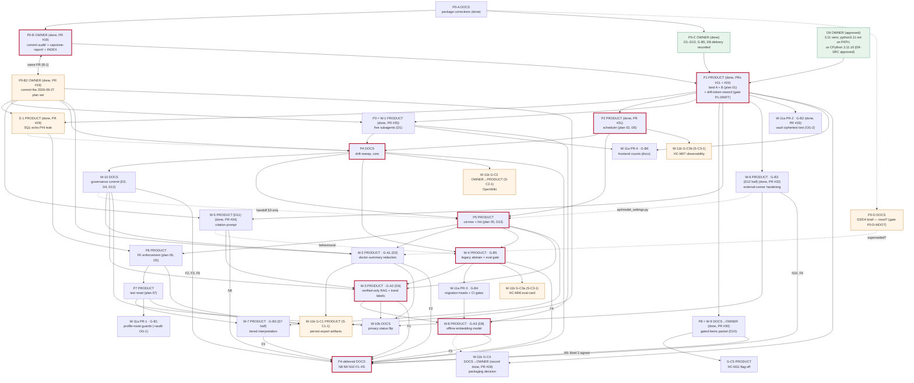

# Asclexis — Implementation Program

**Last Updated:** 2026-10-02 (Waves 0-2 done: Wave 2 = S-1 #29, W-6 #32, W-11a PR-2 #33, W-5 #34, W-1 #35, P2 #31, P8 #30, G-C4 #28; owner decided P2-INFLIGHT and W6-STALE-WARN 2026-10-01; 10 new owner items. 2026-10-01: Waves 0-1 done: P0-B/P0-B2 #19, P1 #21 + #24, S-CACHE #23, CI-DISK #25; Wave 2 dispatched; owner signed W6-Q3, W6-Q5. 2026-09-29: P0-B merged as PR #19; owner signed P1-PR1-MERGE, P1-SLOTS, P1-CAREQ-HTTP, S-CACHE, MEM-AUDIT-CAT; new phase S-CACHE. 2026-09-28: owner signed P0-B2, D9-SRC, P1-DRIFT, SLOT-RULE, P7-ROUTE, SQL-ECHO S1-A+S1-B; all other gates unchanged)
**Status:** IN EXECUTION. Waves 0-2 are merged (PRs #19, #21-#35; main `f5d829b`, 2026-10-02); phases not marked done are still proposed. Execution state lives in the [ledger](../../audit/2026-09-25/swarm-2026-09-27/ledger.md). It replaces the "pending" implementation-program entry in the capstone README and supersedes the sequencing in audit §22–§23 wherever they differ.

This program orders the eight audit plans (`audit/2026-09-25/plans/01`–`08`) and the gaps found on 2026-09-27 that no plan covers. It includes the independent review's corrections ([follow-up](../../audit/2026-09-25/review/2026-09-27-followup.md)). The rules it must preserve are in [architecture-engineering-contract.md](architecture-engineering-contract.md). The gaps it closes are in [specs-compliance-matrix.md](specs-compliance-matrix.md).

## Ground rules for every phase

1. **Three kinds of work, never mixed in one step.**
   - `DOCS`: documentation or planning only.
   - `PRODUCT`: a code, config, CI, or schema change.
   - `OWNER`: a decision or sign-off only the owner can give.

   Agents prepare `OWNER` items; they never record an approval that was not given.
2. **Measured baselines only.** Each phase starts by measuring collection **and** a run on its starting tree, and records the interpreter, OS and command. Acceptance is stated relative to that measurement: "collected = start + tests this phase adds; failures ⊆ start failures". No phase uses a number carried from another ref.
   - Reference points measured 2026-09-27 (collection only; Windows Python 3.13.7):

     | Ref | Collected |
     |---|---|
     | main `40f590e` | 1245 |
     | branch A `692fdf3` | 1248 |
     | branch B `7b2ff1f` | 1288 |
     | A+B merge-tree, 5 doc conflicts unresolved | 1291 |

   - These are context, not targets.
3. **Interpreter.** CI uses Python 3.11 (`.github/workflows/ci.yml`). In this WSL checkout, `python` is absent and `/home/danny/venvs/healthcentral-backend` lacks SQLAlchemy. `/mnt/c/Python313/python.exe` (3.13.7) collects successfully.
   - Before P1, the owner picks the phase-gate interpreter: a 3.11 venv with `src/backend/requirements.txt` (preferred, matches CI) or the Windows 3.13 install.
   - Record the choice in each phase's log.
   - Frontend toolchain runs on Windows; `vitest` stalls under WSL on `/mnt/c`.
4. **Clean trees.** Execute in a dedicated `git worktree` per phase. The owner's uncommitted `docs/INDEX.md` and `.serena/project.yml` edits and the untracked `audit/` + `docs/capstone-report/` package stay untouched unless the owner says otherwise. Stage with explicit pathspecs and review `git diff --cached --name-only` (contract C-GATE-3).
5. **Ask-first surfaces** (CLAUDE.md §1) need an explicit owner "yes" *for that change*, even inside an approved phase:
   - `modules/interpret_safety.py`, `modules/redaction.py`, `modules/faithfulness.py`, `modules/verifier_agent.py`;
   - anything auth or encryption, **including `core/auth.py`**.
6. **Humans merge.** Every `PRODUCT` phase ends at a PR and stops for the owner's merge.
7. **Re-read [`docs/agentic/recurring-failures.md`](../agentic/recurring-failures.md) before claiming any phase done**, and re-walk whole flows, not diffs (#2).
8. **Collected-count slots move with collection.** Any commit that changes the collected backend count also updates, in that same commit, only the collected numbers in `CLAUDE.md` ("**N backend tests collected.**", "if it differs from N") and in `AGENT.md` ("N collected").
   - Pass-count sentences change only with a pass count measured in a named environment (interpreter, plus embedding model present or absent).
   - This applies to plans 05, 06 and 07 (banners) and to W-6 (count-slot carve-out).
   - Development may run in parallel; merges are serial on these two lines, and the second PR re-measures.
   - *(SLOT-RULE: owner-approved 2026-09-28, [owner-decisions](owner-decisions-2026-09-27.md).)*
9. **Execution runs through the 3-tier orchestration** in [docs/agentic/orchestration.md](../agentic/orchestration.md): L0 program orchestrator (Opus), one L1 wave orchestrator per wave (Opus), L2 implementers (`sonnet`) and reviewers (Opus), and Codex for architectural plans and diffs. Owner direction, 2026-09-28. Handoff: [handoff-2026-09-28-execution-orchestrator.md](../../audit/2026-09-25/handoff-2026-09-28-execution-orchestrator.md).

## Dependency graph

Integrated from the Wave-3a audit §2 ([3a-integration.md](../../audit/2026-09-25/swarm-2026-09-27/wave3/3a-integration.md)); edge reasons are in its §2.1. Every node is *proposed*. Solid edge = hard dependency (a shared file, or a required upstream artifact); dashed edge = preferred sequence with no shared-file conflict. Node classes: `appr` = owner-approved decision, `gate` = owner-gated, `crit` = on the critical path.

**Program state (2026-10-02):** Waves 0-2 done. Wave 0-1: P0-B + P0-B2 (PR #19), P1 (PRs #21, #24), S-CACHE (PR #23), CI-DISK (PR #25). Wave 2 (main @ `f5d829b`, `1346 tests collected`, every PR 6/6 CI green): S-1 (#29), W-6 (#32), W-11a PR-2 (#33), W-5 (#34), W-1 = P3 (#35), P2 (#31), P8 = W-9 (#30), G-C4 decision record (#28; S-C4-1…5 unsigned). Next = Wave 3: P4-core and W-11a PR-4, plus G-C3b if S-C3-3 is signed. Ledger: [`ledger.md`](../../audit/2026-09-25/swarm-2026-09-27/ledger.md).

**Critical path (proposed):** ~~P0-B + P0-B2 (one PR) → P1 → P2~~ (done) → P4 → P5 → W-4 → W-3 → W-8 → P4-deferred F5. W-4 → W-11a PR-3 → W-8 is equally long, and P5 → P6 → P7 → G-C1 is one PR shorter. W-10 runs beside P5 (they share no file). The owner gates on the path are P0-B2, D9-SRC, P1-DRIFT, OQ-1, OQ-5, O-5 (skippable), Q-OFFLINE, VERIFIED-FALLBACK and EMB-REV. The audit order (branches → scheduler → phantom → drift → utcnow → FK → reset → gated) is kept, with two changes: P8 moves earlier, because it is docs-only, and the new G-phases are added.

**Shared files are ordered as follows (proposed; supersedes the earlier list).** No two open PRs edit the same file. The PR that merges second rebases and re-measures.
- `CLAUDE.md` invariant text (`:25`, `:59-62`): P1 → P4 → **W-10**. No other phase edits it.
- `CLAUDE.md` / `AGENT.md` collected-count slots: every collection-changing commit, serial at merge (ground rule 8).
- `api/profiles.py`: P5 → P7 → {W-11a PR-1, G-C1}.
- `tests/support/routes.py`: P7 → W-11a PR-1.
- `.github/workflows/ci.yml`: P1 → P5 → W-4 → W-11a PR-3 → W-8.
- `docs/architecture/ci-and-quality-gates.md`: P4 N6 → W-11a PR-3 → W-8 → F4.
- `modules/rag.py`: W-5 → W-3 → W-8 (W-4 does not edit it).
- `api/assistant.py`: P1 → W-4 → W-3.
- `modules/export.py`: P5 → W-2.
- `api/export.py`: P5 → W-2 → G-C1.
- `api/observations.py`: P5 → W-3.
- `api/interpretations.py`, `modules/model_selector.py`: P5 → W-7.
- `api/model_settings.py`: W-6 → P5 (preferred) or P5 → W-6.
- `api/documents.py`: P5 → W-8.
- `core/config.py`: P1 → S-1 → P4 (N7) → W-8.
- `config/.env.example`: P1 → S-1 → P4 (OG-4) → W-8.
- `core/database.py`, `core/profile_database.py`: P1 → S-1 → P6.
- `.gitignore`: P1 → W-1 → W-8.
- `docs/agentic/evals.md`: P4 → W-4 → G-C3a.
- `docs/compliance/data-privacy.md`: P1 → W-10 → W-10b. Its only editors are W-10 (the D3/D4 wording, `:173-174`, and the external-API redaction bullet `main:200` = `A:217`) and W-10b (status lines), per the orchestrator's 2026-09-27 ownership ruling. P4, G-A1/W-2 and P8 read it only; the earlier "P1 → P4 → G-A1" is superseded.
- `docs/features/TASK_LIST.md`: serial, newest-first Session Notes.
- `docs/capstone-report/*`: each plan edits only its own named rows, serially. The matrix scorecard line and cross-row text are edited only by the orchestrator.
- `tests/test_care_tasks.py`: P6 → G-C1.
- `main.py`: P2 → G-C3b.

## Owner decision intake (P0-C)

**All D1–D13, P0-B and G-B5 were answered on 2026-09-27: see [owner-decisions-2026-09-27.md](owner-decisions-2026-09-27.md).** The last column shows each answer. Each decision blocks only the phases listed. D11–D13 were added after the 2026-09-27 contracts review.

| # | Decision | Options (source) | Blocks | Recorded position today |
|---|---|---|---|---|
| D1 | Phantom agent/hook layer | Plan 03 Branch **A** (author + unignore `.claude/agents/`) or **B** (correct docs; the plan author estimates it ~80% pre-written in commit `7b2ff1f`. Plan 03's "Branch B" option is not git branch B, although that commit lives on git branch B) | P3, P4 Task 15 | **DECIDED 2026-09-27: A, all 5 agents** (not the recommendation) |
| D2 | `.serena/memories/` | delete / regenerate / freshness gate (plan 04 Task 12; research 02) | P4 Task 12 | **DECIDED: delete** |
| D3 | Do CSV, JSON and doctor summary count as "leaving"? | redact them, **or** amend `data-privacy.md:173-174` and CLAUDE.md wording to scope redaction to third-party/external paths | G-A1, P4 | **DECIDED: redact doctor summary; CSV/JSON named exceptions** |
| D4 | May trends and legacy RAG use unverified observations? | filter to verified, **or** keep them with labelling and amend `pipelines.md` | G-A2, P4 | **DECIDED: trends label unverified; legacy RAG verified-only** |
| D5 | Approve each FK delete effect explicitly: P14/P15 → CASCADE, P16/P17 → SET NULL; pragma on both engines | approve / amend | P6 Task 2 | **DECIDED: approve all four + pragma** |
| D6 | Scheduler scope, plus touching `core/auth.py` | approve plan 02's session-scoped design and the two `core/auth.py` hooks | P2 | **DECIDED: approve as planned** |
| D7 | Dormant `model_selector` `llama_cpp` path | delete dead code, or route it through ModelRunner | G-B3 | **DECIDED: route via ModelRunner** (not the recommendation) |
| D8 | Implicit embedding-model download | pin offline/local path, or accept | G-A3 | **DECIDED: bundle the model** (not the recommendation; delivery: D8-delivery decided, script + offline load; revision pin EMB-REV unsigned) |
| D9 | Phase-gate interpreter | 3.11 venv (CI parity) or Windows 3.13 | all PRODUCT phases | **DECIDED: new 3.11 venv** |
| D10 | HIPAA applicability | owner + legal review; no status asserted | P8 brief 4 | **DECIDED: treat as HIPAA-aligned** (design posture, not a legal status) |
| D11 | Citation-marker vocabulary (`[cite:N]` vs `[YOUR_RESULTS:N]`/`[REFERENCE:N]`; matrix SAFE-08, contract C-SAFE-5) | align docs to code, or code to docs | P4 (doc wording); any prompt change is ask-first-adjacent | **DECIDED: docs match code (`[cite:N]`)** |
| D12 | External runner (`core/external_runner.py`) as a ModelRunner exception, plus its dev-mode and break-glass redaction bypasses (matrix LOCAL-04, LLM-01) | accept as documented exceptions, or route/remove | G-B3 | **DECIDED: keep, harden** (unconditional redaction; break-glass with audit + UI warning) |
| D13 | `api/profiles.py` auth hunks in P5 (mechanical `utcnow` swap in `create_profile`, `login`, `unlock_profile`, `change_password`) | approve / exclude | P5 Task 4 | **DECIDED: approve** |

---

## P0 — Documentation preparation

**P0-A · DOCS · done in this pass (2026-09-27).**
- **Outcome:** package corrected, four capstone docs written, follow-up published.
- **Owned files:** see the follow-up's changed-file list.
- **Verification:** `python3 scripts/docs_lint.py`, `python3 scripts/generate_docs_index.py --check`, and a relative-link resolver over every edited file. Results are in the follow-up.
- **Rollback:** everything is untracked or uncommitted, so restore from the owner's copy.

**P0-B · OWNER.**
- **Outcome:** the owner decides what happens to the uncommitted `docs/INDEX.md` / `.serena/project.yml` edits and to the untracked package: commit on a docs branch, or keep local. Then run `python3 scripts/generate_docs_index.py && python3 scripts/docs_lint.py --link-graph` so the index covers the new capstone docs.
- **Stop gate:** do not regenerate over uncommitted owner edits without consent.
- **Acceptance:** `generate_docs_index.py --check` exits 0; `docs_lint.py` prints "Docs lint passed."
- **State (2026-10-01): done** — merged as PR #19 (2026-09-28, with P0-B2); index regenerated there.
- **State (2026-09-28, superseded):** owner-approved ("Commit on a docs branch", [owner-decisions-2026-09-27.md](owner-decisions-2026-09-27.md)), not yet executed as approved. A local snapshot branch `docs/p0b-plan-set` (commit `5d56557`, not pushed, not merged) now holds the `audit/` + `docs/capstone-report/` package, `docs/INDEX.md` as it stood, and all 16 `docs/plans/2026-09-27-*.md` files. The plan files are outside P0-B's approved scope; they wait on P0-B2. The index has not been regenerated there. The snapshot stays pending until the owner signs P0-B's execution and P0-B2.

**P0-B2 · OWNER · owner-approved 2026-09-28 ("All 16, push + open PR"; showcase plan included, unaudited, labelled).**
- **Outcome:** the 15 `docs/plans/2026-09-27-*.md` files audited in Wave 3 (W01–W08, W10, W11a, W11b, P04, P08, S01, nightly spec) are committed **in the same PR as P0-B**, and the index is regenerated there. A 16th file, `2026-09-27-senior-report-showcase-plan.md`, is also in the snapshot but was not in the Wave-3 audit scope; the owner includes or excludes it explicitly.
- **Why:** `owner-decisions-2026-09-27.md:46` links the W-8 plan, so P0-B alone fails DOC-007. P4, S-1, W-1, W-2 and W-5 edit their own plan file, and W-11b names the committed plan set as a prerequisite.
- **Acceptance:** in a clean worktree, `docs_lint.py` prints "Docs lint passed." and `generate_docs_index.py --check` exits 0. Measured 2026-09-28 on `docs/p0b-plan-set` before this pass linked the plans: 7 DOC-011 orphans.
- **Sign-off:** owner; it widens P0-B's approved scope. Not signed.

**P0-C · OWNER.**
- **Outcome:** answers to D1–D13, each recorded with date and wording in `docs/features/TASK_LIST.md` Session Notes or a dated `docs/plans/` decision record.
- **Acceptance:** each answer quotes the owner. Agents do not paraphrase an answer into a broader approval.

**P0-D · DOCS.**
- **Outcome:** a 1–2 page brief for D3 and D4. It lists the exact surfaces (overview §5, §8), what each option changes, and the patient-visible effect.
- **Owned files:** a new dated `docs/plans/` file.
- **Acceptance:** each surface is cited `path:line`, and the options are neutral.
- **Superseded? (gate P0-D-MOOT, owner-gated):** D3 and D4 are decided, so W-2 S-5 proposes that this brief is moot. Until the owner answers, P0-D stays listed and nothing is written.

**D9 · OWNER · owner-approved; source owner-approved 2026-09-28 (D9-SRC: uv CPython 3.11.16).**
- `python3.11` is not on PATH (`/usr/bin/python3.12` only; re-checked 2026-09-28).
- A uv-managed CPython 3.11.16 exists: `uv python list --only-installed` → `/home/danny/.local/share/uv/python/cpython-3.11-linux-x86_64-gnu/bin/python3.11`.
- Proposed command: `uv venv -p 3.11 ~/venvs/asclexis-311 && uv pip install -p ~/venvs/asclexis-311 -r src/backend/requirements.txt`.
- Acceptance: `~/venvs/asclexis-311/bin/python -c "import sys, sqlcipher3; assert sys.version_info[:2]==(3,11)"` exits 0.

## P1 — Land branches A and B (plan 01) · PRODUCT

- **Outcome:** security gate fails closed; agent trust score computed; recovery-code card and correlations wiring on main; care-task quote cleared on document delete; FK and HC-M11 owner records on main.
- **Owned files:** the 5 conflicted files (`AGENT.md`, `CLAUDE.md`, `docs/INDEX.md`, `docs/_link_graph.json`, `docs/agentic/recurring-failures.md`) plus the branch contents. Branch A has 21 files; branch B has 120. There are no migrations in either branch; they touch `ci.yml` and `requirements.txt`.
- **Depends on:** P0-B (clean tree; with P0-B2 in the same PR), D9 (interpreter source: gate D9-SRC).
- **Stop gates:**
  - Branch A ≠ 5 or branch B ≠ 19 commits ahead after `git fetch`.
  - Conflicts beyond the 5 files.
  - The security gate does not exit non-zero on a missing report.
  - Any failure not present on the parent refs.
  - Owner merge approval.
- **Verification** (clean worktree):
  1. `git rev-list --count origin/main..<branch>` for each branch.
  2. `git merge-tree --write-tree --name-only origin/claude/healthcentral-agentic-research-r1n54x origin/claude/asclexis-repo-audit-349pjq` → exactly the 5 files listed above (reproduced 2026-09-27).
  3. `cd src/backend && <interp> -m pytest tests/ -p no:cacheprovider -q` on main, A, B and the merge.
  4. `cd src/frontend && npx tsc --noEmit && npx vitest run` (Windows).
  5. `python3 scripts/docs_lint.py && python3 scripts/generate_docs_index.py --check`.
  6. `timeout 600 python3 scripts/agent_eval_gate.py; echo $?`. Record the printed verdict **and** the exit code. On Win Py 3.13.7 the script printed "Agent eval gate: PASS" and then did not exit (`timeout 420` → `rc=124`; matrix GATE-14, proposed; Linux/3.11 UNMEASURED). A timeout after "PASS" is recorded as GATE-14, not as a pass.
  7. `python3 scripts/security_gate.py --bandit /nonexistent.json --pip-audit /nonexistent.json; echo $?`, which must be non-zero.
- **Measured acceptance:**
  - Merged collected count recorded.
  - Merged failures ⊆ (A failures ∪ B failures ∪ main failures), with each failure named.
  - The step 7 exit code is non-zero.
  - `grep -n "faithfulness_score=1.0" src/backend/api/assistant.py` → none.
  - `SettingsPage.tsx` mounts both `RecoveryCodeCard` and `TierCapabilities`.
  - The baseline lines in `CLAUDE.md` and `AGENT.md` show the measured merged count.
  - `python3 scripts/harness_drift_check.py` exits 0 on the resolved merge. Gate P1-DRIFT (owner-approved 2026-09-28): measured risk is drift=1 from A's `recurring-failures.md:33` token `` `GET /profiles/` ``; the fix is a reword inside the already-conflicted file.
  - Plan 01 Task 4 writes the collected number only, never "N-1" into a pass slot (ground rule 8).
- **Rollback:** `git revert -m 1 <merge>` per branch; no schema to unwind. The `llama-cpp-python==0.3.35` pin may need `pip install -r requirements.txt` after a revert.
- **Sign-off:** owner merges ("as-is", §21 Q3).
- **State (2026-10-01): done** — PR #21 (branch B, 2026-09-29) and PR #24 (branch A + CAREQ HTTP test, 2026-10-01). Post-merge checks on `8064244`: 1296 collected in both slots, security-gate poison proofs exit 2/2/0, docs gates incl. `harness_drift_check.py` exit 0 (ledger 2026-10-01).

## P2 — Notification scheduler (plan 02) · PRODUCT

- **Outcome:** the scheduler starts in the lifespan, is fail-soft, registers per session, records `skipped_locked`, and no longer logs medication names.
- **Owned files:**
  - `src/backend/main.py`, `src/backend/core/auth.py:361-419`, `modules/notification_scheduler.py`, `api/notifications.py`;
  - the new `tests/test_notification_scheduler_wiring.py`;
  - docs listed in plan 02 Task 6.
- **Depends on:** P1; D6 (explicit yes for the `core/auth.py` hooks, because auth is an ask-first area).
- **Stop gates:**
  - Any edit outside the listed files.
  - Any naive/aware mixing: `core.time.utcnow` is naive (plan 02 corrected).
  - Reminder content reaches the master DB or logs.
- **Verification:**
  - HC-NSW tests observed failing first, then passing.
  - Full backend suite.
  - `cd src/backend && <interp> -c "from main import app"`.
  - The lifespan starts and stops the scheduler (test).
  - A `caplog` test drives a reminder and asserts the medication name is absent from every log record. `grep` alone cannot show this: the log call spans `:517-520`, and the matching f-string line has no `logger` token.
- **Measured acceptance:**
  - Collected = P2-start + (number of HC-NSW tests added).
  - Failures ⊆ P2-start failures.
  - A test proves no reminder fires for a locked vault and that `skipped_locked` increments.
- **Rollback:** revert the PR. The scheduler becomes inert again, with no data written to master.
- **Sign-off:** owner (D6 and merge).
- **State (2026-10-02): done** — PR #31 (merged `cff3827`). Collected 1335 → 1346 (+11, HC-NSW-001…010); P2-INFLIGHT fix `4775e59` (owner-approved 2026-10-01); L0 break-it (drain wait dropped) → HC-NSW-010 FAILED; CI 6/6. Open LOWs: SCHED-STATUS-GLOBAL, SCHED-DRAIN-UNBOUNDED, TOAST-MED-NAMES.

## P3 — Phantom-layer decision (plan 03) · OWNER → DOCS or CONFIG

P3 is now **W-1** ([W01 plan](../plans/2026-09-27-W01-harness-agents-branch-a.md); row in [W-plans](#w-plans-2026-09-27)). D1 chose Branch A with all 5 agents, so plan 03's scope is superseded; the rows below are kept for history.

- **Outcome:** docs match committed artifacts.
- **Owned files:**
  - Branch B: `docs/agentic/harness.md`, `docs/agentic/roadmap.md`, `CS4610_Report_Demo/README.md`.
  - Branch A: `.gitignore`, `.claude/agents/*`.
- **Depends on:** P1 (brings `7b2ff1f` and `harness_drift_check.py`), D1.
- **Stop gate:** plan 03's STOP gate, unchanged.
- **Verification:**
  - `git log --all -- .claude/agents`.
  - `python3 scripts/harness_drift_check.py`, which is on main after P1.
  - `python3 scripts/docs_lint.py`.
- **Acceptance:** zero doc references to non-existent agents or hooks (drift check exits 0), and the claims ledger H5/H6 are updated.
- **Rollback:** revert.
- **Sign-off:** owner (D1).
- **State (2026-10-02): done as W-1** — PR #35 (merged `cbabed1`): 5 agents committed at `9345cc3`, HC-AGENTS-001…008, drift check 0. Open: W1-SMOKE.

## P4 — Documentation drift sweep (plan 04, extended) · DOCS

- **Outcome:** the 16 verified ledger rows are fixed, plus the gaps below that no plan covers.
  - Tasks 1–11 and 13–14 as written.
  - Task 4 after P2.
  - Task 12 after D2.
  - Task 15 after P3.
  - Task 16 with explicit pathspecs (corrected).
  - **Added:** the 7 architecture-doc divergences in [architecture-overview.md §12](architecture-overview.md#12-divergences-from-docsarchitecturemd-code-wins).
  - **Added:** `core/config.py:109` comment vs `validate_startup`.
  - **Moved to W-10** (orchestrator ownership ruling, 2026-09-27): the `docs/compliance/data-privacy.md:173-174` D3/D4 wording and the external-API redaction bullet (`main:200` = `A:217`). P4 does not edit `data-privacy.md`; see the shared-file order above.
  - **Added:** `hipaa-controls.md:169` ("key rotation") wording, after plan 08 brief 2 is signed.
  - **Added:** the citation-marker vocabulary in docs, after D11 (P04 N8, after W-5). `CLAUDE.md:62` is not P4's: it goes to W-10 under GOV-D11, and stays unchanged while GOV-D11 is unsigned.
- **Owned files:** as listed in plan 04 plus `docs/architecture/*.md`. `core/config.py` is a comment-only edit.
- **Depends on:** P1, P2, P3, D2, D3, D4, D11.
- **Stop gate:** if a "stale" claim turns out true in code, write the measured truth and flag it (plan 04 notes).
- **Verification:** plan 04 Task 16 greps; `python3 scripts/docs_lint.py`; `generate_docs_index.py --check`.
- **Acceptance:** every Task 16 grep returns its documented empty result; lint passes; the index is fresh.
- **Rollback:** revert.
- **Sign-off:** none beyond D2/D3 (docs only).

## P5 — `datetime.utcnow` → `core.time.utcnow` (plan 05) · PRODUCT

- **Outcome:** zero product `datetime.utcnow`, and a CI lint prevents regression.
- **Owned files:** the 30 product files enumerated in plan 05, the test helpers, `scripts/time_source_lint.py`, `ci.yml`.
- **Depends on:** P2 (so the newly wired scheduler is migrated too); P4 (no concurrent doc edits); **D13**. The invariant is already binding, but Task 4 touches auth flows in `api/profiles.py`, which CLAUDE.md §1 makes ask-first.
- **Stop gates:**
  - Any serialization output changes.
  - Any aware datetime appears.
  - An ask-first file would need editing. None of the four named safety modules does, but the `api/profiles.py` auth hunks need D13.
- **Verification:**
  - `grep -rn "datetime\.utcnow" src/backend --include=*.py | grep -v /tests/ | wc -l` → 0. Today it is 101 lines (109 references by AST).
  - Full suite.
  - A lint negative test: add a violation and watch the lint fail.
- **Acceptance:** 0 product hits; the lint job exists in `ci.yml` and fails on a seeded violation; failures ⊆ P5-start failures.
- **Rollback:** revert per-file commits.
- **Sign-off:** owner merge.

## P6 — FK enforcement (plan 06) · PRODUCT (data-lifecycle)

- **Outcome:** declared FKs enforced on the master and profile engines, with the four constraints realigned first.
- **Owned files:**
  - `core/fk_audit.py`, `scripts/fk_orphan_audit.py`;
  - profile migration `013_fk_cascade_alignment.py`;
  - `models/document_category.py`, `models/care_plan_task.py`;
  - `core/database.py`, `core/profile_database.py`. The pragma listener sits beside the SQLCipher key hook, an encryption-adjacent file, so ask first.
  - tests.
- **Depends on:** P1 (the owner record and CARE-QUOTE fix on main); P5; D5.
- **Stop gates:**
  - Before Task 2: the owner reviews the orphan-audit report from Task 1, run on a real vault backup, and confirms D5.
  - Stop if any constraint would need relaxing.
  - Stop if restore or crypto-erase behaviour changes.
  - Plan 06 Task 3 Step 5 (reset tuple) is **superseded by P7**; do not do it here.
  - Migration `013` moves the profile head, so Task 2 also updates the two `== "012_pinboards"` literals in `tests/test_care_tasks.py:809,825` to `013_fk_cascade_alignment` (3a M-5; re-checked at main `40f590e`). Plan 06 does not list that file today.
- **Verification:**
  - Orphan audit (report-only).
  - Migration up/down on a populated vault, with row counts compared.
  - Pragma asserted on ≥2 distinct physical connections per engine.
  - Full suite, run as the approval requires: red failures are findings, fixed in setup or code, never in the constraint.
- **Measured acceptance:**
  - `PRAGMA foreign_keys` = 1 on every new app connection.
  - Migration round-trip preserves row counts.
  - Failures ⊆ P6-start failures, after the orphan-write fixes, each fix listed.
- **Rollback:** migration downgrade; remove the listener; restore from a pre-phase backup of any real vault.
- **Sign-off:** owner (D5, orphan report, merge).

## P7 — Test-reset coverage (plan 07) · PRODUCT

- **Outcome:** `/profiles/test/reset` wipes every profile table, child-first, with a coverage test.
- **Owned files:** `api/profiles.py` (the reset tuple only), `tests/support/routes.py`, the new `tests/test_profile_test_reset.py`.
- **Depends on:** P6 (FK state known); gate **P7-ROUTE** (owner-approved 2026-09-28): P7 edits the `/profiles/test/reset` route (`api/profiles.py:498-532`, imports `:52-72`) in a file that also holds login, unlock, change-password and recovery.
- **Stop gate:** decide the treatment of the FTS `search_records*` tables (N-02) before writing the coverage assertion.
- **Verification:** HC-RESET tests over HTTP (`route_client`); full suite.
- **Acceptance:** collected = P7-start + 7; the coverage test fails when a model is removed from the tuple (break it on purpose).
- **Rollback:** revert.
- **Sign-off:** owner merge.

## P8 — Gated-items decision packet (plan 08) · DOCS → OWNER

P8 = W-9: [P08 amendment](../plans/2026-09-27-P08-gated-packet-hipaa-aligned-amendment.md) (HIPAA-aligned posture, D10).

- **Outcome:** five briefs (MFA, key rotation, pen test, audit retention, HC-M11) with a sign-off ledger.
- **Owned files:** `audit/2026-09-25/gated-items-decision-packet.md`, `docs/features/TASK_LIST.md`.
- **Depends on:** P1, so the HC-M11 branch record is on main (N-04).
- **Stop gates:**
  - No legal status asserted (F-08).
  - The six-year rule is scoped to 45 CFR 164.316 documentation.
  - HC-M11's existing flag-only approval is cited, not re-asked.
- **Acceptance:** each brief has evidence, options, a recommendation, and an **unsigned** sign-off line.
- **Sign-off:** owner, per brief.
- **State (2026-10-02): done** — PR #30 (merged `242f7a0`). The `Owner decision:` lines and the sign-off ledger in `audit/2026-09-25/gated-items-decision-packet.md` are unfilled; P8-B2-ORDER still applies to P4.

## Gap phases with no existing plan

Each needs its own `writing-plans` plan before execution. As of 2026-09-27 every row except G-C5 has one (Plan column).

| ID | Kind | Scope (matrix rows) | Depends on | Stop gate | Measured acceptance | Plan (see [W-plans](#w-plans-2026-09-27)) |
|---|---|---|---|---|---|---|
| G-A1 | PRODUCT or DOCS | Export redaction for CSV/JSON/doctor summary, or scope the doc (PRIV-04) | D3 | `modules/redaction.py` is ask-first | Either each exporter calls `RedactionEngine` (test with a PHI fixture), or `data-privacy.md` names the unredacted surfaces. After D3 (doctor summary redacted; CSV/JSON named exceptions), that `data-privacy.md` wording is W-10's edit; G-A1/W-2 read the file only | W-2 |
| G-A2 | PRODUCT or DOCS | Verified-only filtering for trends and legacy RAG, or labelled display plus a doc fix (SAFE-02) | D4 | `modules/rag.py` sits beside ask-first safety modules | A test proves an unverified observation is excluded or labelled on each surface | W-3 |
| G-A3 | PRODUCT | Local-only embedding load (LOCAL-03) | D8 | — | With the network blocked and an empty HF cache, the embedding module either loads from the configured local path or fails closed. It must not silently use the fallback. | W-8 |
| G-B1 | PRODUCT | HTTP tests for `require_profile_access` on profile routes; audit rows for the 4 unaudited profile routes (ISO-02, AUD-02) | P7 (shares `api/profiles.py` and `tests/support/routes.py`) | auth-adjacent: tests only unless the owner approves route edits | Tests go red when the guard is removed; each of the 4 routes writes an audit row, asserted over HTTP | W-11a PR-1 |
| G-B2 | PRODUCT | On-disk ciphertext test with encryption required (KEY-02) | P1 | encryption: ask first | A test fails if the vault header reads `SQLite format 3` | W-11a PR-2 (done, PR #33) |
| G-B3 | PRODUCT | Inference-boundary check; resolve the dormant `model_selector` path (LLM-02/03) | D7, D12 | — | The boundary test fails on a seeded `import llama_cpp` in `modules/` | W-6 (D12, done PR #32) + W-7 (D7) |
| G-B4 | PRODUCT | Single-head migration test (MIG-02); CI `npm run build`, eslint, ruff; coverage report (GATE-07) | P5 (shares `ci.yml`) | — | Each new gate fails on a seeded violation | W-11a PR-3 |
| G-B5 | PRODUCT (**priority raised**: low-faithfulness legacy answers reach patients today) | Eval gate for the legacy RAG path, plus an owner decision on whether `is_valid=False` must abstain (SAFE-04) | P1; owner, because the abstain behaviour sits beside ask-first files | ask-first files are read-only | The gate fails on a seeded uncited answer | W-4 |
| G-B6 | DOCS | Measure the frontend counts (vitest, Playwright) on Windows and replace the 155/25 claims. Measured on main `40f590e` (static count and W-11a's Linux listing): vitest **165 tests / 28 files**; Playwright chromium **28 listed / 5 files**. "25" was a pass count (`TASK_LIST.md:794`: "Playwright 25 passed / 3 conditional skips"). Windows run UNMEASURED | P1 | — | Command output recorded | W-11a PR-4 |
| G-C1 | PRODUCT | Persist export artifacts across restarts (PRIV-08; audit §16 #7) | P1 | — | A download succeeds after a restart | W-11b |
| G-C2 | OWNER→PRODUCT | OpenWiki generation: the owner generates locally and a session reviews the diff (branch A §14 d4) | P1 | — | `openwiki/` contains generated pages | W-11b |
| G-C3 | PRODUCT | HC-M06 extraction eval card; HC-M07 observability baseline | P1 | — | Per their `feature_list.json` verification steps | W-11b (G-C3a, G-C3b) |
| G-C4 | DOCS→OWNER | HC-M08a packaging decision spike (portable folder vs PyInstaller+Tauri/Electron) | P1 | a decision doc before any build | A decision record names the chosen path | W-11b (record done, PR #28; path unsigned, S-C4-1) |
| G-C5 | PRODUCT | HC-M11 cross-encoder behind a default-off flag | P8 brief 5; P1 | ask-first files; no production scoring change | Flag off ⇒ eval output byte-identical to before | none yet |

## W-plans (2026-09-27)

Integrated from Wave-3a §5.5. Rows are **proposed** unless their Sign-off cell says "done: PR #N"; Waves 0-2 rows marked done are merged. "Approved scope" quotes an existing owner decision in [owner-decisions-2026-09-27.md](owner-decisions-2026-09-27.md); stop gates are unsigned lines, named by their canonical IDs (3a §3). Every plan file below needs P0-B2 before it is on main.

| ID | Kind | Plan | Depends on (hard; *soft*) | Stop gates (owner) | Measured acceptance | Sign-off |
|---|---|---|---|---|---|---|
| S-CACHE | PRODUCT (security) | [S02 agent-cache profile isolation](../plans/2026-09-29-S02-agent-cache-profile-isolation.md) | P1 PR #1 | S-CACHE, MEM-AUDIT-CAT (signed 2026-09-29) | 1288 → 1292 collected | **done: PR #23** (2026-09-29) |
| CI-DISK | CI | [CI01 CPU torch](../plans/2026-09-30-CI01-cpu-torch-ci-disk.md) | — | CI-DISK-FIX (signed 2026-09-30) | E2E Smoke green, no Errno 28 | **done: PR #25** (2026-09-30) |
| S-1 | PRODUCT | [S01 SQL-echo PHI leak](../plans/2026-09-27-S01-sql-echo-phi-leak.md) | P1, P0-B2, D9; before P6; *before P2, P4* | SQL-ECHO (S1-A Task 2, S1-B Task 3): owner-approved 2026-09-28 (S1-A + S1-B) | collected = start + 3 (+1 with S1-B); break-it table green→red; probe sentinels 0 on the end tree | **done: PR #29** (2026-10-01) |
| W-1 (= P3) | PRODUCT + DOCS | [W01 harness agents](../plans/2026-09-27-W01-harness-agents-branch-a.md) | P1 (+P1-DRIFT), P0-B2, D9, D1 (approved) | OG-3 (Task 9); OG-1/2/4/5 optional | 5 files in `git ls-files .claude/agents`; drift check 0; collected = start + 7 (+8) | **done: PR #35** (2026-10-02); W1-SMOKE open |
| P4-core | DOCS | [P04 drift-sweep amendment](../plans/2026-09-27-P04-doc-drift-sweep-amendment.md) | P0-B2, D9, P1, P2, W-1; *S-1* | OG-4/5/6 per commit; S1–S9; OG-2 = D4-EXPORTS (exports carry unverified rows; D4 does not cover exports; P4 documents only) | Task 16 greps empty; lint + index pass; collected = start | none beyond D2/D3 |
| P4-deferred | DOCS | same (N8–N10, F1–F6) | per trigger: W-5, P8 Brief 2, W-6, W-3, W-2+W-10, W-7, W-4, W-8 | N9 needs P8-B2-ORDER | per task | owner merge per PR |
| P8 (= W-9) | DOCS → OWNER | [P08 gated packet, HIPAA-aligned](../plans/2026-09-27-P08-gated-packet-hipaa-aligned-amendment.md) | P0-B, P1, D9 (approved scope: D10) | per-brief lines (unsigned); P8-B2-ORDER; SQL-ECHO (its S-3) | each brief has evidence, options, a recommendation and an **unsigned** sign-off line | **done: PR #30** (2026-10-02); briefs unsigned |
| W-10 | DOCS (governance) | [W10 governance amendments](../plans/2026-09-27-W10-governance-invariant-amendments.md) | P0-B, P1, P4 | GOV-D11 (C-3), GOV-BG (C-2 clause; proposed default "include"; the break-glass "only bypass" wording enters C-2 and DP-4 only once signed; unsigned, both quote D12; W-6 Q2 points here), Q3 (C-4), Q4 (slot) | exactly 2 files; `w10_assert.py` 9/9; lint + index 0; collected unchanged | owner merge |
| W-10b | DOCS | same, Task 6 | W-2, W-3, W-6, W-10 | S6 (variant I needs 4 evidence items) | 1 file; lint + index 0 | owner merge |
| W-2 (G-A1) | PRODUCT | [W02 doctor-summary redaction](../plans/2026-09-27-W02-doctor-summary-redaction.md) | P0-B2, P1, P4, W-10, P5, D9 (approved scope: D3) | S-2/O-2 (Task 3), S-3/O-3 (pre-merge), P0-D-MOOT, EXPORT-QUESTIONS | 8 items; collected = start + 8; 1 xfail; `redaction.py` diff empty | owner S-3, S-6 |
| W-3 (G-A2) | PRODUCT | [W03 verified-only RAG + trend labels](../plans/2026-09-27-W03-verified-only-rag-and-trend-labels.md) | P1, P5, W-10, W-4, W-5, D9 (approved scope: D4) | O-5 (Task 3), O-1 (Task 7, VERIFIED-FALLBACK), O-2 veto | collected = start + 5 (−1 per skipped task); agent golden set IDENTICAL; vitest + 8 | owner merge |
| W-4 (G-B5) | PRODUCT | [W04 legacy abstain + eval gate](../plans/2026-09-27-W04-legacy-abstain-and-eval-gate.md) | P0-B, P1, **P4, P5** (3a M-1), D9; *W-5* (approved scope: G-B5) | OQ-1 (Task 2), OQ-5 + OQ-2 (pre-merge), CI-SEED; optional W4-EXPEDITE | `legacy-evals` fails on the seed, passes on main; 0.6 unchanged | owner PR acceptance |
| W-5 | PRODUCT + DOCS | [W05 citation-marker prompt](../plans/2026-09-27-W05-citation-marker-prompt.md) | P0-B2, P1, D9 (approved scope: D11) | GOV-D11 (for W-10); N-mapping (optional) | 3 red → green; collected = start + 3 | **done: PR #34** (2026-10-02) |
| W-6 (G-B3, D12 half) | PRODUCT | [W06 external-runner hardening](../plans/2026-09-27-W06-external-runner-hardening.md) | P1, D9; *W-10*; *before P5* (approved scope: D12) | BG-REACH (Q1), Q4 (+ `api/model_settings.py`), Q3/Q5 pre-merge, SLOT-RULE carve-out | collected = start + 17; `test_redaction.py` green; hunks outside `:1-92`, `:328-369` | **done: PR #32** (2026-10-01); BG-WARN-STALE open |
| W-7 (G-B3, D7 half) | PRODUCT | [W07 tiered interpretation via ModelRunner](../plans/2026-09-27-W07-tiered-interpretation-via-modelrunner.md) | P1, P5, P7, D9 (approved scope: D7) | none pre-execution; OG-1/2/3 not licensed (OG-3 = AUD-INTERP) | collected = start + 23; only `core/llm/llama_cpp_provider.py` imports `llama_cpp` | owner merge |
| W-8 (G-A3) | PRODUCT | [W08 bundled embedding model](../plans/2026-09-27-W08-bundled-embedding-model.md) | P1, P4, P5, W-1, W-3, W-11a PR-3, D9 (approved scope: D8 + D8-delivery) | Q-OFFLINE (Task 2), Q-HASH (Task 7), Q-FC + VERIFIED-FALLBACK + EMB-REV (pre-merge) | 13 (+1) new tests; socket-blocked HC-EMB-001/002 green; no weights in git | owner merge |
| W-11a PR-1 (G-B1) | PRODUCT | [W11a test + gate hardening](../plans/2026-09-27-W11a-test-and-gate-hardening.md) | P5, P7, D9 | OG-1 + Q-AUD-LIST (Task 2) | collected = start + 15 (21/22 with Task 2) | owner merge |
| W-11a PR-2 (G-B2) | PRODUCT (tests) | same | P1, D9 | OG-2 (commit) | 7 passed on Linux with `HC_REQUIRE_SQLCIPHER=1` | **done: PR #33** (2026-10-01); VAULT-SIDECAR open |
| W-11a PR-3 (G-B4) | PRODUCT (CI) | same | P4, P5, W-4, D9 | Q-RUFF (Task 7), Q-COV, CI-SEED | each gate fails on a seeded violation; collected = start + 5 | owner merge |
| W-11a PR-4 (G-B6) | DOCS | same | P0-B, P1, W-1 | — | Windows vitest/Playwright outputs pasted | owner merge |
| G-C1 | PRODUCT | [W11b roadmap items G-C1…G-C4](../plans/2026-09-27-W11b-roadmap-items-gc1-gc4.md) | P0-B2, P5, W-2, P6, P7, D9 | S-C1-1 (all), S-C1-2 | 16 items; download 200 after restart; migration `014` linear | owner |
| G-C2 | OWNER → PRODUCT | same | P4 (Task 13), owner run | S-C2-1, S-C2-2 (pre-merge), S-C2-3 | `openwiki/` generated; lint + index 0 | owner |
| G-C3a / G-C3b | PRODUCT | same | P4 + W-4 / P2; D9 | S-C3-1, S-C3-2 / S-C3-3 | 5 items + eval card / HC-OBSV + E2E-HEALTH | owner |
| G-C4 | DOCS → OWNER | same | P1; *W-8* | S-C4-1…5 (S-C4-5 = EMB-REV) | decision record; no build | **done: PR #28** (2026-10-02); S-C4-1…5 unsigned |
| G-C5 | PRODUCT | none yet | P8 Brief 5, P1 | HC-M11 flag-only (branch A §14 d2) | flag off ⇒ eval output byte-identical | owner |
| RTN | OWNER (routine config; no repo edit) | [nightly doc-drift routine spec](../plans/2026-09-27-nightly-doc-drift-routine-spec.md) | P0-B + P0-B2 on `origin/main` (the cloud routine checks out `origin/main`); P1 for `harness_drift_check.py` | spec §9 confirmation (unsigned), incl. RTN Q6 (if the push probe shows the session can push; proposed default: do not enable) | routine not created until §9 is signed; read-only runs | owner (§9) |
| SHOWCASE | DOCS + demo | [senior-report showcase plan](../plans/2026-09-27-senior-report-showcase-plan.md) | P0-B, P0-B2, P1; W-1 Task 6 before its Task 5 (per its own header) | not audited in Wave 3a/3b; P0-B2 must name it explicitly | per its own plan | owner |

## Program owner items (no plan owns them)

Findings that no plan covers, registered so they are not lost. They are **owner items, not plans**: each is *owner-gated*, nothing is scheduled, and none is approved. The matrix IDs are the rows proposed in [3b-evidence.md §3](../../audit/2026-09-25/swarm-2026-09-27/wave3/3b-evidence.md); adding them to the matrix is the matrix editor's job. Citations were re-checked on 2026-09-28 at main `40f590e` unless a ref is named.

| ID | Finding | Evidence | Ask-first? | Proposed home |
|---|---|---|---|---|
| INTERP-UNVERIFIED | An observation's value goes into the model question on the interpretations path whether or not it is verified (W-3 O-3; D4 does not cover this surface) | `api/interpretations.py:426-431` builds the question from `observation.value` / `value_text` | no | later W-7 follow-up, if the owner opens it |
| MSG-UNVERIFIED | "Please make sure you have uploaded relevant documents." misleads a patient whose only data is unverified (W-3 O-4) | `modules/rag.py:1240` (main and B) | no, but new patient-facing wording needs a licence | owner decides the wording; no plan |
| AUD-INTERP (matrix AUD-06, proposed) | 0 audit calls in `api/interpretations.py`, which has 7 routes (C-AUDIT-1 gap; W-7 OG-3, F-3) | `grep -cE '^@router\.'` → 7 at main and B; `grep -ci audit` → 0 | no (audit, not auth) | W-7 if OG-3 is signed, else a G-B1 / W-11a extension |
| C-LLM-2 remainder | HTTP-client imports outside `core/llm/` have no owner: W-7 creates `test_llm_import_boundary.py`, W-6 does not extend it (3a m-8) | 3a §3.3 | no | program item; attach to W-6 or W-7 on the owner's word |
| RL-EXPORTS (matrix PRIV-10, proposed; security) | `src/backend/rl_exports/` is not git-ignored and is not swept by `DELETE /profiles`; the `api/profiles.py:799-803` docstring ("the export routes stream downloads rather than writing files server-side") is false (W-11b F-1) | default dir `api/feedback.py:63-67`; `git check-ignore -v --no-index src/backend/rl_exports/x.jsonl` → not ignored (rc 1); `git grep -c rl_export main -- src/backend/api/profiles.py` → 0 | **yes**: the delete path is crypto-erase (C-KEY-2) | a **new small ask-first plan** (gitignore + erase sweep + test). W-11b S-C1-2 fixes only the docstring |
| GATE-14 (matrix, proposed) | `scripts/agent_eval_gate.py` prints "Agent eval gate: PASS" and then does not exit (3b M9) | `wave3/evalgate.out`: "All 74 golden cases passed." then `rc=124 elapsed=409s` under `timeout 420` (Win Py 3.13.7, HF offline, scratch main archive). W-3 saw the same (>300 s). Linux/3.11 UNMEASURED. P1 step 6 now records the exit code | no | W-11a (proposed by 3b); until then every gate run records the exit code |
| TIME-03 (matrix, proposed) | Aware datetimes exist beside the naive-UTC invariant (C-TIME); plan 05 converts `datetime.utcnow` only. `core/auth.py:73` compares against an aware `expires_at` (`:144`, `:207`) | Literal `datetime.now(timezone.utc)`: **7 sites in 5 files** (`core/auth.py:73,144`; `core/security.py:136`; `core/token_revocation.py:51`; `api/export.py:949,1005`; `api/model_settings.py:332`). 3b says "6 files"; the recount gives 5. The alias `dt_timezone.utc` adds `api/gamification.py:148` and `modules/badge_evaluator.py:84`, and `auth.py:207`, `api/medications.py:84`, `badge_evaluator.py:54` build aware values another way: 12 lines in 8 files (`git grep -nE '(dt_)?timezone\.utc' 40f590e -- 'src/backend/*.py' ':!src/backend/tests' ':!src/backend/core/time.py'`). **One aware value is persisted** (3b's "none persisted" is false; matrix TIME-03 `contradicted`): `modules/badge_evaluator.py:84` → `earned_at=now` (`:101`) → `EarnedBadge(earned_at=…)` (`:157-163`), a naive `DateTime` column (`models/gamification.py:64-68`), reached from `api/medications.py:1000`. No test enforces any of it | auth/security sites (`core/auth.py`, `core/security.py`): **yes**, stay ask-first; `badge_evaluator.py`: no | **proposed:** add the `badge_evaluator.py:84` persistence site to P5 scope; the other sites stay a note in P5's scope. Owner decides. P5's stop gate "any aware datetime appears" applies only to new sites |
| LOCAL-07 (matrix, contradicted doc) | `data-privacy.md:196-197` @main (`:213-214` @A) says "Only the specific query text is sent to the external provider" and "Full health records are never transmitted"; the whole composed prompt goes to the override runner (W-10 F-2). No plan owns it: P04 §1 #2 routes every `data-privacy.md` edit to W-10, and W-10 §1.4 #8 excludes it (no D-decision covers it) | `modules/rag.py:1257` `compose_prompt(question, chunks, history=history)`, `:1259-1263` memory, `:1266-1267` → runner (main) | no, but it is an owner-visible privacy correction | **proposed:** a W-10 addendum (W-10 is the file's only editor under the 2026-09-27 ruling), before W-6 ships the external runner; owner decides W-10 addendum vs its own `docs:` commit |
| KEY-08 (matrix, proposed; security) | Native Windows dev vaults are unencrypted: no `sqlcipher3` wheel for Win Py 3.13, so `dev.ps1` installs without it and sets `DATABASE_ENCRYPTION_REQUIRED=false` | `dev.ps1:471-500` (retries the install without `sqlcipher3`), `:586-593` (flips REQUIRED to false); `wave3/evalgate.out` line 1 "sqlcipher3 not available - using stdlib sqlite3"; the Wave-0 1241-passed run therefore used unencrypted vaults. `pip download` result is 3b's (not re-run: no network in this pass). Other Windows Pythons UNMEASURED | **yes** (encryption) | owner item; G-C4 packaging (W-11b) must carry SQLCipher |
| SECGATE-SHAPE (security, 2026-09-29) | `scripts/security_gate.py` treats valid JSON without `results` / `dependencies` as a clean report: `{}` for both → "Security gate: PASS", exit 0. Pre-existing in B; not a regression; B lands as-is | `scripts/security_gate.py:61,88 @7b2ff1f`; reproduced by L1 and L0 on PR #21 head `14f7812` | no | owner decision; small fail-closed fix + test |
| CACHE-STALE (2026-09-29) | 3 agent tools read data outside the answer-cache fingerprint (care tasks, timeline, medication changes), so a cached answer can outlive a change there. S-CACHE's profile key does not change this | security-reviewer on PR #21; `api/assistant.py:553-596 @B` | no | owner decision; extend `_profile_version` or drop caching for those tools |
| AGENT-PASS-LINE (2026-09-29) | Also `CLAUDE.md:31` "all 1288 pass" beside 1292 collected after S-CACHE (L1 flag). After PR #21, `AGENT.md:76` reads "1288 collected; 1269 pass in CI, 1268 without an embedding model"; the pass half is stale (CI on 36b2ff2 + B: 1288 passed locally). Plan 01 banner item 2 leaves the pass sentence to W-8 | PR #21 head `14f7812` | no | W-8 (owns that clause), or P1 PR #2 with owner OK |
| MODEL-PIN (2026-09-29) | B's mid-tier model downloads at `revision="main"` with no sha256; `model_manifest.json:12` still names Phi-3; the `phi-3-mini` default filename pattern will not match a Phi-4 file | L1 wave-1 report (PR #21 reviews) | no | owner decision; W-8 neighbourhood (model delivery) |
| AUDIT-KEYS-DROPPED (2026-09-29) | Memory audit `value_length` and `fields` are not on `ALLOWED_DETAIL_KEYS`, so `_scrub_details` drops them; the audit rows carry less than the code intends | `core/audit.py` allowlist @ `77aaf20`; L1 measured | yes (`core/audit.py` untouched by MEM-AUDIT-CAT) | owner decision |
| CACHE-HIT-AUDIT (2026-09-29) | A cache hit in `_serve_via_agent` returns without writing an audit row; `test_hc_a1` `verify_003` also passes on main (cannot fail) | L1 wave-1 report (S-CACHE reviews) | no | owner decision; pairs with CACHE-STALE |
| DOC-DELETE-INTERP (security + data loss, 2026-09-29) | Deleting a document whose observation has a `LabInterpretation` raises IntegrityError (HTTP 500): `Observation.interpretation` has no ORM cascade and `lab_interpretations.observation_id` is NOT NULL. `doc_path.unlink()` runs before the commit, so the encrypted file is destroyed while the document row, entity quotes and care-task quote survive, with no audit row. `data-privacy.md:185` ("ORM cascade") and `sql-fk-001-foreign-key-audit.md:59` claim otherwise | `models/observation.py:106-108`, `models/interpretation.py:50-55`, `api/documents.py:1875` vs `:1879` @ PR #24 head `d116931`; reproduced by security-reviewer | no (docs gate for data-privacy.md) | owner decision; fix ORM cascade + unlink after commit + HTTP test; neighbour of P6 |
| RECOVERY-CODE-CACHE (security, 2026-09-29) | `RecoveryCodeCard.tsx:48-52`: the TanStack mutation cache keeps `{profileId, password}` and the `recovery_code` in memory for up to 5 min, contrary to the component comment. Fix: `gcTime: 0` or `reset()` | Codex on PR #24 | no | owner decision; small frontend fix |
| CLAUDE-FAILURE-COUNT (2026-09-29; updated 2026-10-02) | `CLAUDE.md:50` says "Eight failure modes"; `recurring-failures.md` now has 10 sections (§10 "A fully unit-tested feature that was never started", `:277`) | `grep -n '^## ' docs/agentic/recurring-failures.md` @ `f5d829b` → 10 headings (`:17`…`:277`) | governance text | W-10 or owner |
| TORCH-PIN (2026-09-30) | CI torch (`ci.yml` CPU index, 3 test jobs) is unpinned and nothing asserts `+cpu`; a torch release without a CPU wheel for the resolved version would silently fall back to CUDA wheels from PyPI and re-open CI-DISK | PR #25 reviewer (LOW), ledger 2026-09-30 | no | owner decision; small CI phase |
| NPM-AUDIT (security, 2026-10-01) | `npm audit` in `src/frontend` reports 21 vulnerabilities: 1 critical, 14 high. Pre-existing; no ticket | wave-2-L1-D G-C4 open finding 1 (measured on `8064244`) | no | owner decision; schedule a dependency-upgrade phase (Wave 3 gate list) |
| BG-WARN-STALE (W-6, 2026-10-01) | The break-glass warning is absent while the flag is unknown or stale (query error, an older backend without the field, 30 s `staleTime`); HC-EXT-003c pins "absent → no warning". Codex [high] = security LOW-3. Owner chose "Keep plan, register item" (W6-STALE-WARN): the flag changes only with env + restart, and the server-side audit and refusal still apply | `src/frontend/src/pages/ExplainAssistant.tsx:475`, `pages/SettingsPage.tsx:681`; `ExternalApiBreakGlassWarning.test.tsx:28`; wave-2-L1-B open finding 1 | no | owner item; a follow-up may block or warn on unknown status |
| DOC-OVERCLAIM (2026-10-01) | Compliance docs overstate the code: `docs/compliance/data-privacy.md:33` "Master DB + log file" (no product log sink; matrix AUD-05); `docs/compliance/hipaa-controls.md:49` "correlation IDs" (`models/audit.py` has no correlation-id column); `hipaa-controls.md:52` "append-only" vs the `delete(AuditLog)` at `api/profiles.py:908-910` | lines re-read on main `f5d829b`; P8 F-P8-2 (wave-2-L1-D) | no (`data-privacy.md` edits belong to W-10) | P4 (`hipaa-controls.md`) / W-10 (`data-privacy.md`) |
| SCHED-STATUS-GLOBAL (P2 LOW, 2026-10-01) | `/notifications/scheduler/status` reports global `registered_profiles` / `skipped_locked`, so any profile learns how many others are unlocked | `api/notifications.py:492-509` (`len(scheduler._profile_sessions)` at `:509`); P2 security LOW | no | owner decision; scope the counts to the caller |
| SCHED-DRAIN-UNBOUNDED (P2 LOW, 2026-10-01) | The P2-INFLIGHT drain waits with no upper bound; any future timeout must not dispose the engine early. Also: a lock entry can be re-created per drained profile (bounded), and a `CancelledError` at the await would skip the vault close (unreachable today: no `BaseHTTPMiddleware`). Separately, auto-lock is not server-enforced, so reminders keep firing after JWT expiry | `modules/notification_scheduler.py:201-210`; `core/auth.py:443`; P2 security re-review LOW 1-3 | yes (`core/auth.py`) | owner decision |
| TOAST-MED-NAMES (P2 LOW, 2026-10-01) | Medication names appear in OS toasts and on the lock screen | `modules/notification_scheduler.py:535` (`medication_name`) → `:552` (`title`); P2 security LOW 4 | no, but patient-facing | owner decision ("private reminders" mode?) |
| MIGRATION-ECHO (S-1 LOW, 2026-10-01) | The migration engines lack `hide_parameters` (they bind no PHI today and do not echo; `sqlalchemy.engine` is held at WARN by `alembic.ini:50-53`); there is no production force-off for `SQL_ECHO` (`model_post_init` forces only `debug`) | `core/migrations.py:134,255,257,368,406,408`; `migrations/master/env.py:90`; `migrations/profile/env.py:153,159`; `core/config.py:157-160`; S-1 security LOW (counted 8 engines); matrix PRIV-09 | yes (`core/profile_database.py` neighbourhood; migrations) | owner decision; small S-1 follow-up |
| VAULT-SIDECAR (W-11a MEDIUM, 2026-10-01) | The `vault.db*` sidecar canary scan is vacuous: the vault runs in rollback-journal mode (`journal_mode=delete`), so the glob only ever sees `vault.db`; the canary and "not a database" checks have no negative control of their own; `vaults/<id>/docs/` is not covered | `src/backend/tests/security/test_vault_ciphertext.py:54`; wave-2-L1-C W-11a open findings 1-3; matrix KEY-02 | yes (encryption tests) | owner decision; W-11a follow-up |
| W1-SMOKE (W-1, 2026-10-02) | The owner's manual `/agents` smoke (W-1 Task 7 Steps 2–5) is pending. "Cannot create files" is unverified: `Edit` may create a file when `old_string` is empty (→ W-1 OG-1, PreToolUse write-scope hook). Also HC-AGENTS-001/002 give a misleading message on git rc 128 | `docs/agentic/harness.md:28` ("cannot create files"); wave-2-L1-C W-1 open findings 1, 3; matrix GATE-09 | no | owner manual step; then OG-1 if `Edit` creates files |

Also unowned per 3b §3, not in the ledger's list: GATE-12 (no general guard stops tests opening the developer's real master DB; S-1 covers only its own tests; 3b proposes W-11a). Also unowned: the PRIV-06 remainder, `api/profiles.py:328` logs the profile display name at INFO (main = B; suppressed today only because root is WARN after Alembic's `fileConfig`). S-1 excludes it (S01 `:134`); `api/profiles.py` is auth-adjacent, so the owner decides between an S-1 addendum (3b's proposal) and leaving it.

**Program-level owner gates** (canonical IDs from 3a §3). *Owner-approved 2026-09-28:* P0-B2, D9-SRC, P1-DRIFT, SLOT-RULE (ground rule 8), P7-ROUTE, SQL-ECHO (S1-A + S1-B). *2026-09-29:* P1-PR1-MERGE (PR #1 opens from a merge branch; only the two generated files are regenerated), P1-SLOTS, P1-CAREQ-HTTP, W6-Q4, BG-REACH (W-6), OG-2 (W-11a PR-2), OG-3 (W-1 Task 9), S-CACHE + MEM-AUDIT-CAT (new phase S-CACHE, [plan](../plans/2026-09-29-S02-agent-cache-profile-isolation.md), Wave 1 after PR #1). *2026-09-30:* CI-DISK-FIX. *2026-10-01:* W6-Q3 (warning on Settings + chat page), W6-Q5 (copy as written), P2-INFLIGHT (approve fix in P2: per-profile lock + awaited unregister in the `core/auth.py` close hook + regression test), W6-STALE-WARN (keep plan; registered as owner item BG-WARN-STALE). *Still owner-gated:* W4-EXPEDITE (optional), CI-SEED (one approval for throwaway draft PRs, closed unmerged), P0-D-MOOT.

## Plan overlaps and conflicts

| Overlap | Resolution |
|---|---|
| Plan 06 Task 3 Step 5 and plan 07 both edit the reset tuple | P7 owns it; plan 06 Step 5 is superseded |
| Plans 02 and 05 both touch `notification_scheduler.py` timestamps | P2 leaves existing `datetime.utcnow` calls; P5 converts them afterwards |
| Plans 02, 04 and 01 all edit `CLAUDE.md`/`AGENT.md` baseline lines | Each phase writes its own measured count; never edit concurrently |
| Plan 04 Task 16 and P0-B both regenerate `docs/INDEX.md` | P0-B first, with owner consent; P4 regenerates only a clean tree |
| Plan 08 (HC-M11 "gated") vs branch A §14 d2 ("approved, flag-only") | Cite the record; ask only about production behaviour change |

## What this program does not claim

- It does not say any phase is started or passing.
- It does not predict test-count deltas beyond "tests this phase adds".
- It does not treat an agent-recorded owner answer as broader than its text.
- It does not decide D1–D13.

Back to index: [README.md](README.md)
